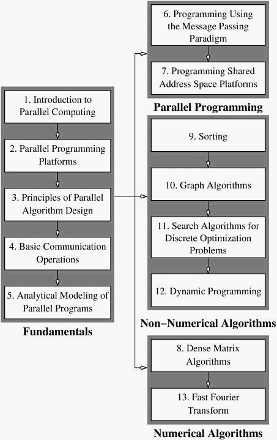

# 并行计算简介

过去十年，微处理器技术取得了巨大进步。处理器的时钟频率已从约 40 MHz（如约 1988 年的 MIPS R3000）提高到超过 2.0 GHz（如 2002 年的Pentium 4）。同时，处理器现在能够在同一周期内执行多条指令。在过去 10 年中，高端处理器每条指令的平均周期数（cycles per instruction，CPI）大约提高了一个数量级。所有这些都意味着浮点运算峰值执行率（floating point operations per second，FLOPS）提高了几个数量级。在同一时期，其他各种问题也变得十分重要，其中最突出的问题可能是内存系统以所需速度向处理器提供数据的能力。架构和软件方面的重大创新已经解决了数据通路和内存造成的瓶颈问题。

几十年来，并行计算在加速计算方面的作用已得到公认。然而，并行计算在提供多重数据路径、增加对存储元件（内存和磁盘）的访问、可扩展性能和降低成本方面的作用，体现在并行计算的广泛应用中。台式机、工程工作站以及连接有两个、四个甚至八个处理器的计算服务器正成为设计应用的常用平台。科学和工程领域的大规模应用依赖于更大规模的并行计算机配置，通常包括数百个处理器。数据库或网络服务器等数据密集型平台以及事务处理和数据挖掘等应用通常使用工作站集群，以提供较高的总磁盘带宽。图形和可视化应用使用多个渲染管道和处理元件，实时计算和渲染具有数百万个多边形的逼真环境。需要高可用性的应用依赖并行和分布式平台来实现冗余。因此，从成本、性能和应用要求的角度来看，了解当前各种并行平台的编程原理、工具和技术极为重要。

## 1.1 并行计算的动机

并行软件的开发历来被认为是费时费力的。这主要是由于指定和协调并发任务本身的复杂性，以及缺乏可移植的算法、标准化环境和软件开发工具包。从微处理器迅猛发展的角度来看，人们不禁会质疑是否有必要投入大量精力来利用并行性作为加速应用的手段。毕竟，如果开发一个并行应用程序需要两年时间，而在此期间底层硬件和/或软件平台已经过时，那么开发工作显然是白费了。然而，硬件设计中存在一些明显的趋势，表明单处理器（或隐式并行）架构在未来可能无法维持可实现的性能提升速度。这是由于缺乏隐式并行性以及数据路径和内存等其他瓶颈造成的。同时，标准化的硬件接口缩短了从开发微处理器到基于微处理器的并行机的周转时间。此外，在编程环境标准化方面也取得了长足进步，从而确保了并行应用程序更长的生命周期。所有这些都是支持并行计算平台的有力论据。

### 1.1.1 算力的讨论 - 从晶体管数量到FLOPS

1965 年，Gordon Moore提出了以下简单的观点：

> 最低组件成本的复杂性以每年大约 2 倍的速度增长。当然，在短期内，这一速度即使不会增加，也会继续保持。从长远来看，虽然没有理由相信至少在 10 年内不会保持几乎不变的增长速度，但增长速度的不确定性要大一些。这意味着到 1975 年，以最低成本计算，每个集成电路的元件数量将达到 65,000 个。

他的推理是基于在三个数据点上观察到的设备复杂性与时间之间的对数线性关系。他据此推断，到 1975 年，在面积仅占四分之一平方英寸的单晶硅芯片上安装多达 65,000 个元件的设备将是可行的。事实证明，1975 年制造出的 16K CCD 存储器拥有约 65,000 个元件，这一预测是准确的。在 1975 年随后发表的一篇论文中，摩尔将对数线性关系归因于芯片尺寸的指数行为、更精细的最小尺寸以及 "电路和设备的聪明才智"。他接着指出:

> 现在已经没有任何空间可以通过巧妙的方式来挤出任何东西了。今后，我们必须依靠更大的模具和更精细的尺寸这两个尺寸因素

他将电路复杂性翻番的速度修订为 18 个月，并从 1975 年起按这一降低的速度进行预测。这条曲线后来被称为 "==摩尔定律=="。摩尔定律正式指出，电路复杂性每 18 个月翻一番。多年来，无论是对于微处理器还是 DRAM，这一经验关系都具有惊人的弹性。通过将元件密度和芯片尺寸的增加与设备的计算能力联系起来，摩尔定律被推断为：在给定成本下，计算能力大约每 18 个月翻一番。

在过去几年里，摩尔定律的极限一直是人们广泛讨论的话题。

在这场辩论中，将晶体管转化为有用的 OPS（每秒操作数）才是关键问题。我们有可能制造出晶体管数量非常大的设备。如何利用这些晶体管实现更高的计算速度是关键的架构挑战。为此，一个合乎逻辑的方法就是依靠并行性 - 包括隐式和显式并行性。我们将在第 2.1 节简要讨论隐式并行性，并在本书的其余部分讨论显式并行性。

### 1.1.2 内存/硬盘速度的讨论

计算的整体速度不仅取决于处理器的速度，还取决于内存系统向其提供数据的能力。在过去的十年中，高端处理器的时钟速率每年大约提高 40%，而 DRAM 的访问时间在此期间每年大约只提高 10%。再加上每个时钟周期执行指令的增加，处理器速度与内存之间的这种差距构成了巨大的性能瓶颈。处理器速度与 DRAM 延迟之间的这种日益严重的不匹配，通常是通过被称为高速缓存的逐级更快的内存设备来弥合的，这些高速缓存依靠数据参考的定位来提供更高的内存系统性能。除延迟外，DRAM 与处理器之间的净有效带宽也给持续计算速度带来了其他问题。

内存系统的整体性能取决于高速缓存可满足的内存请求占总内存请求的比例。第 2.2 节将详细介绍内存系统的性能。并行平台通常能提供更好的内存系统性能，因为它们能提供：(i) 更大的总高速缓存；(ii) 更高的内存系统总带宽（两者通常与处理器数量成线性关系）。此外，并行算法的核心原则，即==数据引用的局部性==，也适用于高速缓存友好的串行算法。这一论点可以延伸到磁盘，在磁盘上，并行平台可用于实现二级存储的高总带宽。在这里，并行算法为核外计算的发展提供了启示。事实上，数据服务器（数据库服务器、网络服务器）中一些增长最快的并行计算应用领域并不依赖于它们的高总计算速度，而是依赖于以更快的速度输出数据的能力。

### 1.1.3 数据通信的讨论

随着网络基础设施的发展，将互联网作为一个大型异构并行/分布式计算环境的愿景已经开始形成。许多应用自然而然地适合这种计算模式。在广域分布式平台中，大规模并行计算的一些应用给人留下了深刻印象。SETI（地外智能搜索）项目利用大量家用电脑的力量来分析来自外太空的电磁信号。其他此类工作还包括尝试对超大整数进行因式分解和解决大型离散优化问题。

在许多应用中，==数据和/或资源在互联网上的位置都受到限制==。这种应用的一个例子是挖掘分布在带宽相对较低的网络上的大型商业数据集。在此类应用中，即使计算能力无需借助并行计算即可完成所需的任务，但在中心位置收集数据是不可行的。在这种情况下，并行计算的动力不仅来自对计算资源的需求，还来自其他（集中式）方法的不可行性或不可取性。

## 1.2 并行计算的应用范围

并行计算已在多个领域产生了巨大影响，从科学和工程应用的计算模拟，到数据挖掘和事务处理的商业应用，不一而足。并行计算的成本优势与应用对性能的要求共同构成了支持并行计算的有力论据。我们将介绍并行计算各种应用的样例。

### 1.2.1 工程与设计中的应用

传统上，并行计算在机翼设计（优化升力、阻力、稳定性）、内燃机设计（优化装料分布、燃烧）、高速电路设计（延迟、电容和电感效应布局）以及结构设计（优化结构完整性、设计参数、成本等）等方面都取得了巨大成功。最近，微机电系统和纳米机电系统（MEMS 和 NEMS）的设计引起了广泛关注。工程和设计中的大多数应用都会带来多时空尺度和耦合物理现象的问题，而在 MEMS/NEMS 设计中，这些问题尤为突出。在这里，我们经常要处理量子现象、分子动力学、随机和连续模型与传导、对流、辐射和结构力学等物理过程的混合问题，所有这些都在一个系统中进行。这对几何建模、数学建模和算法开发提出了严峻的挑战，而所有这些都需要并行计算机的支持。

工程和设计领域的其他应用==侧重于各种流程的优化==。并行计算机已被用于解决各种离散和连续优化问题。简约算法、线性优化的内点法、分界法和离散优化的遗传编程等算法已被高效并行化，并得到了广泛应用。

### 1.2.2 科学应用

过去几年，高性能科学计算应用领域发生了一场革命。国际人类基因组测序联盟（International Human Genome Sequencing Consortium）和塞莱拉公司（Celera, Inc.）探索基因和蛋白质的功能和结构特征为了解和从根本上影响生物过程带来了希望。分析生物序列以开发新药和治疗疾病和医疗条件，需要创新的算法和大规模的计算能力。事实上，一些最新的并行计算技术就是专门针对生物信息学应用的。

计算物理学和化学的进步侧重于理解从量子现象到大分子结构的各种过程。这些研究有助于设计新材料、了解化学途径和提高过程效率。天体物理学中的应用探索了星系的演化、热核过程以及对来自望远镜的超大数据集的分析。==天气建模、矿产勘探、洪水预测==等在很大程度上依赖于并行计算机，并对日常生活产生了非常重大的影响。

==生物信息学和天体物理学==在分析超大数据集方面也提出了一些最具挑战性的问题。蛋白质和基因数据库（例如 PDB、SwissProt、ENTREZ 和 NDB）以及巡天数据集（例如斯隆数字巡天）代表了一些最大的科学数据集。有效分析这些数据集需要巨大的计算能力，并且是重大科学发现的关键。

### 1.2.3 商业应用

随着网络及相关静态和动态内容的广泛应用，人们越来越重视能够提供可扩展性能的高性价比服务器。从多处理器到 linux 集群的并行平台经常被用作网络和数据库服务器。例如，在交易量大的日子里，华尔街的大型经纪公司会同时处理数十万个用户会话和数百万个订单。IBM SP 超级计算机和 Sun Ultra HPC 服务器等平台为这些关键业务网站提供动力。华尔街拥有一些最大的超级计算网络，但它们并不显眼。

大规模交易数据的可用性也激发了人们对数据挖掘和分析以优化业务和营销决策的浓厚兴趣。这些数据的庞大数量和地理分布性质要求使用有效的并行算法来==解决关联规则挖掘、聚类、分类和时间序列分析==等问题。

### 1.2.4 计算机系统应用

随着计算机系统的普及和计算在网络上的传播，并行处理问题已深入到各种应用中。在计算机安全领域，入侵检测是一个突出的挑战。在==网络入侵检测==中，数据是在分布式站点收集的，必须对入侵信号进行快速分析。由于不可能在一个中心位置收集这些数据进行分析，因此需要有效的并行和分布式算法。在==密码学领域==，基于互联网的并行计算的一些最引人注目的应用主要集中在超大整数的因式分解上。

嵌入式系统越来越依赖分布式控制算法来完成各种任务。现代汽车由数十个处理器组成，它们通过通信执行复杂的任务，以优化操控性和性能。在这类系统中，经常使用传统的并行和分布式算法来进行领导者选择、最大独立集等。

虽然==并行计算传统上仅限于具有性能良好的计算和网络元素的平台==，在这些平台中，故障和错误不会发挥重要作用，但并行计算的宝贵经验也可扩展到临时、移动或故障环境中的计算。

## 1.3 本书的组织结构

本书全面、自成一体地阐述了使用并行计算机解决问题的方法。算法和度量侧重于并行机的实用和可移植模型。算法设计原理侧重于并行算法的理想属性，以及在大量应用和架构竞赛中实现这些属性的技术。编程技术涵盖标准范例，如 MPI 和 POSIX 线程，可用于各种并行平台。

本书各章可分为四个主要部分，如[图 1.1](#fig1.1) 所示。这些部分如下：

    
    

        图1.1 推荐的章节阅读顺序
    

**基础** 本节横跨本书的第 2 章至第 4 章。第 2 章 "并行编程平台 "讨论并行平台的物理组织。它建立了可用于算法设计的成本度量。本章的目的不是详尽论述并行体系结构，而是提供高效使用这些机器所需的足够细节。第 3 章 "并行算法设计原理 "讨论了有助于高效并行算法的关键因素，并介绍了一套可广泛应用的技术。第 4 章 "基本通信操作 "介绍了一套贯穿全书的核心操作，用于促进并行算法中的高效数据传输。最后，第 5 章 "并行程序的分析建模 "介绍了量化并行算法性能的指标。

**并行编程** 本节包括本书的第 6 章和第 7 章。第 6 章 "使用消息传递范例编程 "主要介绍消息传递接口 (MPI)，用于对包括集群在内的消息传递平台进行编程。第7章 "共享地址空间平台编程 "涉及线程和基于指令的方法等编程范式。该章使用 POSIX 线程和 OpenMP 等范例，介绍了共享地址空间并行机编程所需的各种功能。这两章都使用各种并行程序实例说明了各种编程概念。

**非数值算法** 第 9-12 章介绍并行非数值算法。第 9 章介绍排序算法，如位排序、冒泡排序及其变体、quicksort、抽样排序和 shellsort。第 10 章介绍了各种图论问题的算法，如最小生成树、最短路径和连接成分。还讨论了稀疏图的算法。第 11 章讨论基于搜索的方法，如组合问题的分支边界和启发式搜索。第 12 章对各种动态编程算法进行了分类并介绍了并行公式。

**数值算法** 第 8 章和第 13 章介绍并行数值算法。第 8 章介绍密集矩阵的基本运算，如矩阵乘法、矩阵向量乘法和高斯消元。本章放在非数值算法之前，因为将矩阵分割和分配给处理器的技术是许多非数值算法的共通之处。此外，矩阵-向量和矩阵-矩阵乘法算法构成了许多图算法的内核。第 13 章介绍计算快速傅立叶变换的算法。

