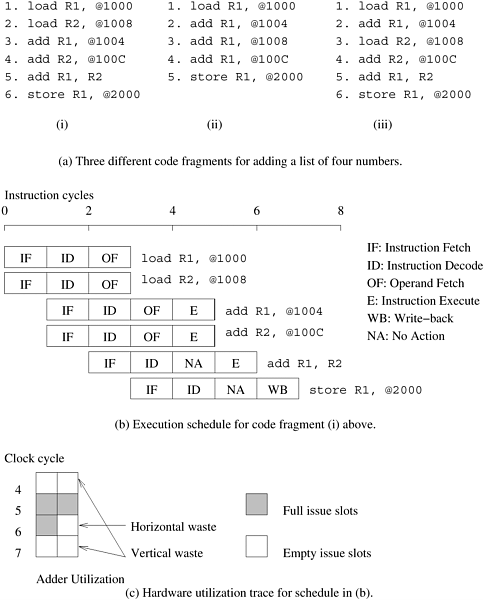

## 2.1 隐式并行 - 微处理器架构的趋势

在过去的十年中，微处理器技术在时钟速度方面取得了显著的进步，但同时也暴露出其他各种性能瓶颈。为了缓解这些瓶颈，微处理器设计人员探索了其他途径，以实现具有成本效益的性能提升。在本节中，我们将概述其中的一些趋势，以便了解它们的局限性以及对算法和代码开发的影响。本节的目的不是全面介绍处理器架构。参考书目中提到的几篇优秀文章都涉及这一主题。

在过去的 20 年中，微处理器的时钟速度令人印象深刻地提高了两到三个数量级。然而，内存技术的限制严重削弱了这些时钟速度的提升。与此同时，更高的设备集成度也导致晶体管数量庞大，这就提出了一个显而易见的问题，即如何更好地利用晶体管。因此，能够在一个时钟周期内执行多条指令的技术开始流行起来。事实上，这种趋势在当前新一代的微处理器（如 Itanium、Sparc Ultra、MIPS 和 Power4）中都很明显。在本节中，我们将简要探讨各种处理器支持多指令执行的机制。

### 2.1.1 流水线和超标量

长期以来，处理器一直依赖流水线来提高执行速度。通过重叠指令执行中的各个阶段（获取、调度、解码、操作数获取、执行、存储等），流水线实现了更快的执行速度。装配线的比喻很适合用来理解流水线。如果一辆汽车的组装需要 100 个时间单位，可以分成 10 个流水线阶段，每个阶段 10 个单位，那么一条流水线每 10 个时间单位就能生产一辆汽车！这比完全串行地一辆接一辆生产汽车的速度提高了 10 倍。从这个例子中还可以看出，要想提高单条流水线的速度，就必须将任务分解成越来越小的单元，从而延长流水线的长度，增加执行中的重叠。就处理器而言，由于任务变小了，时钟频率也随之加快。例如，工作频率为 2.0 GHz 的奔腾 4 处理器就有 20 级流水线。请注意，单个流水线的速度最终受限于流水线中最大的原子任务。此外，在典型的指令跟踪中，每隔五到六条指令就是一条分支指令。因此，长指令流水线需要有效的技术来预测分支目的地，以便流水线能被推测性地填满。由于需要刷新的指令数量较多，因此流水线越深，预测错误的惩罚就越大。这些因素限制了处理器流水线的深度和由此带来的性能提升。

要提高指令执行率，一个显而易见的方法就是使用多条流水线。在每个时钟周期内，多条指令并行地流水线进入处理器。这些指令在多个功能单元上执行。我们通过一个例子来说明这一过程。

- **例2.1 超标量执行**

  考虑一种具有两条流水线并能同时发出两条指令的处理器。这些处理器有时也被称为超流水线处理器。处理器在同一周期内发出多条指令的能力被称为超标量执行。由于[图2.1](#fig2.1) 所示的架构允许在每个时钟周期内发出两条指令，因此也被称为双向超标量或双指令执行。

  

      
      

          图2.1 双向超标量执行指令示例
      

  

  [图2.1 ](#fig2.1)中第一个代码片段的执行情况，该代码用于四个数字的加法运算。第一条指令和第二条指令是独立的，因此可以同时执行。在 *t = 0* 时同时发出的指令 `load R1, @1000` 和 ` load R2, @1008` 就说明了这一点。接下来的两条指令，`add R1, @1004` 和 `add R2, @100C`也是相互独立的，尽管它们必须在前两条指令之后执行。因此，由于处理器采用流水线设计，它们可以在 *t = 1* 时同时发出。这些指令在 *t = 5* 时终止。接下来的两条指令，即`add R1, R2 `和`store R1, @2000 `不能同时执行，因为前一条指令的结果（寄存器 `R1` 的内容）被后一条指令使用。因此，只能在 *t = 2* 时发出`add`指令，在 *t = 3* 时发出`store`指令。需要注意的是，只有在前两条指令执行完毕后，才能执行`add R1, R2` 指令。指令时间表如[图2.1(b)](#fig2.1)所示。该时间表假定每次内存访问只需一个周期。实际情况可能并非如此。第 2.2 节**将**讨论这一假设对内存系统性能的影响。

原则上，超标量执行似乎很自然，甚至很简单。然而，有一些问题需要解决。首先，如示例2.1所示，程序中的指令可能相互关联。一条指令的结果可能是后续指令所需要的。这被称为真正的数据依赖性。例如，[图 2.1](#fig2.1) 中的第二个代码片段，该代码用于四个数字的相加。`load R1, @1000` 和 `add R1, @1004` 之间存在真正的数据依赖关系，后续指令之间也存在类似的数据依赖关系。这种依赖关系必须在同时发出指令之前解决。这有两层含义。首先，由于解决是在运行时进行的，因此必须有硬件支持。这种硬件的复杂性可能很高。其次，程序中指令级并行性的数量通常是有限的，这与编码技术有关。在第二个代码片段中，不可能同时出现问题，从而导致资源利用率低下。[图 2.1(a)](#fig2.1)中的三个代码片段也说明，在许多情况下，通过对指令重新排序和修改代码，可以获得更多的并行性。请注意，在本例中，代码重组相当于以一种可被指令发布机制使用的形式暴露出并行性。

指令之间的另一个依赖性来源于不同流水线共享的有限资源。举例来说，考虑在具有单浮点运算单元的双发机器上共同调度两个浮点运算。虽然指令之间可能不存在数据依赖关系，但由于这两条指令都需要浮点运算单元，因此不能同时进行调度。这种两条指令竞争单个处理器资源的依赖形式被称为**资源依赖**。

程序中的控制流会在指令之间产生第三种形式的依赖关系。考虑一下有条件分支指令的执行。由于只有在执行时才知道分支的目的地，因此事先跨分支安排指令可能会导致错误。这些依赖关系被称为**分支依赖**关系或**程序依赖**关系，通常通过在分支间进行推测性调度并在出现错误时进行回滚来处理。对典型跟踪的研究表明，平均每五到六条指令就会遇到一条分支指令。因此，与填充指令流水线一样，准确的分支预测对于高效超标量执行至关重要。

处理器检测和调度并发指令的能力对于超标量性能至关重要。例如，[图 2.1](#fig2.1) 中的第三个代码片段也是计算四个数的和。读者会发现，这只是对第一个代码片段进行了语义等价的重新排序。然而，在这种情况下，前两条指令 - `load R1, @1000` 和 `add R1, @1004` 之间存在数据依赖关系。因此，这些指令不能同时发出。但是，如果处理器具有前瞻能力，它就会意识到可以将第三条指令（`load R2, @1008`）与第一条指令安排在一起。在下一个执行周期中，指令二和指令四可以同时执行，以此类推。这样，第一个和第三个代码片段就可以得到相同的执行时间表。不过，处理器需要具备不按顺序发布指令的能力，以完成所需的重新排序。如本例所示，按顺序发出指令的并行性可能会受到很大限制。目前大多数微处理器都能实现无序指令的发布和完成。这种模式也称为动态指令发布，可最大限度地利用指令级并行性。处理器使用一个指令窗口，从中选择指令同时执行。该窗口与调度程序的前瞻性相对应。

超标量架构的性能受到可用指令级并行性的限制。请看[图 2.1](#fig2.1) 中的示例。为便于讨论，我们忽略该示例中的流水线问题，重点关注程序的执行问题。假设有两个执行单元（乘加单元），图中显示有几个零问题周期（浮点单元空闲的周期）。从执行单元的角度来看，这些周期基本上是浪费周期。如果在某个周期内，执行单元没有发出任何指令，则称为纵向浪费；如果在一个周期内只使用了部分执行单元，则称为横向浪费。在本例中，有两个周期存在垂直浪费，一个周期存在水平浪费。总之，八个可用周期中只有三个用于计算。这意味着代码片段的计算量不会超过处理器额定 FLOP 数峰值的八分之三。通常，由于并行性有限、资源依赖或处理器无法提取并行性，超标量处理器的资源利用率严重不足。目前的微处理器通常最多支持四组超标量执行。

### 2.1.2 超长指令字处理器

超标量处理器提取的并行性往往受到指令前瞻性的限制。在传统微处理器上，用于动态依赖性分析的硬件逻辑通常占总逻辑的 5-10%（在四路超标量 Sun UltraSPARC 上约占 5%）。这种复杂性随着问题数量的增加而呈四倍增长，并可能成为瓶颈。超长指令字（Very Long Instruction Word，VLIW）处理器中使用的另一种利用指令级并行性的概念是依靠编译器在编译时解决依赖性和资源可用性问题。可同时执行的指令被打包成组，并作为单个长指令字（因此得名）分发给处理器，以便在多个功能单元上同时执行。

与超标量处理器相比，VLIW 概念既有优势也有劣势。VLIW 概念最早用于多流跟踪（Multiflow Trace，约 1984 年），后来作为英特尔 IA64 架构的一个变体。由于调度是在软件中完成的，因此 VLIW 处理器的解码和指令发布机制更为简单。与硬件发行单元相比，编译器有更大的范围来选择指令，并能使用各种转换来优化并行性。编译器通常可以使用额外的并行指令来控制并行执行。然而，编译器没有动态程序状态（如分支历史缓冲区）可用来做出调度决策。这就降低了分支和内存预测的准确性，但允许使用更复杂的静态预测方案。其他运行时情况，如高速缓存未命中导致的数据获取停滞，则极难准确预测。这就限制了基于编译器的静态调度的范围和性能。

最后，VLIW 处理器的性能对编译器检测数据和资源依赖性以及读写危险的能力，以及为最大并行性安排指令的能力非常敏感。循环展开、分支预测和推测执行都对 VLIW 处理器的性能起着重要作用。虽然超标量和 VLIW 处理器在利用隐式并行性方面取得了成功，但它们通常仅限于四路至八路并行性范围内的较小并发规模。
