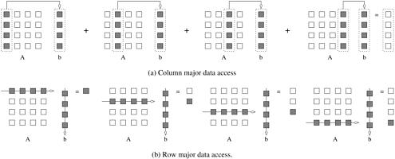

## 2.2 内存系统性能限制

计算机程序的有效运行不仅取决于处理器的速度，还取决于内存系统向处理器提供数据的能力。在逻辑层面上，内存系统（可能由多级缓存组成）接收一个内存字的请求，并在 l 纳秒后返回一个大小为 b 的数据块，其中包含所请求的字。这里的 l 指的是内存的**延迟**时间。数据从内存传送到处理器的速度决定了内存系统的**带宽**。

了解延迟和带宽之间的区别非常重要，因为解决这两个问题需要不同的技术，而且往往是相互竞争的技术。打个比方，如果消防栓打开 2 秒钟后，消防水带的末端就有水流出，那么系统的延迟时间就是 2 秒钟。一旦水流开始，如果水管以每秒 1 加仑的速度抽水，那么水管的 "带宽 "就是每秒 1 加仑。如果我们需要立即灭火，我们可能希望延迟时间更短。这通常需要消防栓提供更高的水压。另一方面，如果我们希望扑灭更大的火灾，我们可能需要更高的流量，这就需要更宽的水管和消防栓。我们将在这里看到，这种类比对内存系统也很有效。延迟和带宽在决定内存系统性能方面都起着至关重要的作用。我们将通过几个例子分别对它们进行更详细的研究。

为了研究内存系统延迟的影响，我们在下面的示例中假设一个内存块由一个字组成。稍后，我们将在研究内存带宽的作用时放宽这一假设。由于我们主要关注的是可实现的最高性能，因此我们还假设了最佳情况下的高速缓存替换策略。有关内存系统设计的详细讨论，请参阅参考书目。

- **例2.2 内存延迟对性能的影响**

  考虑一个工作频率为 1 GHz（1 ns 时钟）的处理器，它与一个延迟时间为 100 ns（无缓存）的 DRAM 相连。假设该处理器有两个乘加单元，能够在每个 1 ns 周期内执行四条指令。因此，处理器的峰值为 4 GFLOPS。由于内存延迟等于 100 个周期，块大小为一个字，因此每次内存请求发出后，处理器必须等待 100 个周期才能处理数据。考虑在这样的平台上计算两个向量的点积问题。点积计算对一对矢量元素进行一次乘加运算，即每次浮点运算需要获取一次数据。不难看出，这种计算的峰值速度仅限于每 100 ns 进行一次浮点运算，或 10 MFLOPS 的速度，仅占处理器峰值额定值的很小一部分。这个示例突出说明，要实现高计算速度，需要有效的内存系统性能。

### 2.2.1 利用缓存改善有效内存延迟

为解决处理器和 DRAM 速度不匹配的问题，内存系统设计中出现了许多架构创新。其中一项创新是通过在处理器和 DRAM 之间放置一个更小、更快的存储器来解决速度不匹配问题。这种内存被称为高速缓冲存储器，是一种低延迟、高带宽的存储设备。处理器所需的数据首先被获取到高速缓存中。对缓存中数据项的所有后续访问都由缓存提供服务。因此，原则上说，如果一个数据被重复使用，缓存可以减少该内存系统的有效延迟。高速缓存满足的数据引用比例称为系统计算的高速缓存命中率。许多应用的有效计算速度并不取决于 CPU 的处理速度，而是取决于向 CPU 输入数据的速度。这种计算被称为内存约束计算。内存绑定程序的性能受到高速缓存命中率的严重影响。

- **例2.3 缓存对内存系统性能的影响**

  与上一示例相同，考虑一个 1 GHz 处理器和一个 100 ns 延迟的 DRAM。在这种情况下，我们引入一个大小为 32 KB 的高速缓存，其延迟时间为 1 ns 或一个周期（通常在处理器本身）。我们使用这种设置对两个矩阵 A 和 B 进行乘法运算，矩阵尺寸为 32 x 32。我们精心选择了这些数字，以便高速缓存足够大，可以存储矩阵 A 和 B 以及结果矩阵 C。我们再次假设了一种理想的缓存放置策略，即所有数据项都不会被其他数据项覆盖。将两个矩阵取入高速缓存相当于取 2K 个字，大约需要 200 μs。我们从基本算法中得知，两个 n x n 矩阵相乘需要 2n3 次运算。对于我们的问题，这相当于 64K 次运算，以每个周期四条指令计算，可以在 16K 个周期（或 16 μs）内完成。因此，计算的总时间约为加载/存储操作时间与计算本身时间的总和，即 200+16 μs。这相当于 64K/216 或 303 MFLOPS 的峰值计算速度。请注意，这比上一个示例提高了 30 倍，但仍不到处理器峰值性能的 10%。从这个例子中我们可以看到，通过放置一个小型高速缓冲存储器，我们可以大大提高处理器的利用率。

缓存对性能的提升是基于对同一数据项的重复引用这一假设。这种在较小的时间窗口内重复引用数据项的概念被称为引用的时间局部性。在我们的示例中，数据访问次数为 O(n2)，计算次数为 O(n3)。(数据重用对高速缓存性能至关重要，因为如果每个数据项只使用一次，那么每次使用时仍需从 DRAM 中提取一次，因此每次操作都要支付 DRAM 延迟。

### 2.2.2 内存带宽的影响

内存带宽是指数据在处理器和内存之间移动的速度。它由内存总线和内存单元的带宽决定。提高内存带宽的一个常用技术是增加内存块的大小。举例说明，让我们放宽对内存块大小的简化限制，假设单个内存请求返回一个包含四个字的连续内存块。在这种情况下，由四个字组成的单个单元也被称为高速缓存行。传统计算机通常会将 2 到 8 个字一起取入高速缓存。我们将看到这对数据重用受限的应用性能有何帮助。

- **例2.4 区块大小的影响：两个向量的点积**

  再考虑一个具有单周期高速缓存和 100 周期延迟 DRAM 的内存系统，处理器工作频率为 1 GHz。如果块大小为一个字，处理器取每个字需要 100 个周期。对于每一对字，点积执行一次乘加运算，即两个 FLOP。因此，如示例 2.2 所示，该算法每 100 个周期执行一次 FLOP，峰值速度为 10 MFLOPS。

  现在让我们考虑一下，如果块的大小增加到 4 个字，即处理器每 100 个周期可以获取一个 4 个字的高速缓存行，会发生什么情况。假设向量在内存中是线性排列的，那么在 200 个周期内可以执行 8 个 FLOP（4 个乘加）。这是因为单次内存访问可获取矢量中的四个连续字。因此，两次访问可获取每个向量的四个元素。这相当于每 25 ns 完成一个 FLOP，峰值速度为 40 MFLOPS。请注意，将块大小从一个字增加到四个字并没有改变内存系统的延迟。但带宽却增加了四倍。在这种情况下，内存系统带宽的增加使我们能够加速点积算法，因为该算法完全没有数据重用。

  另一种快速估算性能边界的方法是估算缓存命中率，用它来计算每个字的平均访问时间，并通过底层算法将其与 FLOP 率联系起来。例如，在本例中，算法每访问八次数据，就会有两次 DRAM 访问（缓存未命中）。这相当于 75% 的高速缓存命中率。假设主要的开销来自高速缓存未命中，则未命中的平均内存访问时间为 25%，即 100 ns（或 25 ns/字）。由于点积的运算量为 1 次/字，因此计算速率与之前一样为 40 MFLOPS。对这一计算率的更精确估计是，平均内存访问时间为 0.75 x 1 + 0.25 x 100 或 25.75 ns/字。相应的计算速度为 38.8 MFLOPS。

从物理角度看，例 2.4 中的情况相当于一条宽数据总线（4 个字或 128 位）连接到多个内存库。实际上，这种宽总线的构建成本很高。在更实用的系统中，在取回第一个字后，会在随后的总线周期中向内存总线发送连续的字。例如，对于 32 位数据总线，第一个字在 100 毫微秒（相关延迟）后放入总线，随后每个总线周期放入一个字。由于整个高速缓存行在 100 + 3 x（内存总线周期）ns 后才可用，因此上述计算结果会稍有变化。假设数据总线的工作频率为 200 MHz，则高速缓存行的访问时间将增加 15 ns。这并不会明显改变我们对执行速率的限制。

上述例子清楚地说明了带宽的增加如何带来更高的峰值计算速度。这些示例还做出了某些对程序员具有重要意义的假设。假设数据布局是这样的：内存中连续的数据字被连续的指令使用。换句话说，如果我们以计算为中心，那么内存访问存在空间位置性。如果从以数据布局为中心的角度来看，计算是有序的，因此连续的计算需要连续的数据。如果计算（或访问模式）不具有空间位置性，那么有效带宽可能会比峰值带宽小得多。

这种访问模式的一个例子是，当密集矩阵在内存中以行主方式存储时，按列读取矩阵。编译器通常可以很好地重组计算，以利用空间局部性。

- **例2.5 跨步访问的影响**

  请看下面的代码片段：

  ```c
  for (i = 0; i < 1000; i++) {
  	column_sum[i] = 0.0;
  	for (j = 0; j < 1000; j++) {
  		column_sum[i] += b[j][i];
      }
  }
  ```

  代码片段将矩阵 b 的列求和为一个向量 column_sum。有两点值得注意：(i) 向量 column_sum 较小，很容易放入高速缓存；(ii) 如[图 2.2(a)](#fig2.2)所示，按列顺序访问矩阵 b。对于以行主序存储的 1000 x 1000 大小的矩阵，这相当于访问每 1000 个条目。因此，从内存中获取的每个高速缓存行可能只使用一个字。因此，上述代码片段的性能可能会很差。
  
  <div align="center" id="fig2.2" name="fig2.2">
      
      <div>
          图2.2 矩阵与矢量相乘：(a) 逐列相乘，保持流水和；(b) 计算结果中的每个元素，作为矩阵的一行与矢量的点积
      </div>
  </div>

上面的例子说明了分步访问（步长大于 1）的问题。计算中缺乏空间定位会导致内存系统性能低下。通常情况下，可以通过调整计算结构来消除跨步访问。在我们的示例中，可以对循环进行如下简单重写：

- **例2.6 消除跨步访问**

  下面是对列和片段的重组：

  ```c
  for (i = 0; i < 1000; i++) {
      column_sum[i] = 0.0;
  }
  for (j = 0; j < 1000; j++) {
      for (i = 0; i < 1000; i++) {
          column_sum[i] += b[j][i];
      }
  }
  ```

  在这种情况下，矩阵是按行顺序遍历的，如[图 2.2(b)](#fig2.2)所示。不过，读者会注意到，这个代码片段依赖于这样一个事实，即向量 column_sum 可以通过循环保留在高速缓存中。事实上，在这个特定的例子中，我们的假设是合理的。如果向量更大，我们就必须将迭代空间分割成块，每次计算一个块的乘积。这一概念也被称为迭代空间**平铺**。这个循环的性能改进留给读者去练习。

因此，下一个问题是，我们是否已经有效解决了内存延迟和带宽带来的问题。在过去的几十年里，处理器的峰值运算速率大幅增长，但内存延迟和带宽却没有跟上增长的步伐。因此，对于典型计算机而言，峰值 FLOPS 速率与峰值内存带宽的比率介于 1 MFLOPS/MB（该比率表示每兆字节/秒带宽的 FLOPS 速率）与 100 MFLOPS/MB 之间。较低的数字通常与大型矢量超级计算机相对应，较高的数字则与基于微处理器的快速计算机相对应。这个数字非常有启发性，因为它告诉我们，一个字在被取入全带宽存储（通常是 L1 高速缓存）后，平均必须重复使用 100 次才能达到处理器的全部利用率。在此，我们将全带宽定义为计算所需的数据传输速率，以使其与处理器绑定。

本节介绍的一系列示例说明了以下概念：

- 利用应用中的空间和时间位置性，对于摊销内存延迟和增加有效内存带宽至关重要。
- 某些应用本身就比其他应用具有更强的时间局部性，因此对低内存带宽的容忍度更高。操作次数与内存访问次数的比率是衡量内存带宽预期承受能力的一个很好指标。
- 内存布局和适当组织计算可对空间和时间局部性产生重大影响。

### 2.2.3 隐藏内存延迟的其他方法

想象一下，在网络流量高峰时段坐在电脑前浏览网页的情景。您可以使用以下三种简单的方法之一来缓解浏览器缺乏响应的问题：

1. 我们提前预知要浏览的网页，并提前向它们发出请求；
2. 我们打开多个浏览器，并在每个浏览器中访问不同的网页，因此，当我们等待一个网页加载时，我们可能正在阅读其他网页
3. 我们一次性访问一大堆网页-在各种访问中摊销延迟。

第一种方法称为预取，第二种称为多线程，第三种则对应于访问内存字的空间位置性。在这三种方法中，内存访问的空间位置性之前已经讨论过。在本节中，我们将重点讨论作为延迟隐藏技术的预取和多线程技术。

#### 多线程隐藏延迟

线程是程序流程中的单个控制流。我们用一个简单的例子来说明线程：

- **例2.7 矩阵乘法的线程执行**

  请看以下代码段，用于将 *n × n* 矩阵 `a` 与向量 `b` 相乘，得到向量 `c`。

  ```c
  for(i=0;i<n;i++) {
      c[i] = dot_product(get_row(a, i), b);
  }
  ```

  请注意，每个点积都相互独立，因此代表了一个并发执行单元。我们可以安全地将上述代码段重写为：

  ```c
  for(i=0;i<n;i++) {
      c[i] = create_thread(dot_product, get_row(a, i), b);
  }
  ```

  这两段代码之间的唯一区别是，我们明确指定了点积计算的每个实例都是一个线程。(我们将在第 7 章中了解到，有许多指定线程的 API。我们只是为创建线程的函数选择了一个直观的名称）。现在，请考虑函数 `dot_product `的每个实例的执行情况。该函数的第一个实例访问一对向量元素并等待它们。在此期间，该函数的第二个实例可以在下一个循环中访问另外两个向量元素，以此类推。经过 l 个单位的时间（l 为内存系统的延迟时间）后，第一个函数实例从内存中获取了所需数据，并可以执行所需的计算。在下一个周期，下一个函数实例的数据项到达，依此类推。这样，在每个时钟周期内，我们都可以执行一次计算。

例 2.7 中的执行时间表基于两个假设：内存系统能够满足多个未处理请求，处理器能够在每个周期切换线程。此外，它还要求程序以线程的形式明确说明并发性。多线程处理器能够保持多个计算线程的上下文，这些线程具有未处理请求（内存访问、I/O 或通信请求），并在请求得到满足时执行这些请求。HEP 和 Tera 等机器所依赖的多线程处理器可以在每个周期内切换执行上下文。因此，只要有足够的并发性（线程）来防止处理器空转，它们就能有效地隐藏延迟。并发性和延迟之间的权衡将是本文许多章节中反复出现的主题。

#### 预取隐藏延迟

在一个典型的程序中，处理器会在一个很小的时间窗口内加载并使用一个数据项。如果加载导致缓存丢失，那么使用就会停滞。解决这个问题的一个简单办法是提前加载操作，这样即使出现缓存缺失，数据也有可能在使用时已经到达。但是，如果数据项在加载和使用之间被覆盖，则需要重新加载。请注意，这种情况不会比未提前加载的情况更糟。仔细研究这种技术就会发现，预取的工作原理与多线程的工作原理大致相同。在提前加载时，我们试图找出与其他线程没有资源依赖性（即使用相同寄存器）的独立执行线程。许多编译器都会积极尝试提前加载，以掩盖内存系统的延迟。

- **例2.8 通过预取隐藏延迟**

  考虑使用一个 for 循环添加两个向量 a 和 b 的问题。在循环的第一次迭代中，处理器请求 a[0] 和 b[0]。由于这两个向量不在高速缓存中，处理器必须支付内存延迟。在处理这些请求的同时，处理器还请求 a[1] 和 b[1]。假设每个请求在一个周期（1 毫微秒）内产生，而内存请求在 100 毫微秒内满足，那么在 100 次此类请求后，内存系统将返回第一组数据项。随后，每个周期将返回一对矢量分量。这样，在随后的每个周期中，都可以执行一次加法运算，而不会浪费处理器周期。

### 2.2.4 多线程与预取的权衡

多线程和预取似乎可以解决所有与内存系统性能有关的问题，但它们却受到内存带宽的严重影响。

- **例2.9 带宽对多线程程序的影响**

  考虑在一台机器上运行的计算，其时钟频率为 1 GHz，缓存行为 4 字，缓存访问为单周期，到 DRAM 的延迟为 100 ns。计算在 1 KB 时的缓存命中率为 25%，在 32 KB 时的缓存命中率为 90%。考虑两种情况：第一种是单线程执行，串行上下文可使用整个高速缓存；第二种是多线程执行，有 32 个线程，每个线程有 1 KB 的高速缓存驻留。如果计算在每 1 ns 周期内发出一个数据请求，在第一种情况下，DRAM 的带宽需求为每 10 ns 一个字，因为其他字来自高速缓存（高速缓存命中率为 90%）。这相当于 400 MB/s 的带宽。在第二种情况下，对 DRAM 的带宽要求增加到每个线程每四个周期三个字（缓存命中率为 25%）。假设所有线程都表现出类似的缓存行为，这相当于 0.75 字/秒，或 3 GB/秒。

例 2.9 说明了一个非常重要的问题，即由于每个线程的缓存驻留时间较小，多线程系统的带宽需求可能会大幅增加。在本例中，虽然 400 MB/s 的持续 DRAM 带宽是合理的，但 3.0 GB/s 的带宽已超过了目前大多数系统所能提供的带宽。此时，多线程系统就不再受延迟限制，而是受带宽限制。必须认识到，多线程和预取只能解决延迟问题，往往会加剧带宽问题。

另一个问题与有效使用预取和多线程所需的额外硬件资源有关。假设我们向寄存器进行了 10 次高级加载。这些加载要求 10 个寄存器在持续时间内保持空闲。如果中间的指令覆盖了寄存器，我们就必须重新加载数据。与没有预取的情况相比，这不会增加取数的延迟。但是，现在我们要两次获取相同的数据项，导致对内存系统带宽的需求增加了一倍。这种情况与例 2.9 中说明的缓存限制类似。通过使用更大的寄存器文件和高速缓存来支持预取和多线程，可以缓解这种情况。与静态网络一样，动态网络的成本由链路成本和交换机成本决定。在典型的动态网络中，交换机的阶数是恒定的。因此，链路和交换机的数量近似相同。此外，在典型网络中，交换机成本超过链路成本。因此，动态网络的成本通常由网络中交换节点的数量决定。
