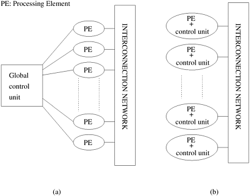

## 2.3 并行计算平台的两部分

在前面的章节中，我们指出了影响串行或隐式并行程序性能的各种因素。当前微处理器的峰值性能和可持续性能之间的差距越来越大，内存系统性能的影响，以及许多问题的分布式性质，都是并行化的主要动机。现在，我们将从高层次介绍并行计算平台的要素，这些要素对于面向性能和可移植的并行编程至关重要。为了便于我们讨论并行平台，我们首先探讨了基于并行平台的逻辑组织和物理组织的两部分。逻辑组织指的是程序员对平台的看法，而物理组织指的是平台的实际硬件组织。从程序员的角度来看，并行计算的两个关键组成部分是表达并行任务的方法和指定这些任务之间交互的机制。前者有时也被称为控制结构，后者则被称为通信模型。

### 2.3.1 并行平台的控制结构

并行任务可以按不同的粒度进行指定。一个极端是，一组程序中的每个程序都视为一个并行任务。在另一个极端，每个程序中的单个指令也可视为并行任务。在这两个极端之间，有一系列用于指定程序控制结构和相应架构支持的模型。

- ##### **例2.10 多处理器上单指令的并行性**

  请看下面这段添加两个向量的代码：

  ```c
  for (i = 0; i < 1000; i++) {
      c[i] = a[i] + b[i];
  }
  ```

  在本例中，循环的各种迭代是相互独立的，即 `c[0] = a[0] + b[0];`、`c[1] = a[1] + b[1];`等等，都可以相互独立地执行。因此，如果有一种机制可以执行相同的指令，在本例中，在所有处理器上加上适当的数据，我们就可以更快地执行这个循环。

并行计算机中的处理单元要么在单个控制单元的集中控制下运行，要么独立工作。在被称为SIMD（Single Instruction Stream, Multiple Data Stream，单指令流多数据流）的体系结构中，单个控制单元向每个处理单元发送指令。[图 2.3(a) ](#fig2.3)展示了典型的 SIMD 架构。在 SIMD 并行计算机中，所有处理单元同步执行同一指令。在[例 2.10](#例2.10 多处理器上单指令的并行性) 中，加法指令被分派给所有处理器，并由它们同时执行。一些最早的并行计算机，如 Illiac IV、MPP、DAP、CM-2 和 MasPar MP-1 都属于这类计算机。最近，这一概念的变种被用于协同处理单元，如英特尔处理器中的 MMX 单元和 Sharc 等 DSP 芯片。英特尔奔腾处理器的 SSE（流 SIMD 扩展）提供了许多在多个数据项上执行相同指令的指令。这些架构改进依赖于底层计算的高度结构化（规则）性质，例如在图像处理和图形处理中，以提高性能。

<div align="center" id="fig2.3" name="fig2.3">
    
    <div>
        图2.3 典型的SIMD架构(a)和典型的MIMD架构(b)
    </div>
</div>


虽然 SIMD 概念对数组等并行数据结构的结构化计算非常有效，但通常需要有选择地关闭对某些数据项的操作。因此，大多数 SIMD 编程范式都允许使用 "活动掩码（Activity Mask）"。这是一个与每个数据项和操作相关联的二进制掩码，用于指定该数据项是否参与操作。`where (condition) then <stmnt> <elsewhere stmnt>` 等原语用于支持选择性执行。条件执行可能会损害 SIMD 处理器的性能，因此必须谨慎使用。

与 SIMD 体系结构不同，每个处理元件都能独立于其他处理元件执行不同程序的计算机被称为MIMD（Multiple Instruction Stream, Multiple Data Stream，多指令流多数据流）计算机。[图 2.3(b) ](#fig2.3)描述了典型的 MIMD 计算机。这种模式的一个简单变体被称为SPMD (Single Program, Multiple Data，单程序多数据) 模式，它依赖于同一程序的多个实例在不同数据上执行。不难看出，SPMD 模型与 MIMD 模型具有相同的表达能力，因为多个程序中的每个程序都可以插入一个大的 `if-else` 块中，其条件由任务标识符指定。SPMD 模型被许多并行平台广泛使用，只需最低限度的架构支持。这类平台包括 Sun Ultra 服务器、多处理器 PC、工作站集群和 IBM SP。

SIMD 计算机所需的硬件比 MIMD 计算机少，因为它们只有一个全局控制单元。此外，由于 SIMD 计算机只需存储一份程序，因此所需的内存也较少。相比之下，MIMD 计算机则在每个处理器上存储程序和操作系统。然而，SIMD 处理器作为通用计算引擎并不受欢迎，这可能要归咎于其专用的硬件架构、经济因素、设计限制、产品生命周期和应用特性。与此相反，支持 SPMD 模式的平台可以在短时间内利用廉价的现成组件构建，所需的工作量相对较少。SIMD 计算机需要大量的设计工作，因此产品开发时间较长。由于底层串行处理器变化如此之快，SIMD 计算机很快就会被淘汰。许多应用的不规则性也使 SIMD 体系结构不太适用。[例 2.11](#例2.11 在 SIMD 架构上执行条件语句) 举例说明了 SIMD 体系结构在条件执行时资源利用率较低的情况。

- ##### **例2.11 在 SIMD 架构上执行条件语句**

  考虑执行[图 2.4 ](#fig2.4)所示的条件语句。[图 2.4(a)](#fig2.4) 中的条件语句分两步执行。第一步，所有 `B == 0` 的处理器执行指令 `C = A`，所有其他处理器处于空闲状态。第二步，执行指令的 `else `部分（`C = A/B`）。在第一步中处于活动状态的处理器现在变成空闲。这说明了 SIMD 架构的一个缺点。

  <div align="center" id="fig2.4" name="fig2.4">
      
      <div>
          图2.4 在有四个处理器的 SIMD 计算机上执行条件语句：(a)条件语句；(b)分两步执行语句。
      </div>
  </div>

### 2.3.2 并行平台的通信模式

并行任务之间的数据交换主要有两种形式 - 访问共享数据和消息传递。

#### 共享地址空间平台

并行平台的 "共享地址空间（shared-address-space）"支持所有处理器都能访问的通用数据空间。处理器通过修改存储在共享地址空间中的数据对象进行交互。支持 SPMD 编程的共享地址空间平台也被称为多处理器。共享地址空间平台中的内存可以是本地的（处理器独占），也可以是全局的（所有处理器共有）。如果处理器访问系统中任何内存字（全局或局部）所需的时间相同，则该平台被归类为UMA（Uniform Memory Access，统一内存访问）多核计算机。另一方面，如果访问某些内存字所需的时间比其他内存字长，该平台就被称为NUMA（Non-Uniform Memory Access，非统一内存访问）多计算机。[图 2.5(a)](#fig2.5)和[图 2.5(b)](#fig2.5)展示的是 UMA 平台，而[图 2.5(c) ](#fig2.5)展示的是 NUMA 平台。

图 [2.5(b) ](#fig2.5)展示了一个有趣的案例。在这里，访问高速缓存中的内存字比访问内存中的位置更快。然而，我们仍将其归类为 UMA 架构。原因在于目前所有的微处理器都有高速缓存分层。因此，如果考虑缓存访问时间，即使是单处理器也不能称为 UMA。因此，我们仅根据内存访问时间而非高速缓存访问时间来定义 NUMA 和 UMA 架构。SGI Origin 2000 和 Sun Ultra HPC 服务器等机器属于 NUMA 多处理器。UMA 和 NUMA 平台之间的区别非常重要。如果访问本地内存的成本比访问全局内存的成本低，算法就必须建立本地性，并相应地构建数据和计算结构。

<div align="center" id="fig2.5" name="fig2.5">
    
    <div>
        图2.5 典型的共享地址空间架构：(a)统一内存访问的共享地址空间计算机；(b)带缓存和内存的统一内存访问共享地址空间计算机；(c)仅带本地内存的非统一内存访问共享地址空间计算机。
    </div>
</div>
全局内存空间的存在使此类平台的编程变得更加容易。程序员看不到所有只读交互，因为它们的编码方式与串行程序并无不同。这大大减轻了编写并行程序的负担。不过，读/写交互比只读交互更难编程，因为这些操作需要互斥才能实现并发访问。因此，共享地址空间编程范式（如线程（POSIX、NT）和指令（OpenMP））支持使用`lock`和相关机制进行同步。

处理器上缓存的存在也提出了两个或多个处理器同时操作单个内存字的多个副本的问题。在这种情况下，支持共享地址空间涉及两项主要任务：提供一种地址转换机制，用于定位系统中的内存字；确保对同一内存字的多个副本进行的并发操作具有定义明确的语义。后者也被称为**高速缓存一致性（Cache Coherence）**机制。第 2.4.6 节将详细讨论这一机制及其实现。支持高速缓存一致性需要大量的硬件支持。因此，一些共享地址空间机器只支持地址转换机制，而将确保一致性的任务留给了程序员。这类平台的本地编程模型包括 `get`和 `put`等原语。这些原语允许处理器获取（和放入）存储在远程处理器中的变量。

但是，如果该变量的一个副本发生变化，其他副本不会自动更新或失效。

必须注意两个常用但经常被误解的术语之间的区别 - 共享地址空间和共享内存计算机。**共享内存计算机（Shared-Memory Computer）**一词历来用于在不同处理器之间物理共享内存的体系结构，即每个处理器对任何内存段的访问都是平等的。这与我们刚才讨论的 UMA 模式相同。这与分布式内存计算机形成鲜明对比，在分布式内存计算机中，不同的内存段在物理上与不同的处理元件相关联。共享内存计算机与分布式内存计算机的两部分与计算机的物理组织有关，将在第 2.4 节中详细讨论。无论是共享内存还是分布式内存，这两种物理模型都可以呈现不相连或共享地址空间平台的逻辑视图。分布式内存共享地址空间计算机与 NUMA 机器相同。

#### 消息传递平台

消息传递平台的逻辑机器视图由 *p* 个处理节点组成，每个节点都有自己的专用地址空间。每个处理节点既可以是单处理器，也可以是共享地址空间的多处理器 - 这是现代消息传递并行计算机迅速发展的趋势。这种观点的实例自然来自集群工作站和非共享地址空间多处理器。在这些平台上，运行在不同节点上的进程之间的交互必须通过消息来完成，因此也被称为**消息传递（Message Passing）**。这种消息交换用于在进程间传输数据、工作和同步操作。在最一般的形式中，消息传递范式支持在每 *p* 个节点上执行不同的程序。

由于交互是通过发送和接收信息完成的，因此这种编程范式的基本操作是`send`和`receive`（各应用程序接口的相应调用可能不同，但语义基本相同）。此外，由于发送和接收操作必须指定目标地址，因此必须有一种机制来为执行并行程序的多个进程中的每个进程分配唯一的标识或 ID。程序通常可以使用 `whoami `等函数来获取 ID，该函数会向调用进程返回其 ID。通常还需要一个函数来完成基本的消息传递操作 - `numprocs`，该函数用于指定参与集合的进程数量。有了这四个基本操作，就可以编写任何消息传递程序了。不同的消息传递应用程序接口，如消息传递接口（MPI）和并行虚拟机（PVM），以不同的函数名称支持这些基本操作和各种更高级的功能。支持消息传递范例的并行平台包括 IBM SP、SGI Origin 2000 和工作站集群。

在具有相同节点数的共享地址空间计算机上模拟包含 *p* 个节点的消息传递架构非常容易。假定使用单处理器节点，可以将共享地址空间划分为 *p* 个互不相连的部分，并将其中一个部分专门分配给每个处理器。这样，一个处理器就可以通过写入或读取另一个处理器的分区来 "发送 "或 "接收 "信息，同时使用适当的同步原语来通知其通信伙伴它已完成数据的读取或写入。然而，在消息传递计算机上模拟共享地址空间架构的成本很高，因为访问另一个节点的内存需要发送和接收消息。

> [!NOTE]
>
> 并行计算的平台主要分为两个部分：控制结构和通信模式
>
> **控制结构**：
>
> 1. **SIMD**（Single Instruction Stream, Multiple Data Stream，单指令流多数据流）
> 2. **MIMD**（Multiple Instruction Stream, Multiple Data Stream，多指令流多数据流）
> 3. **SPMD **(Single Program, Multiple Data，单程序多数据)  - MIMD的一个简单变体
>
> **通信模式**：
>
> 1. 共享地址空间
>    - **UMA**（Uniform Memory Access，统一内存访问）
>    - **NUMA**（Non-Uniform Memory Access，非统一内存访问）
>    - 需要特别注意读写锁和缓存一致性的问题
> 2. 消息传递
>    - 通过`send`/`receive`等操作实现数据传输

