## 2.4 并行计算平台的物理结构

在本节中，我们将讨论并行机的物理架构。我们将从理想架构开始，概述与实现这一模型相关的实际困难，并讨论一些传统架构。

### 2.4.1 理想并行计算机的结构

串行计算模式的自然扩展由 $p$ 个处理器和一个大小不等的全局存储器（Random Access Machine，RAM）组成，所有处理器均可访问该存储器。所有处理器访问相同的地址空间。处理器共享一个时钟，但在每个周期内可能执行不同的指令。这种理想模式也被称为 **并行随机访问设备（Parallel Random Access Machine，PRAM）**。由于 PRAM 允许并发访问不同的内存位置，根据处理并发内存访问的方式，PRAM 可分为四个子类。

1. **独占读写 (Exclusive-Read, Exclusive-Write，EREW) PRAM**：在这类内存中，对内存位置的访问是排他性的。不允许同时进行读或写操作。这是最薄弱的 PRAM 模型，可提供最小的内存访问并发性。
2. **并发读取、独占写入（Concurrent-Read, Exclusive-Write，CREW）PRAM**：在该类中，允许对内存位置进行多次读取访问。但是，对一个内存位置的多次写入访问会被序列化。
3. **独占读取、并发写入 (Exclusive-Read, Concurrent-Write，ERCW) PRAM**：允许对一个内存位置进行多次写入访问，但多次读取访问会被序列化。
4. **并发读写 (Concurrent-Read, Concurrent-Write，CRCW) PRAM**：该类别允许对一个共同的内存位置进行多次读写访问。这是最理想的 PRAM 模型。

允许并发读取访问不会在程序中产生任何语义差异。但是，并发写入内存位置的访问则需要仲裁。有几种协议可用于解决并发写入问题。最常用的协议如下：

- **一般（Common）**：如果处理器试图写入的所有值都相同，则允许并发写入。
- **竞争（Arbitrary）**：在这种情况下，选取任意一个处理器进行写入操作，其他处理器则失败
- **优先（Priority）**：即所有处理器被编入一个预定义的优先级列表，优先级最高的处理器成功，其他处理器失败。
- **求和（Sum）**：其中写入所有数量的总和，类似Reduce操作。（基于求和的写入冲突解决模型可以扩展到在正在写入的数量上定义的任何关联运算符）

> [!NOTE]
>
> - **并行随机访问设备（Parallel Random Access Machine，PRAM）** $p$​ 个处理器可以同时访问同一个全局存储器（Random Access Machine，RAM），进而在一个时钟周期内可以执行不同的指令
>   - PRAM是串行计算模式的一种扩展
>   - 它可以分为EREW、CREW、ERCW和CRCW四种模式
>
> - **写入冲突** 当理想的PRAM模型下多个处理器同时写入时，可能会发生冲突，为了解决这种同时访问（写入）的冲突，一般有Common、Arbitrary、Priority、Sum四种解决方式

#### 理想模型的结构复杂性

考虑将 EREW PRAM 作为一台共享内存计算机来实现，它有 $p$ 个处理器和 $m$ 个字的全局存储器。处理器通过一组开关与内存相连。这些开关决定了每个处理器访问的内存字。在 EREW PRAM 中，只要内存字不被多个处理器同时访问，组合中的 $p$ 个处理器都可以访问任何一个内存字。为确保这种连通性，开关总数必须为 $\Theta(mp)$​。对于合理的内存大小，构建如此复杂的开关网络非常昂贵。因此，PRAM 计算模型在实践中是不可能实现的。

> [!NOTE]
>
> - $p$ 个处理器和 $m$ 个字的全局存储器构成全连接的PRAM需要$\Theta(mp)$​​个交换节点，在日常使用时几乎无法承担这种花销
>
>   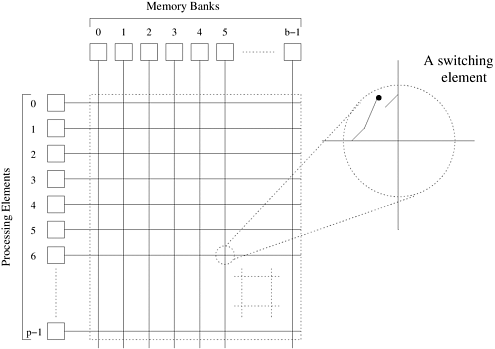

### 2.4.2 并行计算机互连网络

互连网络为处理节点之间或处理器与内存模块之间的数据传输提供了机制。互联网络的黑盒视图由 *n* 个输入和 *m* 个输出组成。输出可能有别于输入，也可能没有。典型的互连网络是利用链路和交换机构建的。链路对应于物理介质，如一组能够传输信息的电线或光纤。影响链路特性的因素有很多。对于基于导电介质的链路，导线之间的电容耦合限制了信号的传播速度。这种电容耦合和信号强度的衰减是链路长度的函数。

互连网络可分为 **静态** 和 **动态** 两种。静态网络由处理节点之间的点对点通信链路组成，也称为 **直接网络（Direct Network）**。而动态网络则是利用交换机和通信链路构建的。通信链路通过交换机动态地相互连接，在处理节点和内存库之间建立路径，动态网络也称为 **间接网络（Indirect Network）**。[图 2.6(a) ](#fig2.6)展示了一个由四个处理元件或节点组成的简单静态网络。每个处理节点通过一个网络接口与其他两个节点相连，形成网状配置。[图 2.6(b)](#fig2.6) 展示了一个由四个节点组成的动态网络，这些节点通过交换机网络与其他节点相连。

    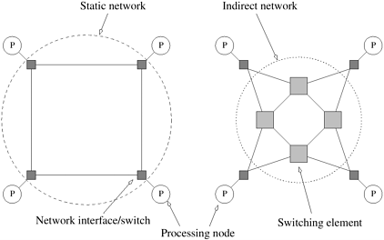
    

        图2.6 互联网络的分类：(a) 静态网络；(b) 动态网络
    

> [!NOTE]
>
> - **直接网络（Direct Network）**：由处理节点之间的点对点通信链路组成，也称为静态网络
> - **间接网络（Indirect Network）**：通信链路通过交换机动态地相互连接，在处理节点和内存库之间建立路径，也称为动态网络

互连网络中的单个交换机由一组输入端口和一组输出端口组成。交换机提供一系列功能。交换机提供的最小功能是从输入端口到输出端口的映射。交换机的端口总数也称为交换机的 **度（Degree）**。交换机还可支持内部缓冲（当请求的输出端口繁忙时）、路由（缓解网络拥塞）和组播（多个端口上的相同输出）。从输入端口到输出端口的映射可通过基于物理横梁、多端口存储器、多路复用器-解多路复用器和多路复用总线的各种机制来实现。交换机的成本受映射硬件、外设硬件和封装成本的影响。映射硬件的成本通常是开关度的平方，外围硬件的成本是开关度的线性增长，而封装成本则是引脚数量的线性增长。

节点与网络之间的连接由网络接口提供。网络接口有输入和输出端口，将数据导入和导出网络。它通常负责对数据进行分组、计算路由信息、缓冲输入和输出数据以匹配网络和处理元件的速度，以及进行错误检查。处理元件与网络之间的接口位置也很重要。传统的网络接口挂在 I/O 总线上，而紧密耦合并行机的接口则挂在内存总线上。由于 I/O 总线通常比内存总线慢，因此后者可以支持更高的带宽。

> [!NOTE]
>
> - **度（Degree）**：交换机的端口总数，*有时候计算节点中网卡的数量也称为Degree*

### 2.4.3 网络拓扑

互联网络中使用了多种网络拓扑结构。这些拓扑结构试图在成本和可扩展性与性能之间进行权衡。虽然纯拓扑结构具有吸引人的数学特性，但在实践中，互连网络往往是本节讨论的纯拓扑结构的组合或修改。

#### 总线网络

总线网络可能是最简单的网络，它由所有节点共用的共享介质组成。总线具有一个理想特性，即网络成本与节点数 *p* 成线性关系。此外，网络中任意两个节点之间的距离是恒定的（$O(1)$）。总线也是在节点间广播信息的理想选择。由于传输介质是共享的，因此与点对点信息传输相比，广播的开销很小。然而，随着节点数量的增加，总线的带宽限制了网络的整体性能。典型的基于总线的机器只能有几十个节点。Sun 企业服务器和基于共享总线的英特尔奔腾多处理器就是这种架构的例子。

在典型的程序中，访问的大部分数据都是节点本地数据，利用这一特性可以降低对总线带宽的需求。对于此类程序，可以为每个节点提供一个缓存。私人数据在节点上缓存，只有远程数据通过总线访问。

- **例2.12 利用缓存减少共享总线带宽**

  [图 2.7(a)](#fig2.7) 展示了 $p$ 个处理器共享一条总线到内存的情况。假设每个处理器访问 $k$ 个数据项，每次数据访问耗时 $t_{cycle}$，则执行时间的下限为 $t_{cycle} \times kp$ 秒。现在考虑[图 2.7(b)](#fig2.7) 的硬件组织结构。假设 $50 \%$ 的内存访问（$0.5k$）是对本地数据的访问。这些本地数据位于处理器的专用内存中。假设访问专用内存的时间与访问全局内存的时间相同，即 $t_{cycle}$。在这种情况下，总执行时间的下限为 $0.5 \times t_{cycle} \times k + 0.5 \times t_{cycle} \times kp$。这里，第一项是访问本地数据的结果，第二项是访问共享数据的结果。不难看出，当 $p$ 变大时，[图 2.7(b)](#fig2.7) 的组织结构会导致下限接近 $0.5 \times t_{cycle} \times kp$。与[图 2.7(a)](#fig2.7) 相比，执行时间下限提高了 $50 \%$。

  

      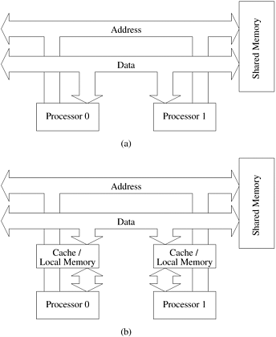
      

          图2.7 基于总线的互连 (a) 无本地缓存；(b) 有本地内存/缓存。
      

  

实际上，共享数据和私有数据的处理方式更为复杂。第 2.4.6 节将简要讨论缓存一致性问题。

> [!NOTE]
>
> **总线网络** 所有的处理器挂载在同一个铜线系统上对内存进行访问，由于共享总线，所有处理器对数据的访问可能存在阻塞，且总线的带宽也会限制对数据访问的性能
>
> - **优点**
>   - 由于所有处理器共享同一个总线，对广播应用的场景支持较好
>   - 总线上任意一个处理器到内存系统的距离都是恒定的$O(1)$
> - **缺点**
>   - 随着节点的数量增加，总线的带宽限制了网络的整体性能
>   - 不同处理器之间对总线资源存在竞争关系
> - **缓存系统**
>   - 缓存系统能有效的降低并行计算对总线系统的带宽依赖
>   - 缓存的引入可能存在缓存一致性问题，在第2.4.6章节会进行讨论

#### 交叉网络

将 $p$ 个处理器连接到 $b$ 个内存库的简单方法是使用交叉条网络。如[图 2.8](#fig2.8) 所示，交叉网络采用网格状的开关或交换节点。横条网络是一种非阻塞网络，即一个处理节点与一个内存库的连接不会阻塞其他处理节点与其他内存库的连接。

    
    

        图2.8 连接 p 个处理器和 b 个内存库的完全无阻塞的交叉网络
    

实现这样一个网络所需的交换节点总数为 $\Theta(pb)$。可以合理地假设内存库 $b$ 的数量至少为 $p$；否则，在任何给定时间内，都会有一些处理节点无法访问任何内存库。因此，随着 $p$ 值的增加，交换网络的复杂性（组件数）也会随着 $\Omega(p^2)$​ 的增加而增加。随着处理节点数量的增加，这种交换复杂性很难在高数据速率下实现。因此，就成本而言，交叉网络的可扩展性并不高。

> [!NOTE]
>
> **交叉网络** 采用网格状的开关或交换节点将$p$个处理器与$b$​个内存进行连接
>
> - **优点**
>   - 结构简单，小规模性能好
>   - 任意一个处理器到内存系统的距离都是$O(1)$
> - **缺点**
>   - 节点数增加的情况下网络的复杂度也会增加，所需的交换节点总数也会增加
>   - 在成本角度上考虑，可扩展性不高

#### 多级网络

交叉互连网络在性能方面是可扩展的，但在成本方面是不可扩展的。相反，共享总线网络在成本方面是可扩展的，但在性能方面是不可扩展的。在这两个极端之间有一类中间网络，称为 **多级互连网络（Multistage Interconnection）**。就性能而言，它比总线网络更具可扩展性，而就成本而言，它比交叉网络更具可扩展性。

> [!NOTE]
>
> **多级互连网络（Multistage Interconnection）** 弥补了总线网络在性能方面不可扩展的缺点和交叉网络在成本上不可扩展的缺点，它在成本和性能上都具有扩展性。

由 $p$ 个处理节点和 $b$ 个内存库组成的多级网络的一般示意图如[图 2.9 ](#fig2.9)所示。常用的多级连接网络是 **Omega网络（Omega Network）**。该网络由 $\log p$ 级组成，其中 $p$ 是输入（处理节点）和输出（存储库）的数量。Omega 网络的每一级都由连接 $p$ 个输入和 $p$ 个输出的互连模式组成；如果以下条件为真，则输入 $i$ 和输出 $j$ 之间存在连接：

$$
j = \left\{
\begin{array} \\
2i, & 0 \le i \le p/2-1 \\
2i+1-p, & p/2 \le i \le p-1\\
\end{array}
\right.
$$

    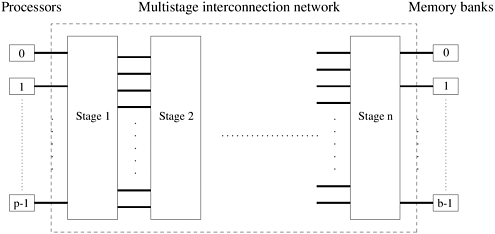
    

        图2.9 典型的多级互连网络示意图
    

上式表示对 $i$ 的二进制表示进行左旋转操作，从而得到 $j$。[图 2.10](#fig2.10) 显示了8个输入和输出的 **完美随机（Perfect Shuffle）** 互联模式。在Omega网络的每个阶段，完美随机互联模式都会输入一组 $p/2$​ 开关或开关节点。每个开关处于两种连接模式之一。在其中一种模式下，输入端直通输出端，如[图 2.11(a)](#fig2.11)所示。这就是所谓的 **直通连接（Pass-Through）**。在另一种模式中，开关节点的输入被交叉后送出，如[图 2.11(b)](#fig2.11)所示。这就是所谓的 **交叉连接（Cross-Over）**。

    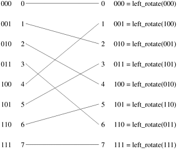
    

        图2.10 8个输入和输出的完美随机互连
    

> [!NOTE]
>
> - Omega网络的输入$i$和输出$j$之间的关系如上式，它的本质是对$i$的二进制数据进行左旋转操作
> - **直通连接（Pass-Through）** 输入与输出直接连接，例如[图2.10](#fig2.10)的`000 <-> 000`和`111 <-> 111`
> - **交叉连接（Cross-Over）** 输入与输出之间存在交叉的关系

    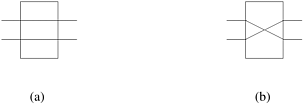
    

        图2.11 2 x 2 交换机的两种交换配置：(a)直通；(b)交叉
    

Omega网络有 $p/2 \times \log p$ 个交换节点，其成本按 $\Theta(p \log p)$ 增长。需要注意的是，这一成本小于完整交叉条网络的 $\Theta(p^2)$ 成本。[图 2.12 ](#fig2.12)显示了八个处理器（左侧二进制数表示）和八个内存库（右侧二进制数表示）的Omega网络。Omega网络中的数据路由是通过一个简单的方案实现的。假设 $s$ 是一个处理器的二进制表示，该处理器需要将一些数据写入内存库 $t$。如果 $s$ 和 $t$ 的最有效位相同，则数据由交换机以直通模式路由。如果这些位不同，则数据以交叉模式路由。在下一个切换阶段，使用下一个最显著位重复这一方案。遍历对数 $p$ 个阶段时，将使用 $s$ 和 $t$ 二进制表示中的所有对数 $p$ 位。

    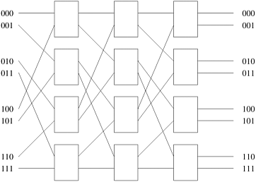
    

        图2.12 一个完整的Omega网络连接8个输入和8个输出
    

> [!NOTE]
>
> 1. Omega网络的每层有$p$个输出和输出，每层有$p / 2$个交换节点，一共有$\log p$​​层，每一层的每个交换节点有直通和交叉两种模式，可以根据连同需要进行切换
> 2. 确定第$i$个输入与第$j$​个输出的关系，每一层执行一次输入的二进制左旋转操作后连接到输出
>    1. 例如输入为0，输出为4，则进行逆向推导：
>    2. 第三层：输出为4，输入应该为2
>    3. 第二层：输出为2，输入应该为1
>    4. 第一层：输出为1，输入应该为0
>    5. 最终将输入的0和输出的4连接在一起
> 3. 在确定了输入与输出之间的连线后根据切换节点的状态对输入和输出进行连接
>    - 每一层都有$p/2$个交换节点
>    - 交换节点的输入和输出连接是固定的

[图 2.13](#fig2.13) 显示了从处理器 2（010）到内存库 7（111）以及从处理器 6（110）到内存库 4（100）的Omega网络数据路由。该图还说明了该网络的一个重要特性。当处理器 2 (010) 与存储器组 7 (111) 通信时，会阻断处理器 6 (110) 到存储器组 4 (100) 的路径。两条通信路径都使用通信链路 *AB*。因此，在Omega网络中，一个处理器对内存库的访问可能会阻止另一个处理器对另一个内存库的访问。具有这种特性的网络被称为 **阻塞网络（Blocking Networks）**。

    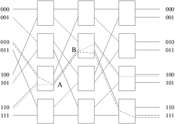
    

        图2.13 Omega网络阻塞示例：其中一条报文（010 至 111 或 110 至 100）在链路 AB 上被阻塞
    

> [!NOTE]
>
> Omega网络是一种**阻塞网络（Blocking Networks）**，当不同的处理器访问不同的数据时可能存在阻塞的情况发生，这也是多级网络（Omega网络）的缺点之一

#### 全连接网络

在 **完全连接的网络（Completely-Connected Network）** 中，每个节点都与网络中的其他节点有直接的通信连接。[图 2.14(a)](#fig2.14) 展示了一个由八个节点组成的完全连接网络。这个网络非常理想，因为节点之间存在通信链路，一个节点只需一步就能向另一个节点发送信息。完全连接网络是交叉交换网络的静态网络，因为在这两种网络中，任何输入/输出对之间的通信都不会阻碍其他任何输入/输出对之间的通信。

    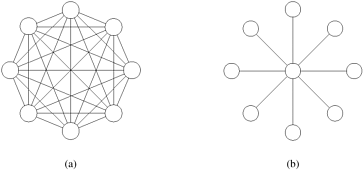
    

        图2.14 (a)由8个节点组成的完全连接网络；(b)由9个节点组成的星形连接网络
    

> [!NOTE]
>
> - **完全连接的网络（Completely-Connected Network）** 每个节点都与网络中的其他节点有直接的通信连接
> - **优点**
>   - 无阻塞网络且任意两点的距离为$O(1)$
> - **缺点**
>   - 链接数量过大，节点数量多的条件下难以实现

#### 星形连接网络

在 **星形连接网络（Star-Connected Network）** 中，一台处理器充当中央处理器，其他每个处理器都有一条通信链路与该处理器相连。[图 2.14(b) ](#fig2.14)显示了一个由9个处理器组成的星形连接网络。星形连接网络与总线型网络类似。任何一对处理器之间的通信都要经过中央处理器，就像共享总线构成了总线型网络中所有通信的媒介一样。中央处理器是星型拓扑结构中的瓶颈。

> [!NOTE]
>
> - **星形连接网络（Star-Connected Network）** 一台处理器充当中央处理器。其他每个处理器都有一条通信链路与该处理器相连
> - **优点**
>   - 结构简单，比较容易实现
> - **缺点**
>   - 中央处理器的转发能力（带宽）成为了瓶颈

#### 线性阵列、网格和k-d网格

由于完全连接的网络中存在大量链接，因此通常使用较稀疏的网络来构建并行计算机。此类网络的一个系列横跨线性阵列和超立方体空间。**线性阵列（Linear Arrays）** 是一种静态网络，其中每个节点（除了两端的两个节点）都有两个邻居，左右各一个。线性阵列（[图 2.15(a)](#fig2.15)）的一个简单扩展是环或一维环（[图 2.15(b)](#fig2.15)）。环形结构在线性阵列的两端之间有环绕连接。在这种情况下，每个节点都有两个邻居。

    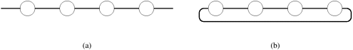
    

        图2.15 线性阵列：(a)无环绕连接；(b)有环绕连接
    

> [!NOTE]
>
> - **线性阵列（Linear Arrays）** 一种静态网络，每个节点（除了两端的两个节点）都有左右两个邻居
> - 如果线性阵列的首尾相连，则构成了有环线性阵列，否则是无环线性阵列

[图 2.16(a)](#fig2.16) 所示的二维 **网格（Mesh）** 是线性数组向二维的扩展。每个维度都有$\sqrt{p}$个节点，节点由两个元组 $(i, j)$ 标识。每个节点（外围节点除外）都与其他四个节点相连，这些节点的索引在任意维度上都相差一个。二维网格具有可在二维空间中布局的特性，因此从布线的角度来看很有吸引力。此外，各种规则结构的计算都能非常自然地映射到二维网格上。因此，二维网格经常被用作并行机器中的互连。如[图 2.16(b)](#fig2.16)所示，二维网格可通过环绕链接形成二维环。如[图 2.16(c)](#fig2.16)所示，三维立方体是二维网格向三维的扩展。三维立方体中的每个节点元素（外围的节点元素除外）都与其他六个节点相连，三个维度各两个。通常在并行计算机上执行的各种物理模拟（如三维天气建模、结构建模等）都可以自然地映射到三维网络拓扑结构中。因此，三维立方体常用于并行计算机的互连网络中（如 Cray T3E）。

    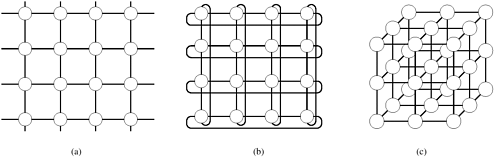
    

        图2.16 二维和三维网格：(a)无环二维网格；(b)有环绕二维网格；(c)无环三维网格
    

> [!NOTE]
>
> - 二维 **网格（Mesh）** 是线性数组向二维的扩展
> - 如果二维网格的端点相连，则构成了有环的二维网格

> [!TIP]
>
> **无环二维网格 vs. 交叉网络**
>
>  - 无环二维网格是网格状的，网格的每个交叉点都是一个处理器
>  - 交叉网络也是网格状的，网格的每个交叉点是交换节点，处理器位于网格的其中一条边上

一般的k-d网格是指由 $d$ 个维度组成的拓扑结构，每个维度有 $k$ 个节点。正如线性阵列构成了k-d网格家族的一个极端，另一个极端则由一种名为超立方体的有趣拓扑构成。超立方体拓扑结构每个维度有两个节点，维数为$\log p$。超立方体的构造如[图 2.17](#fig2.17) 所示。零维超立方由 $2^0$ 个节点组成。一个一维超立方体由两个零维超立方体连接而成。一个有四个节点的二维超立方体是由两个一维超立方体通过连接相应的节点构造而成的。一般来说，一个 *d* 维超立方体是由两个 $(d - 1)$ 维超立方体的相应节点连接而成的。[图 2.17](#fig2.17) 展示了四维超立方体中最多 $16$​ 个节点的情况。

> [!NOTE]
>
> - **k-d网格** 是指由 $d$ 个维度组成的拓扑结构，每个维度有 $k$ 个节点
> - **特殊的k-d网格 1** 线性阵列：线性阵列是一个$k$个节点的$d=1$的k-d网格
> - **特殊的k-d网格 2** 超立方体：超立方体结构是每个维度有$k=2$个节点的$d$维k-d网格

    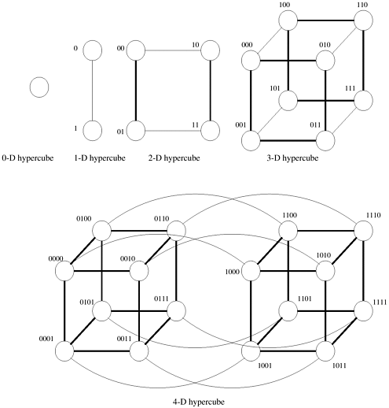
    

        图2.17 从低维度超立方体构建超立方体
    

为超立方体中的节点导出一个编号方案是非常有用的。从超立方体的构造中可以推导出一个简单的编号方案。如[图 2.17](#fig2.7) 所示，如果我们有两个由 $p/2$ 个节点组成的子立方体的编号，我们可以通过在其中一个子立方体的标签前加上 "$0$"，在另一个子立方体的标签前加上 "$1$"，来推导出由 $p$ 个节点组成的立方体的编号方案。这种编号方案有一个有用的特性，即两个节点之间的最小距离由两个标签中不同的比特数给出。例如，标记为 $0110$ 和 $0101$​​ 的节点相距两个链路，因为它们在后两个比特位置上不同。这一特性有助于为超立方架构推导出许多并行算法。

> [!NOTE]
>
> **k-d网格的编号**
>
> - 为了方便后续针对k-d网格节点的描述，需要使用特定的编号格式描述节点的信息
> - $d$个维度使用$d$个数字描述一个节点
> - 由于每个维度只有2个节点，因此使用“$0$”表示第一个节点，使用“$1$”表示第二个节点
> - 数字的顺序表示维度的顺序，即第一个数字表示第一个维度
> - 相同维度的节点对应位置的数字相同

> [!NOTE]
>
> - **k-d网格的优点**
>   - 比全连接网络稀疏
> - **k-d网格的缺点**
>   - 结构比较复杂，一般是静态网络

#### 树状网络

**树状网络（Tree Network）** 是指任意一对节点之间只有一条路径的网络，线性阵列和星形连接网络都是树状网络的特例。[图 2.18](#fig2.18) 显示了基于完整二叉树的网络。静态树状网络的每个节点都有一个处理元件（[图 2.18(a)](#fig2.18)）。树状网络也有动态网络。在动态树状网络中，中间层的节点是切换节点，叶节点是处理元件（[图 2.18(b)](#fig2.18)）。

    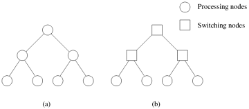
    

        图2.18 完整的二叉树网络：(a)静态树网络；(b)动态树网络
    

要在树中路由信息，源节点会将信息向上发送，直到到达包含源节点和目的节点的最小子树根部的节点。然后，信息沿着树的方向向目的地节点发送。

> [!NOTE]
>
> - **树状网络（Tree Network）** 是指任意一对节点之间只有一条路径的网络，**特殊的树状网络** 有线性阵列、星形网络
> - **优点**
>   - 结构简单
>   - 既可以是静态网络也可以是动态网络
> - **缺点**
>   - 较高层存在通信瓶颈

树状网络的较高层存在通信瓶颈。例如，当节点左侧子树的许多节点与右侧子树的节点通信时，根节点必须处理所有信息。在动态树状网络中，可以通过增加通信链路的数量和切换更靠近根节点的节点来缓解这一问题，这种网络也称为 **胖树（Fat Tree）**，如[图 2.19 ](#fig2.19)所示。

    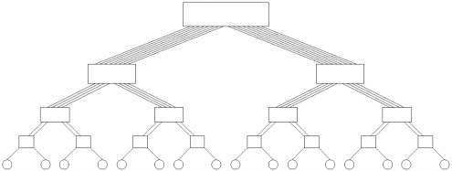
    

        图2.19 由 16 个处理节点组成的胖树网络
    

> [!NOTE]
>
> 为了解决高层的树状网络存在的通信瓶颈，可以增加通信链路的数量和切换更靠近根节点的节点来缓解这一问题，这种网络也称为 **胖树（Fat Tree）**

### 2.4.4 评估静态互连网络

我们现在讨论用于描述静态互连网络成本和性能的各种标准。我们将使用这些标准来评估上一小节介绍的静态网络。

**直径（Diameter）** 网络的直径是网络中任意两个处理节点之间的最大距离。两个处理节点之间的距离定义为它们之间的最短路径（以链接数计）。完全连接网络的直径为 $1$，星形连接网络的直径为 $2$。环形网络的直径为 $\lfloor p/2 \rfloor$。无环绕连接的二维网格的直径为对角线上两个节点的直径 $2(\sqrt{p}-1)$，环绕网格的直径为 $2 \lfloor \sqrt{p}/2 \rfloor$ 。超立方体连接网络的直径为 $\log p$，因为两个节点标签最多相差 $\log p$ 个位置。完整二叉树的直径为 $2 \log((p+1)/2)$，因为两个通信节点可能分别位于根节点的不同子树中，信息可能要一直传到根节点，然后再传到另一个子树。

**连通性（Connectivity）** 网络的连通性是衡量两个处理节点之间路径多寡的标准。具有高连接性的网络是理想的，因为它能减少对通信资源的争夺。连通性的一个衡量标准是，要将网络分成两个互不相连的网络，必须从网络中移除的弧的最小数目，这就是网络的 **弧连通性（Arc Connectivity）**。对于线性阵列以及树形和星形网络，弧连通性为 $1$。对于环形和无环绕的二维网格，弧连通性为 $2$；对于二维环绕网格，弧连通性为 $4$；对于 *d* 维超立方体，弧连通性为 *d*。

**对分宽度和对分带宽（Bisection Width and Bisection Bandwidth）** 网络的 **对分宽度（Bisection Width）** 是指将网络分成相等的两半所必须移除的通信链路的最小数目。环网的分段宽度为 $2$，因为任何对分都只跨越两个通信链路。同样，不带环绕连接的二维 *p* 节点网格的分段宽度为 $\sqrt{p}$，带环绕连接的二维 *p* 节点网格的分段宽度为 $2\sqrt{p}$。树形和星形的对分宽度为 $1$，而由 p 个节点组成的完全连接网络的分段宽度为 $p^2/4$。超立方体的分段宽度可以从其构造中推导出来。我们通过连接两个 $(d - 1)$ 维超立方体的相应链接来构建一个 *d* 维超立方体。由于每个子立方体包含 $2^{(d-1)}$ 或 $p/2$ 个节点，因此至少有 $p/2$ 条通信链路必须穿过超立方体的任何分区，将其分成两个子立方体。

连接两个节点的链路可同时通信的数量称为 **信道宽度（Channel Width）**。信道宽度等于每个通信链路中的物理线数。单根物理线缆传输比特的峰值速率称为 **信道速率（Channel Rate）**。通信链路两端数据通信的峰值速率称为 **信道带宽（Channel Bandwidth）**，信道带宽是信道速率和信道宽度的乘积。

网络的 **对分带宽（Bisection Bandwidth）** 被定义为网络任何两部分之间允许的最小通信量。它是对分宽度与信道带宽的乘积。网络的对分带宽有时也称为 **交叉带宽（Crosssection Bandwidth）**。

**成本（Cost）** 评估网络成本的标准有很多。定义网络成本的一种方法是网络所需的通信链路数或电线数。线性阵列和树状网络只需 $p-1$ 个链接来连接 $p$ 个节点。一个 *d* 维环绕网格有 $dp$ 个链接。超立方体连接网络有 $(p \log p)/2$​​个链接。

> [!NOTE]
>
> - **直径（Diameter）** 网络的直径是网络中任意两个处理节点之间的最大距离
>
> - **连通性（Connectivity）** 网络的连通性是衡量两个处理节点之间路径多寡的标准
>
>   - **弧连通性（Arc Connectivity）** 将网络分成两个互不相连的网络，必须从网络中移除的弧的最小数目
>
> - **对分宽度（Bisection Width）** 是指将网络分成相等的两半所必须移除的通信链路的最小数目
>
> - **对分带宽（Bisection Bandwidth）** 网络任何两部分之间允许的最小通信量，它是对分宽度与信道带宽的乘积，有时也称为 **交叉带宽（Crosssection Bandwidth）**
>
>   - **信道宽度（Channel Width）** 连接两个节点的链路可同时通信的数量，信道宽度等于每个通信链路中的物理线数
>   - **信道速率（Channel Rate）** 单根物理线缆传输比特的峰值速率
>   - **信道带宽（Channel Bandwidth）** 通信链路两端数据通信的峰值速率，是信道速率和信道宽度的乘积
> - **成本（Cost）** 评估网络成本的标准有很多，例如：网络所需的通信链路数或电线数

网络的对分带宽也可用作成本的衡量标准，因为它提供了二维包装中面积或三维包装中体积的下限。如果网络的对分带宽为 $w$，则二维包装的面积下限为 $\Theta(w^2)$，三维包装的体积下限为 $\Theta(w^{3/2})$。根据这一标准，超立方体和完全连接网络比其他网络更昂贵。

表2.1 连接 p 个节点的各种静态网络拓扑结构的特点汇总

|     网络      |             直径              |  对分宽度   | 弧连通性 | 成本（链接数）  |
| :-----------: | :---------------------------: | :---------: | :------: | :-------------: |
|    全连接     |              $1$              |   $p^2/4$   |  $p-1$   |   $p(p-1)/2$    |
|   星形连接    |              $2$              |     $1$     |   $1$    |      $p-1$      |
|  完全二叉树   |       $2 \log((p+1)/2)$       |     $1$     |   $1$    |      $p-1$      |
|   线性阵列    |             $p-1$             |     $1$     |   $1$    |      $p-1$      |
| 无环二维网络  |        $2(\sqrt{p}-1)$        | $\sqrt{p}$  |   $2$    | $2(p-\sqrt{p})$ |
| 有环二维网络  | $2\lfloor \sqrt{p}/2 \rfloor$ | $2\sqrt{p}$ |   $4$    |      $2p$       |
|   超立方体    |           $\log p$            |    $p/2$    | $\log p$ | $(p \log p)/2$  |
| 有环k-d立方体 |    $d\lfloor k/2 \rfloor$     | $2k^{d-1}$  |   $2d$   |      $dp$       |

我们在[表 2.1](#table2.1) 中总结了各种静态网络的特点，其中突出强调了各种性价比权衡。

### 2.4.5 评估动态互连网络

动态网络的一些评估指标源自静态网络的相应指标。由于经过交换机的信息会产生开销，因此除了处理节点外，将每个交换机视为网络中的一个节点也是合乎逻辑的。网络直径现在可以定义为网络中任意两个节点之间的最大距离。这表示信息在选定的一对节点之间传输时将遇到的最大延迟。实际上，我们希望该指标是任意两个处理节点之间的最大距离；不过，对于所有相关网络而言，这等同于任意（处理或交换）一对节点之间的最大距离。

动态网络的连通性可以用 **点连通性（Node Connectivity）** 或 **边连通性（Edge Connectivity）** 来定义。节点连通性是将网络分割成两个部分所必须失效（从网络中移除）的最小节点数。和以前一样，我们应该只考虑切换节点（而不是所有节点）。不过，考虑所有节点可以很好地近似动态网络中路径的多重性。网络的弧连通性可以类似地定义为：要将网络分割成两个无法到达的部分，必须删除的最少边数。

> [!NOTE]
>
> 动态网络的一些评估指标源自静态网络的相应指标
>
> 由于经过交换机的信息会产生开销，因此可以将每个交换机视为网络中的一个节点
>
> - **连通性（Connectivity）** 将网络分割成两个部分所必须移除的最小节点数（只考虑交换节点）
> - 连通性可以用 **点连通性（Node Connectivity）** 或 **边连通性（Edge Connectivity）** 来定义

动态网络的对分宽度必须比直径和连通性定义得更精确。就对分宽度而言，我们考虑将 *p* 个处理节点划分为两个相等部分的任何可能情况。请注意，这并不限制交换节点的划分。对于每个这样的分区，我们选择一个开关节点的诱导分区，使穿过该分区的边的数量最小。任何此类分区的最小边数就是动态网络的分段宽度。另一种直观的分段宽度思维方式是，必须从网络中移除最少数量的边，才能将网络划分为处理节点数量相同的两半。我们在下面的示例中进一步说明这一概念：

- ##### **例2.13 动态网络的对分宽度**

  请看[图 2.20](#fig2.20) 所示的网络。我们在此展示了 *A*、*B* 和 *C* 三个分段，每个分段都将网络划分为两组，每组有两个处理节点。请注意，这些分区并不一定要将网络节点平均分配。在本例中，每个分区都会产生四条切边。因此，我们可以得出结论：该图的分割宽度为 $4$。

  

      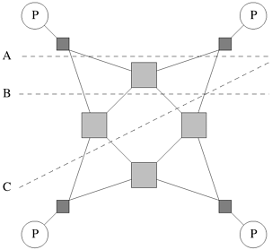
      

          图2.20 动态网络的分割宽度是通过检查处理节点的各种等分区，并选择穿越该分区的最小边数计算得出的。在本例中，每个分区产生的边切为四条，因此，该图的分段宽度为4
      

  

与静态网络一样，动态网络的成本由链路成本和交换机成本决定。在典型的动态网络中，交换机的阶数是恒定的。因此，链路和交换机的数量近似相同。此外，在典型网络中，交换机成本超过链路成本。因此，动态网络的成本通常由网络中交换节点的数量决定。

> [!NOTE]
>
> 上图中`A`、`B`、`C`三种分割方法都可以将网络分成互补通信的两部分，但无论哪种分割方法，分割后的两边都会产生4条切边，因此上图的对分宽度为4

[表 2.2](#table2.2) 总结了各种动态网络的特点：

表2.2 连接 p 个处理节点的各种动态网络拓扑结构的特点概述

|   网络    |    直径    | 对分宽度 | 弧连通性 | 成本（链接数） |
| :-------: | :--------: | :------: | :------: | :------------: |
| 交叉网络  |    $1$     |   $p$    |   $1$    |     $p^2$      |
| Omega网络 |  $\log p$  |  $p/2$   |   $2$    |     $p/2$      |
|  动态树   | $2 \log p$ |   $1$    |   $2$    |     $p-1$      |

### 2.4.6 多处理器系统的缓存一致性

虽然互连网络提供了基本的消息（数据）通信机制，但在共享地址空间计算机中，还需要额外的硬件来保持多个数据副本之间的一致性。具体来说，如果存在两个数据副本（在不同的缓存/内存元件中），我们如何确保不同的处理器以符合预定义语义的方式对这些副本进行操作？

与单处理器系统相比，多处理器系统中保持缓存一致性的问题要复杂得多。这是因为除了单处理器系统中的多个副本外，还可能有多个处理器在修改这些副本。如[图 2.21](#fig2.21) 所示的一个简单场景。两个处理器 $P_0$ 和 $P_1$ 通过共享总线连接到一个全局可访问内存。两个处理器都加载了同一个变量。现在该变量有三个副本。一致性机制现在必须确保在这些副本上执行的所有操作都是可串行化的（即存在某种与并行时间表相对应的串行指令执行顺序）。当处理器更改其变量副本的值时，必须发生以下两种情况之一：其他副本必须失效，或者其他副本必须更新。如果做不到这一点，其他处理器可能会使用变量的错误（陈旧）值工作。这两个协议被称为失效协议和更新协议，如[图 2.21(a)](#fig2.21)和[图 2.21(b)](#fig2.21)所示。

    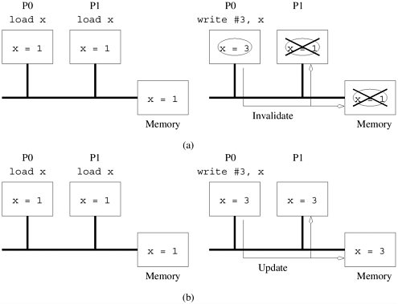
    

        图2.21 多处理器系统的缓存一致性：(a)失效协议；(b)共享变量的更新协议
    

> [!NOTE]
>
> 引入高速缓存可以有效的降低并行计算系统对内存带宽的依赖，但是同样会引入缓存一致性问题：
>
> - **问题1** （如何保持同步）当多个处理器同时读取相同地址的数据到本地的缓存中，若任一处理器修改了该值，如何保证所有处理器缓存的数据一致，且确保该值为更新后的值

在更新协议中，每当写入一个数据项，系统中的所有副本都会被更新。因此，如果一个处理器只读取一次数据项而从不使用它，那么其他处理器对该数据项的后续更新就会造成过多的源延迟和网络带宽开销。另一方面，在这种情况下，失效协议会在远程处理器的第一次更新中使数据项失效，因此无需对该副本执行后续更新。

影响这些协议性能的另一个重要因素是 **错误共享（False Sharing）**。错误共享指的是不同处理器更新同一高速缓存行的不同部分。因此，虽然更新不是在共享变量上进行的，但系统并不能检测到这一点。在失效协议中，当一个处理器更新其缓存行的一部分时，该缓存行的其他副本就会失效。当其他处理器试图更新其缓存行部分时，必须从远程处理器获取该行。不难看出，虚假共享会导致高速缓存行在不同处理器之间 "乒乓 "作响。在更新协议中，这种情况稍好一些，因为所有读取操作都可以在本地执行，而写入操作必须更新。这就节省了一个无效操作，否则就会浪费。

失效和更新方案之间的权衡是通信开销（更新）和空闲（失效中的停滞）之间的经典权衡。目前的高速缓存一致性机器通常依赖于失效协议。因此，我们在讨论多处理器高速缓存系统的其余部分时，将假定使用失效协议。

> [!NOTE]
>
> - **问题2** （如何平衡开销）如果当任一个处理器修改某一值后同步更新到所有副本则可能会造成无效的开销和延迟（因为部分处理器读取一次后并不会再次使用该值）
> - **问题3** （如何有效共享）不同的处理器更新同一缓存区块的不同部分造成指定区域的缓存不停的刷新，进而导致性能下降称为 **错误共享（False Sharing）**

使用 **无效协议保持一致性（Maintaining Coherence Using Invalidate Protocols）** 单一数据项的多个副本可通过跟踪副本数量和每个副本的状态来保持一致。我们在此讨论与数据项相关的一组可能状态，以及触发这些状态之间转换的事件。请注意，这组状态和转换并不是唯一的。我们还可以定义其他状态和相关的转换。

让我们重温一下[图 2.21](#fig2.21) 中的示例。最初，变量 *x* 位于全局内存中。两个处理器执行的第一步都是对该变量进行加载操作。此时，变量的状态可以说是 **共享的（Shared）**，因为它被多个处理器共享。当处理器 $P_0$ 对该变量执行存储操作时，它会将该变量的所有其他副本标记为无效。它还必须将自己的副本标记为已修改或已脏。这样做是为了确保其他处理器对该变量的所有后续访问都由处理器 $P_0$ 而不是内存来完成。此时，处理器 $P_1$ 对 *x* 执行了另一个加载操作，处理器 $P_1$ 尝试获取该变量，由于处理器 $P_0$ 已将该变量标记为 **Dirty**，因此处理器 $P_0$ 为该请求提供服务。处理器 $P_1$ 和全局存储器中该变量的副本被更新，变量重新进入共享状态。因此，在这个简单的模型中，缓存行会经历 **共享（Shared）**、**无效（Invalid）** 和 **脏（Dirty）** 三种状态。

简单三态协议的完整状态图如[图 2.22](#fig2.22) 所示。实线表示处理器的操作，虚线表示一致性操作。例如，当处理器对无效数据块执行读操作时，该数据块将被获取，并从无效数据块过渡到共享数据块。同样，如果处理器对共享区块执行写操作，一致性协议会在该区块上传播 `C_write`（一致性写）。这将触发所有其他区块从共享到无效的转换。

    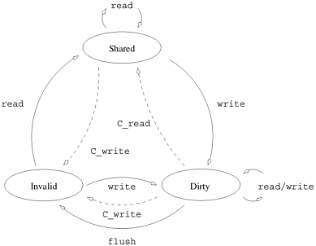
    

        图2.22 简单三态一致性协议的状态图
    

> [!NOTE]
>
> 引入 **无效协议保持一致性（Maintaining Coherence Using Invalidate Protocols）** 解决以上三个问题，缓存中的数据在以上`Shared`、`Invalid`、`Dirty`三个状态中相互切换
>
> - **Shared** 所有处理器的缓存一致，与内存一致，未发生改变
> - **Invalid** 其中一个缓存发生了修改，其他处理器的缓存数据会被标记未Invalid
> - **Dirty** 其中一个缓存发生了修改，本地缓存会被标记为Dirty
> - 当本地变为Dirty后，其他处理器访问Invalid数据会读取Dirty数据，并更新到内存中，此后所有数据的状态均变为Shared

- ##### **例2.14 使用简单的三态协议保持一致性**

  以处理器 $P_0$ 和 $P_1$ 正在执行的两个程序段为例，如[图 2.23](#fig2.23) 所示。系统由处理器 $P_0$ 和 $P_1$ 的本地存储器（或高速缓存）以及全局存储器组成。本例中假设的三态协议与[图 2.22](#fig2.22) 所示的状态图相对应。该系统中的缓存线可以是Shared、Invalid或Dirty的。假定每个数据项（变量）位于不同的高速缓存行上。起初，两个变量 *x* 和 *y* 被标记为脏变量，全局存储器中只有这两个变量的副本。[图 2.23](#fig2.23) 展示了每条指令执行时的状态转换和变量副本的值。

  

      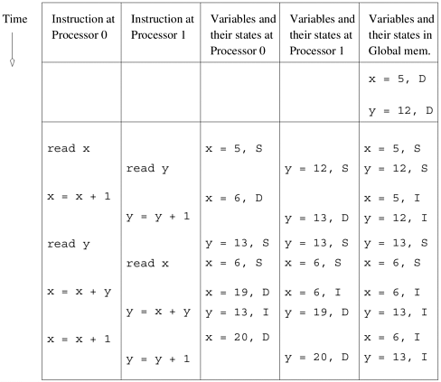
      

          图2.23 使用第2.4.6节中讨论的简单三态一致性协议执行并行程序的示例
      

  

一致性协议的执行可以使用各种硬件机制 - Snoopy系统、基于目录的系统或它们的组合。

#### Snoopy缓存系统

Snoopy缓存通常与基于广播互连网络（如总线或环网）的多处理器系统相关联。在这种系统中，所有处理器都会Snoopy（监控）总线上的事务。这样，处理器就可以对其缓存块进行状态转换。[图 2.24](#fig2.24) 展示了一个典型的基于窥探总线的系统。每个处理器的高速缓存都有一组与之相关的标签位，用于确定高速缓存块的状态。这些标签根据与一致性协议相关的状态图进行更新。例如，当窥探硬件检测到对其拥有脏拷贝的缓存块发出了读取请求时，就会断言对总线的控制并输出数据。同样，当窥探硬件检测到对其拥有副本的缓存块进行了写操作时，就会使缓存块失效。其他状态转换也是以这种方式在本地完成的。

    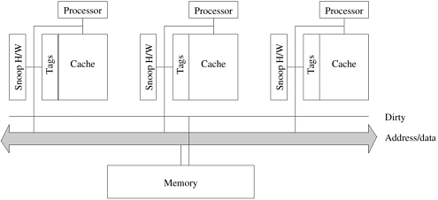
    

        图2.24 一个简单的基于Snoopy总线的缓存一致性系统
    

> [!NOTE]
>
> Snoopy缓存通常与基于广播互连网络（如总线或环网）的多处理器系统相关联，在这种系统中，所有处理器都会Snoopy（监控）总线上的事务。

**Snoopy缓存的性能** Snoopy协议已被广泛研究并用于商业系统。这主要是因为它们简单易用，而且现有的基于总线的系统可以升级以适应Snoopy协议。Snoopy系统的性能提升源于这样一个事实，即如果不同的处理器对不同的数据项进行操作，这些数据项可以被缓存起来。一旦这些数据项被标记为 "Dirty"，所有后续操作都可以在本地缓存中执行，而不会产生外部流量。同样，如果一个数据项被多个处理器读取，它就会过渡到缓存中的共享状态，所有后续读取操作都会变成本地操作。在这两种情况下，一致性协议都不会增加任何开销。另一方面，如果多个处理器读取和更新同一个数据项，就会产生跨处理器的一致性函数。由于共享总线的带宽有限，在单位时间内只能执行一定数量的一致性操作。这就成为基于Snoopy总线的系统的一个基本瓶颈。

Snoopy协议与基于广播网络（如总线）的多计算机密切相关。这是因为所有处理器都必须窥探所有信息。显然，将一个处理器的所有内存操作广播给所有处理器并不是一个可扩展的解决方案。解决这个问题的一个显而易见的办法是，只向必须参与操作的处理器（即拥有相关数据副本的处理器）传播一致性操作。这种解决方案要求我们跟踪哪些处理器拥有各种数据项的副本，以及这些数据项的相关状态信息。这些信息存储在一个目录中，基于这些信息的一致性机制被称为基于目录的系统。

> [!NOTE]
>
> **Snoopy缓存系统的瓶颈**：由于共享总线的带宽有限，在单位时间内只能执行一定数量的一致性操作

#### 基于目录的系统

考虑一个简单的系统，在它的全局内存中增加一个目录，该目录维护着代表缓存块和缓存块所在处理器的位图（[图 2.25](#fig2.25)）。这些位图条目有时被称为 **存在位（Presence Bits）**。如前所述，我们假定采用三状态协议，即 **Invalid状态**、**Dirty状态** 和 **Shared状态**。基于目录方案的性能关键在于一个简单的观察结果，即只有持有特定区块（或正在读取该区块）的处理器才会参与一致性操作引起的状态转换。需要注意的是，处理器读取、写入或刷新（从缓存中删除一行）可能会触发其他状态转换，但这些转换可在本地处理，操作反映在目录中的存在位和状态中。

    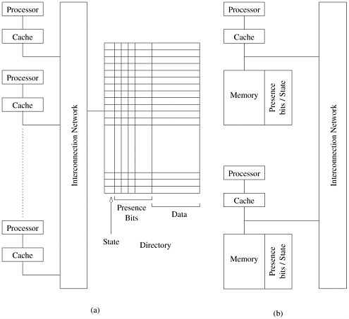
    

        图2.25 典型的基于目录的系统架构：(a)集中式目录；(b)分布式目录。
    

重温[图 2.21](#fig2.21) 中的代码段，当处理器 $P_0$ 和 $P_1$ 访问与变量 *x* 对应的块时，块的状态变为共享，存在位更新以表示处理器 $P_0$ 和 $P_1$ 共享该块。当 $P_0$ 对变量执行存储操作时，目录中的状态变为 Dirty，$P_1$ 的存在位被重置。处理器 $P_0$ 对该变量执行的所有后续操作均可在本地进行。如果其他处理器读取该值，目录会注意到 Dirty 标记，并使用存在位将请求导向相应的处理器。处理器 $P_0$​ 会更新内存中的数据块，并将其发送给提出请求的处理器。存在位会被修改以反映这一情况，状态也会转换为共享状态。

> [!NOTE]
>
> 使用 **存在位（Presence Bits）** 储存和管理缓存映射信息，根据存在位信息只更新对应处理器的缓存信息

**基于目录的方案的性能** 与Snoopy协议一样，如果不同的处理器对不同的数据块进行操作，这些数据块就会在各自的缓存中变脏，第一次操作之后的所有操作都可以在本地执行。此外，如果多个处理器读取（但不更新）一个数据块，该数据块会以共享状态复制到缓存中，随后的读取操作不会触发任何一致性开销。

当多个处理器试图更新同一个数据项时，就会启动一致性操作。在这种情况下，除了必要的数据移动外，一致性操作还会以传播状态更新（失效或更新）和从目录中生成状态信息的形式增加开销。前者以通信开销的形式出现，后者则增加了争用。通信开销是需要状态更新的处理器数量和传播状态信息的算法的函数。争用开销在本质上更为根本。由于目录位于内存中，而内存系统在单位时间内只能处理一定数量的读/写操作，因此状态更新的数量最终会受到目录的限制。如果并行程序需要大量一致性操作（大量读/写共享数据块），目录将最终限制其并行性能。

最后，从成本的角度来看，随着处理器数量的增加，存储目录所需的内存容量本身就可能成为瓶颈。回想一下，目录大小的增长为 $O(mp)$，其中 *m* 是内存块的数量，*p* 是处理器的数量。一种解决方案是增大内存块（从而在给定内存大小的情况下减少 *m*）。然而，这会增加其他开销，如错误共享，即两个处理器更新程序中不同的数据项，但数据项恰好位于同一内存块中。这种现象将在第 7 章中详细讨论。

由于目录是争论的中心点，自然要把保持一致性的任务分解给多个处理器。其基本原理是，假设内存块在处理器之间进行物理（或逻辑）分区，让每个处理器维护自己内存块的一致性。这就是分布式目录系统的原理。

> [!NOTE]
>
> **集中式目录系统的瓶颈**：由于目录位于内存中，而内存系统在单位时间内只能处理一定数量的读/写操作，因此状态更新的数量最终会受到目录的限制，如果并行程序需要大量一致性操作（大量读/写共享数据块），目录数量将最终限制其并行性能。

**分布式目录方案** 在可扩展架构中，内存在物理上分布在各个处理器上。内存块的相应存在位也是分布式的。每个处理器负责维护自己内存块的一致性。这种系统的架构如[图 2.25(b)](#fig2.25)所示。由于每个内存块都有一个所有者（通常可以通过块地址计算出来），所有处理器都隐含地知道其目录位置。当处理器首次尝试读取一个内存块时，它会请求该内存块的所有者。所有者会根据本地可用的存在和状态信息适当地引导这一请求。同样，当处理器向内存块中写入内容时，它会向所有者发出无效请求，所有者再将无效请求转发给所有拥有该内存块缓存副本的处理器。通过这种方式，目录是分散的，与中央目录相关的争用也得到了缓解。需要注意的是，与状态更新信息相关的通信开销并没有减少。

**分布式目录方案的性能** 显然，分布式目录允许同时进行 $O(p)$次一致性操作，前提是底层网络能够承受相关的状态更新信息。从这一点来看，分布式目录的可扩展性本质上要高于窥探式系统或集中式目录系统。网络的延迟和带宽成为此类系统的基本性能瓶颈。

> [!NOTE]
>
> **分布式目录系统的瓶颈**：分布式目录的可扩展性本质上要高于窥探式系统或集中式目录系统，网络的延迟和带宽成为此类系统的基本性能瓶颈。
