## 2.4 并行平台的物理结构

在本节中，我们将讨论并行机的物理架构。我们将从理想架构开始，概述与实现这一模型相关的实际困难，并讨论一些传统架构。

### 2.4.1 理想并行计算机的结构

串行计算模式的自然扩展（随机存取机，简称 RAM）由 p 个处理器和一个大小不等的全局存储器组成，所有处理器均可访问该存储器。所有处理器访问相同的地址空间。处理器共享一个时钟，但在每个周期内可能执行不同的指令。这种理想模式也被称为**并行随机存取机**（parallel random access machine，PRAM）。由于 PRAM 允许并发访问不同的内存位置，根据处理并发内存访问的方式，PRAM 可分为四个子类。

1. **独占读写 (Exclusive-read, exclusive-write，EREW) PRAM**：在这类内存中，对内存位置的访问是排他性的。不允许同时进行读或写操作。这是最薄弱的 PRAM 模型，可提供最小的内存访问并发性。
2. **并发读取、独占写入（Concurrent-read, exclusive-writeCREW）PRAM**：在该类中，允许对内存位置进行多次读取访问。但是，对一个内存位置的多次写入访问会被序列化。
3. **独占读取、并发写入 (Exclusive-read, concurrent-write，ERCW) PRAM**：允许对一个内存位置进行多次写入访问，但多次读取访问会被序列化。
4. **并发读写 (Concurrent-read, concurrent-write，CRCW) PRAM**。该类别允许对一个共同的内存位置进行多次读写访问。这是最强大的 PRAM 模型。

允许并发读取访问不会在程序中产生任何语义差异。但是，并发写入内存位置的访问则需要仲裁。有几种协议可用于解决并发写入问题。最常用的协议如下：

- **通常**：如果处理器试图写入的所有值都相同，则允许并发写入。
- **任意**：在这种情况下，允许任意处理器进行写入操作，其他处理器则失败
- **优先级**：即所有处理器被编入一个预定义的优先级列表，优先级最高的处理器成功，其他处理器失败。
- **总和**，其中写入所有数量的总和（基于总和的写入冲突解决模型可以扩展到在正在写入的数量上定义的任何关联运算符）。

#### 理想模型的结构复杂性

考虑将 EREW PRAM 作为一台共享内存计算机来实现，它有 p 个处理器和 m 个字的全局存储器。处理器通过一组开关与内存相连。这些开关决定了每个处理器访问的内存字。在 EREW PRAM 中，只要一个字不被一个以上的处理器同时访问，组合中的 p 个处理器都可以访问任何一个内存字。为确保这种连通性，开关总数必须为 O(mp)。(关于O符号的解释，请参阅附录。）对于合理的内存大小，构建如此复杂的开关网络非常昂贵。因此，PRAM 计算模型在实践中是不可能实现的。

### 2.4.2 并行计算机互连网络

互连网络为处理节点之间或处理器与内存模块之间的数据传输提供了机制。互联网络的黑盒视图由 n 个输入和 m 个输出组成。输出可能有别于输入，也可能没有。典型的互连网络是利用链路和交换机构建的。链路对应于物理介质，如一组能够传输信息的电线或光纤。影响链路特性的因素有很多。对于基于导电介质的链路，导线之间的电容耦合限制了信号的传播速度。这种电容耦合和信号强度的衰减是链路长度的函数。

互连网络可分为**静态**和**动态**两种。静态网络由处理节点之间的点对点通信链路组成，也称为**直接网络**。而动态网络则是利用交换机和通信链路构建的。通信链路通过交换机动态地相互连接，在处理节点和内存库之间建立路径。动态网络也称为**间接网络**。[图 2.6(a) ](#fig2.6)展示了一个由四个处理元件或节点组成的简单静态网络。每个处理节点通过一个网络接口与其他两个节点相连，形成网状配置。[图 2.6(b)](#fig2.6) 展示了一个由四个节点组成的动态网络，这些节点通过交换机网络与其他节点相连。

    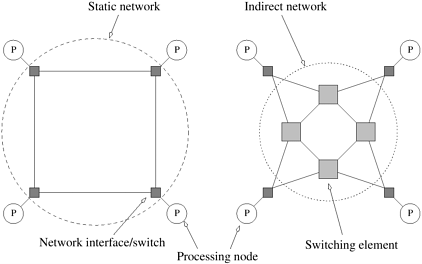
    

        图2.6 互联网络的分类：(a) 静态网络；(b) 动态网络。
    

互连网络中的单个交换机由一组输入端口和一组输出端口组成。交换机提供一系列功能。交换机提供的最小功能是从输入端口到输出端口的映射。交换机的端口总数也称为交换机的**度(Degree)**。交换机还可支持内部缓冲（当请求的输出端口繁忙时）、路由（缓解网络拥塞）和组播（多个端口上的相同输出）。从输入端口到输出端口的映射可通过基于物理横梁、多端口存储器、多路复用器-解多路复用器和多路复用总线的各种机制来实现。交换机的成本受映射硬件、外设硬件和封装成本的影响。映射硬件的成本通常是开关度的平方，外围硬件的成本是开关度的线性增长，而封装成本则是引脚数量的线性增长。

节点与网络之间的连接由网络接口提供。网络接口有输入和输出端口，将数据导入和导出网络。它通常负责对数据进行分组、计算路由信息、缓冲输入和输出数据以匹配网络和处理元件的速度，以及进行错误检查。处理元件与网络之间的接口位置也很重要。传统的网络接口挂在 I/O 总线上，而紧密耦合并行机的接口则挂在内存总线上。由于 I/O 总线通常比内存总线慢，因此后者可以支持更高的带宽。

### 2.4.3 网络拓扑

互联网络中使用了多种网络拓扑结构。这些拓扑结构试图在成本和可扩展性与性能之间进行权衡。虽然纯拓扑结构具有吸引人的数学特性，但在实践中，互连网络往往是本节讨论的纯拓扑结构的组合或修改。

#### 总线网络

总线网络可能是最简单的网络，它由所有节点共用的共享介质组成。总线具有一个理想特性，即网络成本与节点数 p 成线性关系。此外，网络中任意两个节点之间的距离是恒定的（O(1)）。总线也是在节点间广播信息的理想选择。由于传输介质是共享的，因此与点对点信息传输相比，广播的开销很小。然而，随着节点数量的增加，总线的带宽限制了网络的整体性能。典型的基于总线的机器只能有几十个节点。Sun 企业服务器和基于共享总线的英特尔奔腾多处理器就是这种架构的例子。

在典型的程序中，访问的大部分数据都是节点本地数据，利用这一特性可以降低对总线带宽的需求。对于此类程序，可以为每个节点提供一个缓存。私人数据在节点上缓存，只有远程数据通过总线访问。

- **例2.12 利用缓存减少共享总线带宽**

  [图 2.7(a)](#fig2.7) 展示了 p 个处理器共享一条总线到内存的情况。假设每个处理器访问 k 个数据项，每次数据访问耗时 tcycle，则执行时间的下限为 tcycle x kp 秒。现在考虑[图 2.7(b)](#fig2.7) 的硬件组织结构。假设 50%的内存访问（0.5k）是对本地数据的访问。这些本地数据位于处理器的专用内存中。我们假设访问专用内存的时间与访问全局内存的时间相同，即 tcycle。在这种情况下，总执行时间的下限为 0.5 x tcycle x k + 0.5 x tcycle x kp。这里，第一项是访问本地数据的结果，第二项是访问共享数据的结果。不难看出，当 p 变大时，图 2.7(b) 的组织结构会导致下限接近 0.5 x tcycle x kp。与[图 2.7(a)](#fig2.7) 相比，执行时间下限提高了 50%。

  

      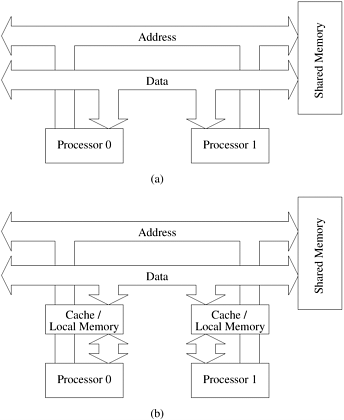
      

          图2.7 基于总线的互连 (a) 无本地缓存；(b) 有本地内存/缓存。
      

  

实际上，共享数据和私有数据的处理方式更为复杂。第 2.4.6 节将简要讨论缓存一致性问题。

#### 交叉网络

将 p 个处理器连接到 b 个内存库的简单方法是使用交叉条网络。如图 2.8 所示，交叉条网络采用网格状的开关或交换节点。横条网络是一种非阻塞网络，即一个处理节点与一个内存库的连接不会阻塞其他处理节点与其他内存库的连接。

    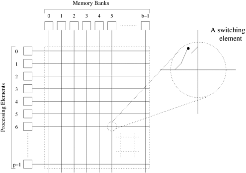
    

        图2.8 连接 p 个处理器和 b 个内存库的完全无阻塞的交叉网络
    

实现这样一个网络所需的交换节点总数为 Q(pb)。可以合理地假设内存库 b 的数量至少为 p；否则，在任何给定时间内，都会有一些处理节点无法访问任何内存库。因此，随着 p 值的增加，交换网络的复杂性（组件数）也会随着 W(p2) 的增加而增加。(有关 W 符号的解释，请参阅附录。）随着处理节点数量的增加，这种交换复杂性很难在高数据速率下实现。因此，就成本而言，交叉条网络的可扩展性并不高。

#### 多级网络

交叉条互连网络在性能方面是可扩展的，但在成本方面是不可扩展的。相反，共享总线网络在成本方面是可扩展的，但在性能方面是不可扩展的。在这两个极端之间有一类中间网络，称为**多级互连网络**。就性能而言，它比总线网络更具可扩展性，而就成本而言，它比交叉网络更具可扩展性。

由 p 个处理节点和 b 个内存库组成的多级网络的一般示意图如[图 2.9 ](#fig2.9)所示。常用的多级连接网络是欧米茄网络。该网络由对数 p 级组成，其中 p 是输入（处理节点）和输出（存储库）的数量。欧米茄网络的每一级都由连接 p 个输入和 p 个输出的互连模式组成；如果以下条件为真，则输入 i 和输出 j 之间存在连接：
$$
j = \left\{
\begin{array} \\
2i, & 0 \le i \le p/2-1 \\
2i+1-p, & p/2 \le i \le p-1\\
\end{array}
\right.
$$

    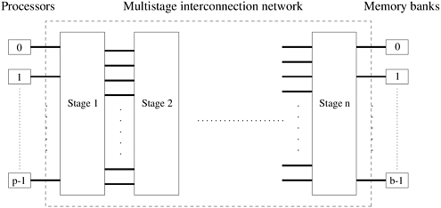
    

        图2.9 典型的多级互连网络示意图
    

等式 2.1 表示对 i 的二进制表示进行左旋转操作，从而得到 j。[图 2.10](#fig2.10) 显示了八个输入和输出的**完美随机**互联模式。在欧米茄网络的每个阶段，完美洗牌互联模式都会输入一组 p/2 开关或开关节点。每个开关处于两种连接模式之一。在其中一种模式下，输入端直通输出端，如[图 2.11(a)](#fig2.11)所示。这就是所谓的**直通连接**。在另一种模式中，开关节点的输入被交叉后送出，如[图 2.11(b)](#fig2.11)所示。这就是所谓的**交叉连接**。

    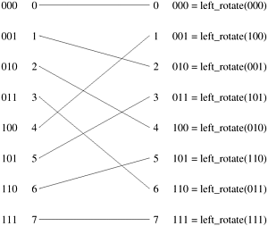
    

        图2.10 八个输入和输出的完美随机互连。
    

    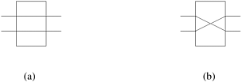
    

        图2.11 2 x 2 交换机的两种交换配置：(a) 直通；(b) 交叉。
    

欧米茄网络有 p/2 x log p 个交换节点，其成本按 Q(p log p) 增长。需要注意的是，这一成本小于完整交叉条网络的 Q(p2) 成本。[图 2.12 ](#fig2.12)显示了八个处理器（左侧二进制数表示）和八个内存库（右侧二进制数表示）的欧米茄网络。欧米茄网络中的数据路由是通过一个简单的方案实现的。假设 s 是一个处理器的二进制表示，该处理器需要将一些数据写入内存库 t。如果 s 和 t 的最有效位相同，则数据由交换机以直通模式路由。如果这些位不同，则数据以交叉模式路由。在下一个切换阶段，使用下一个最显著位重复这一方案。遍历对数 p 个阶段时，将使用 s 和 t 二进制表示中的所有对数 p 位。

    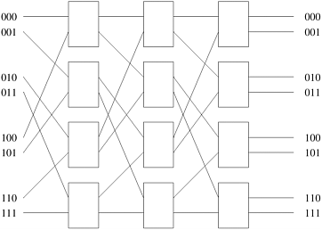
    

        图2.12 一个完整的欧米茄网络连接八个输入和八个输出。
    

[图 2.13](#fig2.13) 显示了从处理器 2（010）到内存库 7（111）以及从处理器 6（110）到内存库 4（100）的欧米茄网络数据路由。该图还说明了该网络的一个重要特性。当处理器 2 (010) 与存储器组 7 (111) 通信时，会阻断处理器 6 (110) 到存储器组 4 (100) 的路径。两条通信路径都使用通信链路 AB。因此，在欧米茄网络中，一个处理器对内存库的访问可能会阻止另一个处理器对另一个内存库的访问。具有这种特性的网络被称为阻塞网络。

    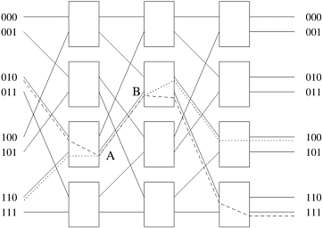
    

        图2.13 欧米茄网络阻塞示例：其中一条报文（010 至 111 或 110 至 100）在链路 AB 上被阻塞。
    

#### 全连接网络

在**完全连接的网络**中，每个节点都与网络中的其他节点有直接的通信连接。[图 2.14(a)](#fig2.14) 展示了一个由八个节点组成的完全连接网络。这个网络非常理想，因为节点之间存在通信链路，一个节点只需一步就能向另一个节点发送信息。完全连接网络是交叉条交换网络的静态对应网络，因为在这两种网络中，任何输入/输出对之间的通信都不会阻碍其他任何输入/输出对之间的通信。

    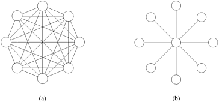
    

        图2.14 (a) 由 8 个节点组成的完全连接网络；(b) 由 9 个节点组成的星形连接网络。
    

#### 星形连接网络

在**星形连接网络**中，一台处理器充当中央处理器。其他每个处理器都有一条通信链路与该处理器相连。[图 2.14(b) ](#fig2.14)显示了一个由九个处理器组成的星形连接网络。星形连接网络与总线型网络类似。任何一对处理器之间的通信都要经过中央处理器，就像共享总线构成了总线型网络中所有通信的媒介一样。中央处理器是星型拓扑结构中的瓶颈。

#### 线性阵列、网格和 k-d 网格网络

由于完全连接的网络中存在大量链接，因此通常使用较稀疏的网络来构建并行计算机。此类网络的一个系列横跨线性阵列和超立方体空间。线性阵列是一种静态网络，其中每个节点（除了两端的两个节点）都有两个邻居，左右各一个。线性阵列（[图 2.15(a)](#fig2.15)）的一个简单扩展是环或一维环（[图 2.15(b)](#fig2.15)）。环形结构在线性阵列的两端之间有环绕连接。在这种情况下，每个节点都有两个邻居。

    
    

        图2.15 线性阵列：(a) 无环绕链接；(b) 有环绕链接。
    

[图 2.16(a)](#fig2.16) 所示的二维网格是线性数组向二维的扩展。每个维度都有$\sqrt{p}$个节点，节点由两个元组 (i, j) 标识。每个节点（外围节点除外）都与其他四个节点相连，这些节点的索引在任意维度上都相差一个。二维网格具有可在二维空间中布局的特性，因此从布线的角度来看很有吸引力。此外，各种规则结构的计算都能非常自然地映射到二维网格上。因此，二维网格经常被用作并行机器中的互连。如[图 2.16(b)](#fig2.16)所示，二维网格可通过环绕链接形成二维环。如[图 2.16(c)](#fig2.16)所示，三维立方体是二维网格向三维的扩展。三维立方体中的每个节点元素（外围的节点元素除外）都与其他六个节点相连，三个维度各两个。通常在并行计算机上执行的各种物理模拟（如三维天气建模、结构建模等）都可以自然地映射到三维网络拓扑结构中。因此，三维立方体常用于并行计算机的互连网络中（如 Cray T3E）。

    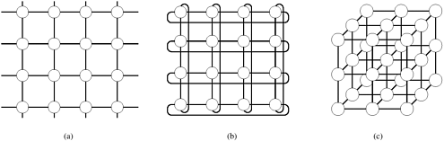
    

        图2.16 二维和三维网格：(a) 无环绕的二维网格；(b) 有环绕链接的二维网格（二维环形）；(c) 无环绕的三维网格
    

一般的 k-d 网格是指由 d 个维度组成的拓扑结构，每个维度有 k 个节点。正如线性阵列构成了 k-d 网格家族的一个极端，另一个极端则由一种名为超立方体的有趣拓扑构成。超立方体拓扑结构每个维度有两个节点，维数为对数 p。超立方体的构造如[图 2.17](#fig2.17) 所示。零维超立方由 20 个节点组成。一个一维超立方体由两个零维超立方体连接而成。一个有四个节点的二维超立方体是由两个一维超立方体通过连接相应的节点构造而成的。一般来说，一个 d 维超立方体是由两个 (d 1) 维超立方体的相应节点连接而成的。[图 2.17](#fig2.17) 展示了四维超立方体中最多 16 个节点的情况。

    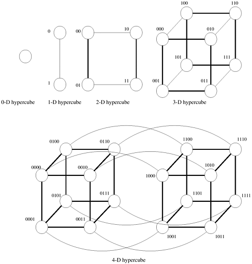
    

        图2.17 从低维度超立方体构建超立方体
    

为超立方体中的节点导出一个编号方案是非常有用的。从超立方体的构造中可以推导出一个简单的编号方案。如图 2.17 所示，如果我们有两个由 p/2 个节点组成的子立方体的编号，我们可以通过在其中一个子立方体的标签前加上 "0"，在另一个子立方体的标签前加上 "1"，来推导出由 p 个节点组成的立方体的编号方案。这种编号方案有一个有用的特性，即两个节点之间的最小距离由两个标签中不同的比特数给出。例如，标记为 0110 和 0101 的节点相距两个链路，因为它们在两个比特位置上不同。这一特性有助于为超立方架构推导出许多并行算法。

#### 树状网络

树状网络是指任意一对节点之间只有一条路径的网络。线性阵列和星形连接网络都是树状网络的特例。[图 2.18](#fig2.18) 显示了基于完整二叉树的网络。静态树状网络的每个节点都有一个处理元件（[图 2.18(a)](#fig2.18)）。树状网络也有动态网络。在动态树状网络中，中间层的节点是切换节点，叶节点是处理元件（[图 2.18(b)](#fig2.18)）。

    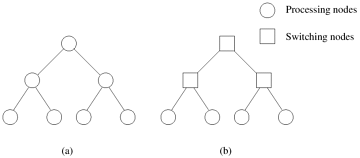
    

        图2.18 完整的二叉树网络：(a) 静态树网络；(b) 动态树网络
    

要在树中路由信息，源节点会将信息向上发送，直到到达包含源节点和目的节点的最小子树根部的节点。然后，信息沿着树的方向向目的地节点发送。

树状网络的较高层存在通信瓶颈。例如，当节点左侧子树的许多节点与右侧子树的节点通信时，根节点必须处理所有信息。在动态树状网络中，可以通过增加通信链路的数量和切换更靠近根节点的节点来缓解这一问题。这种网络也称为胖树，如[图 2.19 ](#fig2.19)所示。

    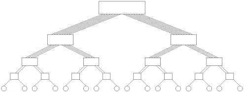
    

        图2.19 由 16 个处理节点组成的胖树网络
    

### 2.4.4 评估静态互连网络

我们现在讨论用于描述静态互连网络成本和性能的各种标准。我们将使用这些标准来评估上一小节介绍的静态网络。

**直径** 网络的直径是网络中任意两个处理节点之间的最大距离。两个处理节点之间的距离定义为它们之间的最短路径（以链接数计）。完全连接网络的直径为 1，星形连接网络的直径为 2。环形网络的直径为 。无环绕连接的二维网格的直径为对角线上两个节点的直径，环绕网格的直径为 。超立方体连接网络的直径为 log p，因为两个节点标签最多相差 log p 个位置。完整二叉树的直径为 2 log((p+1)/2)，因为两个通信节点可能分别位于根节点的不同子树中，信息可能要一直传到根节点，然后再传到另一个子树。

**连通性** 网络的连通性是衡量两个处理节点之间路径多寡的标准。具有高连接性的网络是理想的，因为它能减少对通信资源的争夺。连通性的一个衡量标准是，要将网络分成两个互不相连的网络，必须从网络中移除的弧的最小数目。这就是网络的弧连通性。对于线性阵列以及树形和星形网络，弧连通性为 1。对于环形和无环绕的二维网格，弧连通性为 2；对于二维环绕网格，弧连通性为 4；对于 d 维超立方体，弧连通性为 d。

**分段宽度和分段带宽** 网络的分段宽度是指将网络分成相等的两半所必须移除的通信链路的最小数目。环网的分段宽度为 2，因为任何分段都只跨越两个通信链路。同样，不带环绕连接的二维 p 节点网格的分段宽度为 ，带环绕连接的二维 p 节点网格的分段宽度为 。树形和星形的分段宽度为 1，而由 p 个节点组成的完全连接网络的分段宽度为 p2/4。超立方体的分段宽度可以从其构造中推导出来。我们通过连接两个（d 1）维超立方体的相应链接来构建一个 d 维超立方体。由于每个子立方体包含 2(d-1) 或 p/2 个节点，因此至少有 p/2 条通信链路必须穿过超立方体的任何分区，将其分成两个子立方体（问题 2.15）。

连接两个节点的链路可同时通信的比特数称为**信道宽度**。信道宽度等于每个通信链路中的物理线数。单根物理线缆传输比特的峰值速率称为**信道速率**。通信链路两端数据通信的峰值速率称为**信道带宽**。信道带宽是信道速率和信道宽度的乘积。

表2.1 连接 p 个节点的各种静态网络拓扑结构的特点汇总

|     网络     | 直径 | 对分宽度 | 弧连接 | 花费（Link的序号） |
| :----------: | :--: | :------: | :----: | :----------------: |
|    全连接    |      |          |        |                    |
|   星形连接   |      |          |        |                    |
|  完全二叉树  |      |          |        |                    |
|   线性阵列   |      |          |        |                    |
| 无环二维网络 |      |          |        |                    |
| 有环二维网络 |      |          |        |                    |
|   超立方体   |      |          |        |                    |
| 有环k立方体  |      |          |        |                    |

网络的分段带宽被定义为网络任何两部分之间允许的最小通信量。它是分段宽度与信道带宽的乘积。网络的分段带宽有时也称为交叉带宽。

成本 评估网络成本的标准有很多。定义网络成本的一种方法是网络所需的通信链路数或电线数。线性阵列和树状网络只需 p 1 个链接来连接 p 个节点。一个 d 维环绕网格有 dp 个链接。超立方体连接网络有 (p log p)/2 个链接。

网络的分段带宽也可用作成本的衡量标准，因为它提供了二维包装中面积或三维包装中体积的下限。如果网络的分段带宽为 w，则二维包装的面积下限为 Q(w2)，三维包装的体积下限为 Q(w3/2)。根据这一标准，超立方体和完全连接网络比其他网络更昂贵。

我们在表 2.1 中总结了各种静态网络的特点，其中突出强调了各种性价比权衡。

### 2.4.5 评估动态互连网络

动态网络的一些评估指标源自静态网络的相应指标。由于穿越交换机的信息必须支付开销，因此除了处理节点外，将每个交换机视为网络中的一个节点也是合乎逻辑的。网络直径现在可以定义为网络中任意两个节点之间的最大距离。这表示信息在选定的一对节点之间传输时将遇到的最大延迟。实际上，我们希望该指标是任意两个处理节点之间的最大距离；不过，对于所有相关网络而言，这等同于任意（处理或交换）一对节点之间的最大距离。

动态网络的连通性可以用节点连通性或边缘连通性来定义。节点连通性是将网络分割成两个部分所必须失效（从网络中移除）的最小节点数。和以前一样，我们应该只考虑切换节点（而不是所有节点）。不过，考虑所有节点可以很好地近似动态网络中路径的多重性。网络的弧连通性可以类似地定义为：要将网络分割成两个无法到达的部分，必须失效（从网络中删除）的最少边数。

动态网络的分段宽度必须比直径和连通性定义得更精确。就分段宽度而言，我们考虑将 p 个处理节点划分为两个相等部分的任何可能情况。请注意，这并不限制交换节点的划分。对于每个这样的分区，我们选择一个开关节点的诱导分区，使穿过该分区的边的数量最小。任何此类分区的最小边数就是动态网络的分段宽度。另一种直观的分段宽度思维方式是，必须从网络中移除最少数量的边，才能将网络划分为处理节点数量相同的两半。我们在下面的示例中进一步说明这一概念：

- **例2.13 动态网络的分割宽度**

  请看图 2.20 所示的网络。我们在此展示了 A、B 和 C 三个分段，每个分段都将网络划分为两组，每组有两个处理节点。请注意，这些分区并不一定要将网络节点平均分配。在本例中，每个分区都会产生四条切边。因此，我们可以得出结论：该图的分割宽度为 4。

  

      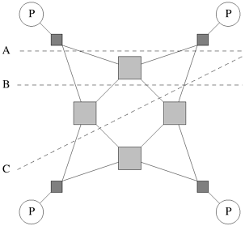
      

          图2.20 动态网络的分割宽度是通过检查处理节点的各种等分区，并选择穿越该分区的最小边数计算得出的。在本例中，每个分区产生的边切为四条。因此，该图的分段宽度为 4。
      

  

与静态网络一样，动态网络的成本由链路成本和交换机成本决定。在典型的动态网络中，交换机的阶数是恒定的。因此，链路和交换机的数量近似相同。此外，在典型网络中，交换机成本超过链路成本。因此，动态网络的成本通常由网络中交换节点的数量决定。

表 2.2 总结了各种动态网络的特点

表2.2 连接 p 个处理节点的各种动态网络拓扑结构的特点概述

| 网络 | 直径 | 对分宽度 | 环型连接 | 花费（Link的序号） |
| :--: | :--: | :------: | :------: | :----------------: |
|      |      |          |          |                    |
