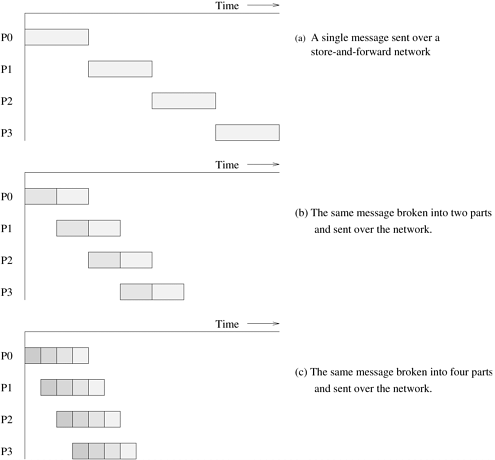
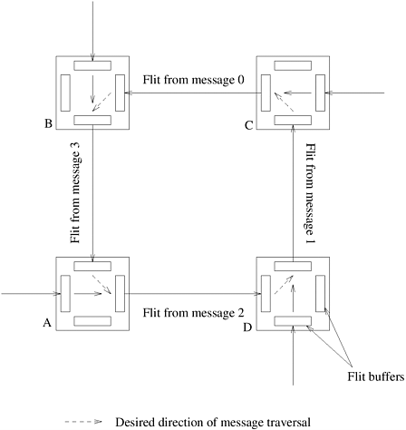

## 2.5 并行计算中的通信开销

并行程序执行过程中的主要开销之一来自处理元件之间的信息通信。通信成本取决于多种特性，包括编程模型语义、网络拓扑结构、数据处理和路由选择，以及相关的软件协议。这些问题是我们在此讨论的重点。

### 2.5.1 并行计算中的消息传递开销

网络中两个节点之间传输信息所需的时间是准备传输信息所需的时间与信息穿越网络到达目的地所需的时间之和。决定通信延迟的主要参数如下：

1. **启动时间（Startup Time）** $t_s$：启动时间是发送节点和接收节点处理信息所需的时间。这包括准备报文的时间（添加报文头、预告片和纠错信息）、执行路由算法的时间以及在本地节点和路由器之间建立接口的时间，单次信息传输只产生一次延迟。
2. **每跳时间（Per-hop Time）** $t_h$​：信息离开一个节点后，到达路径上的下一个节点所需的时间是有限的。信息头在网络中两个直接连接的节点之间传输所需的时间称为每跳时间，它也称为 **节点延迟（Node Latency）**。每跳时间与路由交换机内确定信息应转发到哪个输出缓冲区或通道的延迟直接相关。
3. **每字传输时间（Per-word Transfer Time）** $t_w$：如果信道带宽为每秒 $r$ 个字，那么每个字在链路上的传输时间为 $t_w = 1/r$。这段时间称为每字传输时间。该时间包括网络和缓冲开销。

现在我们讨论并行计算机中使用的两种路由技术 - 存储转发路由和直通路由。

> [!NOTE]
>
> 并行计算的一个重要动作是数据通信，$t_s$、$t_h$、$t_w$是三个衡量并行计算中通信开销的重要指标。

#### 存储转发路由

在 **存储转发路由（Store-and-Forward Routing）** 中，当报文穿越有多个链路的路径时，路径上的每个中间节点都会在接收并存储整个报文后，将报文转发给下一个节点。[图 2.26(a)](#fig2.26) 显示了信息通过存储转发网络进行通信的过程。

    
    

        图2.26 (a)通过存储转发通信网络将信息从节点P0传递到 P3；(b)和(c)将这一概念扩展到直通路由。阴影区域表示信息在传输过程中的时间（与信息传输相关的启动时间假定为零）
    

假设一个大小为 $m$ 的信息正在通过这样一个网络传输。假设它要穿越 $l$ 个链路。在每个链路上，信息头的传输成本为 $t_h$，其余部分的传输成本为 $t_w m$。由于有 $l$ 个这样的链路，所以总时间为 $(t_h + t_w m)l$ 。因此，对于存储转发路由，大小为 $m$ 个字的信息穿越 $l$ 个通信链路的总通信成本为：
$$
t_{comm}=t_s+(mt_w+t_h)l
$$
在当前的并行计算机中，每跳时间 $t_h$ 非常小。对于大多数并行算法来说，即使 $m$ 的值很小，$t_h$ 也小于 $t_w m$，因此可以忽略不计。对于使用存储转发路由的并行平台，上式所给出的时间可简化为：
$$
t_{comm}=t_s+m l t_w
$$

> [!NOTE]
>
> 在 **存储转发路由（Store-and-Forward Routing）** 中，当报文穿越有多个链路的路径时，路径上的每个中间节点都会在接收并存储整个报文后，将报文转发给下一个节点，单个消息发送的通信开销为：
> $$
> \begin{align}
> t_{comm}&=t_s+(mt_w+t_h)l \\
> &=t_s + mlt_w, \ (t_h << t_w m)
> \end{align}
> $$
> 其中：
>
> - $m$ 发送的数据包的大小
> - $l$ 发送过程中通过的链路数量

#### 数据包路由

存储转发路由对通信资源的利用率很低。只有在收到整个信息后，信息才会从一个节点发送到下一个节点（[图 2.26(a)](#fig2.26)）。考虑一下[图 2.26(b)](#fig2.26)所示的情况，在这种情况下，原始信息在发送前被分成大小相等的两部分。在这种情况下，中间节点只需等待原始信息的一半到达即可将其发送出去。从[图 2.26(b)](#fig2.26)中可以明显看出，通信资源的利用率提高了，通信时间缩短了。[图 2.26(c)](#fig2.26) 更进一步，将信息分成四个部分。除了更好地利用通信资源外，这一原则还具有其他优点 - 降低数据包丢失（错误）造成的开销、数据包可能走不同的路径以及更好的纠错能力。由于这些原因，这种技术成为互联网等长途通信网络的基础，因为在这些网络中，错误率、跳数和网络状态的变化可能会更高。当然，这里的开销是每个数据包必须携带路由、纠错和排序信息。

考虑通过网络传输一个 $m$ 字的信息。网络接口编程和计算路由信息等所需的时间与报文长度无关。这些时间汇总为信息传输的启动时间 $t_s$。我们假设路由表在信息传输过程中是静态的（即所有数据包都经过相同的路径）。虽然这种假设并非在所有情况下都有效，但它有助于激发信息传输的成本模型。信息被分解成数据包，数据包与错误、路由和序列字段组装在一起。现在，数据包的大小为 $r + s$，其中 $r$ 是原始信息，$s$ 是数据包中携带的附加信息。将信息打包所需的时间与信息的长度成正比。我们用 $m t_{w1}$ 表示这个时间。如果网络能够每 $t_{w2}$ 秒传送一个字，每跳的延迟为 $t_h$，第一个数据包经过 $l$ 跳，那么这个数据包到达目的地需要 $t_h l + t_{w2}(r + s)$ 时间。此后，目的节点每隔 $t_{w2}(r + s)$秒会收到一个额外的数据包。由于有 $m/r - 1 $个附加数据包，因此总通信时间为：

$$
\begin{align}
t_{comm}&=t_s+t_{w1}m+t_h l+t_{w2}(r+s)+(\frac{m}{r}-1)t_{w2}(r+s) \\
&=t_s+t_{w1}m+t_hl+t_{w2}m+t_{w2}\frac{s}{r}m \\
&=t_s+t_hl+t_wm
\end{align}
$$

其中：

$$
t_w=t_{w1}+t_{w2}(1+\frac{s}{r})
$$

数据包路由适合于具有高度动态状态和较高错误率的网络，如局域网和广域网。这是因为单个数据包可能会选择不同的路由，而且可以对丢失的数据包进行定位重传。

> [!NOTE]
>
> 参考存储转发路由模式，当大小为$m$的数据包被分割为多个小包时，通信开销为：
> $$
> \begin{align}
> t_{comm}&=t_s+t_{w1}m+t_h l+t_{w2}(r+s)+(\frac{m}{r}-1)t_{w2}(r+s) \\
> &=t_s + t_h l + m \left (t_{w1} + t_{w2}(1+\frac{s}{r}) \right)
> \end{align}
> $$
> 其中：
>
> - $t_{w1}$ 信息打包的带宽的倒数，$t_{w2}$ 数据传输的带宽的倒数
> - 将$m$大小的消息拆分成多个数据包，$r$ 是数据包原始数据，$s$ 数据包中附加信息
> - 由此可得，数据包的个数为：$m/r$
>
> 拆解：
>
> - $t_s$ 传输的启动时间（包含对网络接口进行编程以及计算路由选择信息等所花费的时间）
> - $t_{w1} m$ 对$m$大小的数据包进行打包耗时的时间
> - $t_h l+t_{w2}(r+s)$ 对拆分的一个小数据包的数据经过$l$跳之后消耗的时间
> - $(\frac{m}{r} - 1)t_{w2}(r+s)$ 最后一个节点在接受完一个小数据包之后每隔$t_{w2}(r+s)$秒后收到新的小数据包

#### 直通路由

在并行计算机的互连网络中，可以对信息传输施加额外的限制，以进一步减少与数据包交换相关的开销。通过强制所有数据包走相同的路径，我们可以消除随每个数据包传输路由信息的开销。通过强制按顺序传送，可以消除排序信息。通过在信息层而不是数据包层关联错误信息，可以减少与错误检测和纠正相关的开销。最后，由于并行机互连网络中的错误率极低，因此可以使用精简的错误检测机制来代替昂贵的纠错方案。

> [!NOTE]
>
> - 强制所有的数据包走相同的路径 >> 消除每个数据包的传输路由信息开销$t_h$
> - 强制按顺序传输数据 >> 消除排序信息$s$
> - 在信息曾而不是数据包层关联错误信息 >> 减少错误检测和纠正相关的开销$s$​
>
> 由这些优化产生的路由方案称为 **直通路由（Cut-through Routing）**

由这些优化产生的路由方案称为 **直通路由（Cut-through Routing）**。在直通路由中，信息被分解成固定大小的单位，称为 **流量控制字（Flow Control Digits）** 或 **数据片（Flits）**。由于数据片不包含数据包的开销，因此数据片可以比数据包小得多。首先从源节点向目的节点发送跟踪器，以建立连接。一旦建立了连接，就会一个接一个地发送数据片。所有传输片都以对接方式沿相同路径传输。中间节点在转发信息之前不会等待整个信息到达。一旦中间节点收到一个数据片，该数据片就会被转发到下一个节点。与存储转发路由不同，每个中间节点不再需要缓冲空间来存储整个信息。因此，直通式路由占用中间节点的内存和内存带宽更少，速度更快。

> [!NOTE]
>
> 将待传递的消息分解成固定大小的单位，这些单位称为 **数据片（Flits）**
>
> - 数据片不包含数据包中的附加信息$s$
> - 一旦建立连接，数据片会按顺序一个接一个的发送
> - 所有的数据片均以相同的路径传输数据
> - 中间节点一旦收到一个数据片会立刻转发给下一个节点
> - 数据片的大小由各种网络参数决定
>
> **优点** 直通式路由占用中间节点的内存和内存带宽更少，速度更快

假设有一条信息正在穿越这样的网络。如果信息穿越 $l$ 个链路，$t_h$ 是每跳时间，那么信息头到达目的地需要 $l t_h$ 时间。如果消息大小为 $m$ 个字，那么整个信息在信息头到达后的 $t_w m$ 时间内到达。因此，直通式路由的总通信时间为：

$$
t_{comm}=t_s+l t_h+t_w m
$$

由于与跳数和字数相对应的项是加法，而不是前者的乘法，因此与存储转发路由相比，这个时间有所改进。需要注意的是，如果通信是在最近的邻居之间进行（即 $l = 1$​​），或者信息量很小，那么存储转发路由方案和直通路由方案的通信时间是相似的。

> [!NOTE]
>
> 通信开销耗时为：
> $$
> t_{comm}=t_s+l t_h+t_w m
> $$
> 其中：
>
> - $t_s$ 为启动时间
> - $l t_h$ 消息经过$l$跳消耗的时间
> - $t_w m$ 传输$m$字节消耗的时间
>
> 如果通信是在最近的邻居之间进行或者信息量很小，那么存储转发路由方案和直通路由方案的通信时间是相似的

目前大多数并行计算机和许多局域网都支持直通路由。数据片的大小由各种网络参数决定。控制线路必须以数据片速率运行。因此，如果我们选择非常小的数据片大小，在给定链路带宽的情况下，所需的单位速率就会变得很大。这给路由器的设计带来了相当大的挑战，因为它要求控制线路以非常高的速度运行。另一方面，随着数据片大小变大，内部缓冲区的大小也会增加，信息传输的延迟也会增加。这两种情况都不可取。在最近的直通式互连网络中，单位大小从 $4$ 位到 $32$​​ 字节不等。在许多主要依赖短信息（如高速缓存行）的并行编程模式中，信息的延迟至关重要。在这些情况下，长报文在链路中穿行时会耽误短报文的时间，这是不合理的。路由器采用多线穿通路由技术来解决这种情况。在多线穿通路由选择中，单个物理通道被分成多个虚拟通道。

> [!NOTE]
>
> 数据片过小：
>
> - 在给定链路带宽的条件下，数据片转发的频率过快，对路由的设计提出了难题
>
> 数据片过大：
>
> - 内部缓冲区会增加
> - 信息延迟会增加

报文常量 $t_s$、$t_w$ 和 $t_h$​​ 由硬件特性、软件层和报文语义决定。与消息传递等范例相关的消息传递语义最好使用长度可变的消息，而其他范例则使用固定长度的短消息。对于前者，有效带宽可能至关重要，而对于后者，减少延迟则更为重要。这些范例的信息传递层经过调整，以反映这些要求。

在穿越网络时，如果报文需要使用当前正在使用的链接，那么报文就会被阻塞。这可能会导致死锁。[图 2.27](#fig2.27) 展示了直通路由网络中的死锁。报文 $0$、$1$、$2$ 和 $3$ 的目的地分别是 *A*、*B*、*C* 和 *D*。报文 $0$ 的飞信占用了链路 *CB*（及相关缓冲区）。然而，由于来自报文 $3$ 的信道占用了链路 *BA*，因此来自报文 $0$ 的信道被阻塞。同样，由于正在使用链路 *AD*，来自报文 $3$ 的飞信也被阻塞。我们可以看到，任何报文都无法在网络中传输，网络陷入死锁。在直通网络中，可以通过使用适当的路由技术和报文缓冲区来避免死锁。第 2.6 节将对此进行讨论。

    
    

        图2.27 直通路由网络中的死锁示例
    

> [!NOTE]
>
> 假设直通路由中只有一个数据片Buffer，则直通路由中可能存在死锁的问题，在第2.6章节中会讨论如何利用合适的路由技术和报文缓冲区避免死锁的问题。

#### 消息传递的简化开销模型

正如我们在第 2.5.1 节中看到的，使用直通式路由在相距 $l$ 跳的两个节点之间传输信息的开销为：
$$
t_{comm}=t_s+l t_h+t_w m
$$
这个等式意味着，为了优化信息传输的成本，我们需要：

1. **批量通信（Communicate in Bulk）** 也就是说，我们不希望发送小信息并为每条信息支付启动成本 $t_s$，而是希望将小信息汇聚成一条大信息，并在一条更大的信息中分摊启动延迟。这是因为在集群和消息传递机器等典型平台上，$t_s$ 的值远大于 $t_h$ 或 $t_w$ 的值。
2. **尽量减少数据量（Minimize the volume of data）** 为了尽量减少每个字传输时间 $t_w$​ 的开销，最好尽可能减少通信数据量。
3. **最小化数据传输距离（Minimize distance of data transfer）** 尽量减少信息必须经过的跳数 $l$​​。

> [!NOTE]
>
> 由消息传递的简化开下模型可知，为了降低通信开销，可以有以上三种技术路线：
>
> - **批量通信** NCCL的聚合通信，降低平摊的$t_s$开销
> - **尽量减少数据量** 通信压缩算法，降低$t_w m$的开销
> - **最小化数据传输距离** 优化网络拓扑，降低$l t_h$的开销

虽然前两个目标相对容易实现，但最大限度减少通信节点距离的任务却很困难，而且在很多情况下会给算法设计者带来不必要的负担。这是并行平台和范式的以下特点造成的直接后果：

- 在许多消息传递库（如 MPI）中，程序员几乎无法控制进程与物理处理器的映射。在这种模式下，虽然任务可能有定义明确的拓扑结构，并且只能在任务拓扑结构中的邻居之间进行通信，但将进程映射到节点可能会破坏这种结构。
- 许多架构依赖于随机路由（两步法），即首先将信息从源节点发送到一个随机节点，然后再从这个中间节点发送到目的地。这可以缓解网络上的热点和竞争。在随机路由网络中，跳数最小化不会带来任何好处。
- 每跳时间（$t_h$）通常由小型报文的启动延迟（$t_s$）或大型报文的每字分量（$t_w m$）决定。由于大多数网络中的最大跳数（$l$​​）相对较小，因此可以忽略每跳时间，而几乎不会损失准确性。

> [!NOTE]
>
> **最小化数据传输距离** 带来的问题：
>
> - 程序员几乎无法控制进程与物理处理器的映射
> - 随机路由选择中减少跳数不会带来收益（可能造成阻塞、负载均衡问题等）
> - 大多数网络中的最大跳数（$l$）相对较小，可以忽略每跳时间

所有这些都指向一个更简单的成本模型，即在网络的两个节点之间传输信息的成本由以下公式给出：

$$
t_{comm}=t_s+t_w m
$$

这一表达式对独立于架构的算法设计以及运行时预测的准确性具有重要意义。由于这种成本模型意味着任何一对节点之间的通信时间都是相同的，因此它对应的是一个完全连接的网络。我们无需为每种特定架构（如网状、超立方或树状）设计算法，而是可以在设计算法时考虑到这种成本模型，并将其移植到任何目标并行计算机上。

这就提出了一个重要问题，即当算法从我们的简化模型（假设网络完全连接）移植到实际的机器架构时，预测的准确性会有损失。如果我们最初的假设成立，即 $t_h$ 项通常由 $t_s$ 或 $t_w$​​ 项主导，那么准确性的损失应该是最小的。

> [!NOTE]
>
> 由于优化 **最小化数据传输距离** 可能带来的问题以及跳数$t_h l$的开销相对于其他开销可以忽略不计，因此可以将通信开销模型简化为（Hockney模型）：
> $$
> t_{comm}=t_s+t_w m
> $$

不过，需要注意的是，我们的基本成本模型仅适用于不拥堵的网络。不同的架构会有不同的拥塞阈值，例如，线性阵列的拥塞阈值比超立方低得多。此外，不同的通信模式会对特定网络造成不同程度的拥塞。因此，我们的简化成本模型只有在基本通信模式不造成网络拥塞的情况下才有效。

- ##### **例2.15 阻塞对通信开销的影响**

  考虑一个 $\sqrt{p} \times \sqrt{p}$ 的网状结构，其中每个节点只与其最近的邻居通信。由于网络中没有链路用于一次以上的通信，因此这一操作的时间为 $t_s + t_wm$，其中 $m$ 为通信字数。这个时间与我们的简化模型一致。考虑另一种情况，即每个节点与随机选择的节点进行通信。这种随机性意味着有 $p/2$ 次通信（或 $p/4$ 次双向通信）发生在机器的任何等分区中（因为被通信的节点可能以相等的概率出现在任何一半中）。根据我们对对分宽度的讨论，我们知道二维网格的对分宽度为 $\sqrt{p}$。 根据这两点，我们可以推断出，假设有双向通信通道，一些链接现在至少要携带 $\frac{p/4}{\sqrt{p}}=\sqrt{p}/4$ 的信息。这些信息必须在链路上序列化。如果每条信息的大小为 $m$，那么这一操作所需的时间至少为 $t_s+t_w m \times \sqrt{p}/4$​。这个时间与我们的简化模型不符。

> [!NOTE]
>
> 在一个 $\sqrt{p} \times \sqrt{p}$ 的二维网格拓扑结构的网络中：
>
> - 如果每个节点只与临近节点通信，则不会造成阻塞，通信开销为：$t_s+t_w m$
> - 如果任意节点与任意节点通信，则意味着有$p/2$​次通信（或$p/4$次双向通信）
>   - 二维网格的对分宽度为$\sqrt{p}$
>   - 每条对分链路必须携带$\frac{p/4}{\sqrt{p}}=\sqrt{p}/4$条消息通信
>   - 通信时间为$t_s+t_w m \times \sqrt{p}/4$
> - 有阻塞（任意两节点通信）的开销模型与Hockney模型不一致

上面的例子说明，对于给定的架构，有些通信模式可能不会造成拥塞，而有些则可能会造成拥塞。这就使得通信成本建模任务不仅取决于架构，还取决于通信模式。为此，我们引入了 **有效带宽（Effective Bandwidth）** 的概念。对于不会造成网络拥塞的通信模式，有效带宽与链路带宽相同。然而，对于网络拥塞的通信操作，有效带宽是链路带宽按最拥塞链路的拥塞程度缩减后的值。这通常很难估算，因为它是进程到节点映射、路由算法和通信时间表的函数。因此，我们使用信息通信时间的下限。相关的链路带宽按系数 $p/b$ 缩减，其中 $b$​ 是网络的对分宽度。

> [!NOTE]
>
> **有效带宽（Effective Bandwidth）** 对于无阻塞通信，有效带宽与链路带宽一致；对于阻塞通信，有效带宽是链路带宽按最拥堵链路的阻塞程度缩减后的值。
>
> - 在有阻塞网络中，有效带宽很难估算，因为他是进程到节点的映射关系、路由算法、通信时间表的函数

在本文的其余部分，我们将使用简化的通信模型来处理消息传递和有效的每字时间 $t_w$，因为它允许我们以一种与体系结构无关的方式来设计算法。我们还将具体说明算法中的通信操作何时会造成网络拥塞，以及如何将其影响计入并行运行时间。书中的通信时间适用于k-d网格的一般类别。虽然这些时间也可以在其他架构上实现，但这是底层架构的函数。

### 2.5.2 并行计算中的内存共享开销

将通信开销与并行编程相联系的主要目的，是为了将程序与质量相联系，以指导程序的开发。对于高速缓存一致的共享地址空间计算机，实现该目的要比在使用消息传递或非高速缓存一致结构的计算机上困难得多。其原因如下：

- **内存布局通常由系统决定** 程序员对特定数据项位置的控制微乎其微，只能通过排列数据结构来优化访问。这一点在分布式内存共享地址空间架构中尤为重要，因为很难识别本地和远程访问。如果本地数据项和远程数据项的访问时间相差很大，那么通信成本就会因数据布局的不同而大相径庭。
- **有限的高速缓存大小可能会导致高速缓存崩溃** 考虑这样一种情况：节点需要全部数据的某一部分来计算其结果。如果这部分数据小于本地可用的缓存，则可以在首次访问时获取数据并进行计算。但是，如果这部分数据超过了可用缓存的容量，那么数据的某些部分可能会被覆盖，从而被多次访问。随着问题规模的增大，这种开销会导致程序性能急剧下降。为了解决这个问题，程序员必须改变执行计划，以尽量减小工作集的大小。虽然这个问题在串行和多处理器平台上都很常见，但在多处理器情况下，由于每次失误都可能涉及一致性操作和处理器间通信，因此代价要高得多。
- **与失效和更新操作相关的开销很难量化** 数据项被处理器取入高速缓存后，可能会在另一个处理器上进行各种操作。例如，在失效协议中，缓存行可能会被远程处理器的写入操作失效。在这种情况下，数据项的下一次读取操作必须再次支付远程访问延迟成本。同样，与更新协议相关的开销可能会因数据项的副本数量不同而有很大差异。数据项的并发拷贝数和指令执行时间表通常不在程序员的控制范围内。
- **空间定位很难建模** 由于高速缓存行一般比一个字长（从 $4$ 个字到 $128$​ 个字），即使是第一次访问，不同的字也可能有不同的访问延迟。如果高速缓存行尚未被覆盖，那么访问先前获取的字的邻居可能会非常快。同样，程序员对此的控制能力微乎其微，只能通过改变数据结构来最大限度地提高数据引用的空间位置性。
- **预取可以减少与数据访问相关的开销** 编译器可以提前加载，如果有足够的资源，与这些加载相关的开销可能会被完全掩盖。由于这是编译器、底层程序和可用资源（寄存器/缓存）的函数，因此很难准确建模。
- **错误共享通常是许多程序中的重要开销** 不同处理器（在不同处理器上执行的线程）使用的两个字可能位于同一高速缓存行上。这可能会导致一致性操作和通信开销，即使没有任何数据可能被共享。程序员必须充分填充不同处理器使用的数据结构，以尽量减少错误共享。
- **共享访问中的竞争通常是共享地址空间机器的主要开销** 遗憾的是，竞争是执行进度的函数，因此很难准确建模（与调度算法无关）。虽然可以通过计算共享访问的次数来获得松散的渐近估计值，但这种约束往往意义不大。

共享地址空间机器的任何成本模型都必须考虑所有这些开销。将这些费用纳入一个单一的成本模型，会导致该模型过于繁琐，难以设计程序，而且过于针对单个机器，无法普遍适用。

> [!NOTE]
>
> 在有高速缓存的计算机上评估内存开销是一个非常困难的问题
>
> - 内存布局通常由系统决定
> - 有限的高速缓存大小可能会导致高速缓存崩溃
> - 与失效和更新等操作相关的开销很难量化
> - 空间定位很难建模
> - 预取可以减少与数据访问相关的开销
> - 错误共享通常是许多程序中的重要开销
> - 共享访问中的竞争通常是共享地址空间机器的主要开销

作为一阶模型，我们不难看出，访问一个远程字会导致一个高速缓存行被取入本地高速缓存。与此相关的时间包括一致性开销、网络开销和内存开销。一致性开销和网络开销是底层互连的函数（因为一致性操作必须有可能传播到远程处理器，而且必须提取数据项）。在不知道特定访问与哪些一致性操作相关以及字从哪里来的情况下，我们将访问共享数据的缓存行与恒定开销联系起来。为了与消息传递模型保持一致，我们将这一开销称为 $t_s$。由于在现代处理器架构中实施了各种延迟隐藏协议（如预取），我们假定，即使 $m$ 大于缓存行大小，在开始访问共享数据的 $m$ 字连续块时，也会产生一个不变的成本 $t_s$。我们进一步假设，访问共享数据的成本要高于访问本地数据（例如，在 NUMA 机器上，本地数据可能存在于本地内存模块中，而 $p$ 个处理器共享的数据需要从至少 $p - 1$ 个处理器的非本地模块中获取）。因此，我们为共享数据分配的每字访问成本为 $t_w$​。

> [!NOTE]
>
> - 假定存取含共享数据的高速缓存行的开销为常量$t_s$
> - 假定共享数据的每字节存取开销为$t_w$

根据上述讨论，我们可以使用相同的表达式 $t_s + t_wm$ 来计算在共享内存和消息传递模式下一对处理器之间共享单块 $m$ 字的成本，不同的是，在共享内存机器上，常数 $t_s$ 相对于 $t_w$ 的值可能比在分布式内存机器上小得多（在 UMA 机器上，$t_w$ 可能接近于零）。需要注意的是，$t_s + t_wm$ 的代价是假定只读访问时没有竞争。如果多个进程访问同一数据，那么成本将乘以处理器数，就像在消息传递中，拥有数据的处理器需要向每个接收处理器发送一条消息一样。如果是读写访问，那么除写入的进程外，其他处理器的后续访问也会产生成本。这与消息传递模型再次等价。如果一个进程修改了它接收到的消息内容，那么它就必须把它发回给随后需要访问刷新数据的进程。虽然这个模型在共享地址空间机器的背景下显得过于简化，但我们注意到，这个模型很好地估算了在一对处理器之间共享由 $m$​ 个字组成的数组的成本。

> [!NOTE]
>
> 使用相同的表达式 $t_s + t_wm$ 来计算在共享内存和消息传递模式下一对处理器之间共享单块 $m$ 字的成本，但是不同的是：
>
> - 在共享内存机器上（UMA）$t_s$较小
> - 在分布式内存机器上（NUMA）$t_w$可能接近$0$
>
> 需要注意的是，以上建模过程中假定只读访问时不存在竞争，如果存在竞争关系，则需要将以上成本于处理器数量相乘

上述简化模型主要考虑了远程数据访问，但没有模拟其他各种开销。对共享数据访问的争夺必须通过计算共同调度任务之间对共享数据的访问次数来明确计算。该模型没有明确包括许多其他开销。由于不同机器的高速缓存大小不同，因此很难确定工作集大小超过高速缓存大小的时间点，从而导致独立于体系结构的高速缓存崩溃。因此，本成本模型忽略了有限缓存所产生的影响。最大化空间位置性（高速缓存行效应）没有明确包含在成本中。假共享是指令调度和数据布局的函数。成本模型假定共享数据结构经过适当填充，因此不包括错误共享成本。最后，该成本模型不考虑通信和计算的重叠。人们还提出了其他模型来模拟重叠通信。不过，为这些模型设计简单的算法也很麻烦。与此相关的单个处理器上的多个并发计算（线程）问题也没有在表达式中建模。相反，每个处理器都被假定为执行单个并发计算单元。

> [!NOTE]
>
> - 该开下模型只考虑了远程数据访问，未模拟其他的各种开销。
> - 该开销模型忽略了有效缓存所产生的影响
> - 该开销模型不包含错误共享成本
> - 该开销模型未考虑单个处理器上的多个并发线程的影响