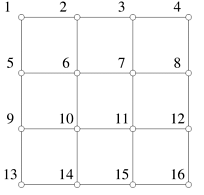
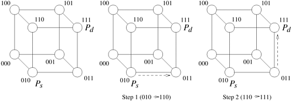

## 2.6 互联网络的路由机制

将信息路由到目的地的高效算法对并行计算机的性能至关重要。**路由机制（Routing Mechanism）** 决定了信息通过网络从源节点到达目的节点的路径。它将信息的源节点和目的节点作为输入。它还可以使用网络状态信息。它返回一条或多条从源节点到目的节点的网络路径。

路由机制可分为 **最小（Minimal）** 路由机制和 **非最小（Non-Minimal）** 路由机制。最小路由机制总是选择信源和目的地之间的一条最短路径。在最小路由方案中，每条链路都能使信息更接近目的地，但该方案可能会导致部分网络拥塞。与此相反，非最小路由方案可能会沿着较长的路径路由信息，以避免网络拥塞。

路由机制还可根据其使用网络状态信息的方式进行分类。**确定性路由（Deterministic Routing）** 方案根据信息的来源和目的地为信息确定唯一的路径。它不使用任何有关网络状态的信息。确定性方案可能会导致网络通信资源的不均衡使用。与此相反，**自适应路由（Adaptive Routing）** 选择方案使用有关网络当前状态的信息来确定信息的路径。自适应路由可检测网络拥塞情况，并绕过拥塞情况路由信息。

> [!NOTE]
>
> **路由机制（Routing Mechanism）** 决定信息通过网络从源节点到达目的节点的路径的机制
>
> - 根据路由的机制分：
>   - **最小路由机制** 总是选出从源节点到目标节点的最短路径之一
>   - **非最小路由机制** 与最小路由机制相反，可能对消息沿着较长的路径信息，避免网络阻塞
> - 根据其使用的网络状态信息分：
>   - **确定性路由** 根据信息的来源和目的地为信息确定唯一的路径，不使用任何有关网络状态的信息，可能会造成网络通信资源的不均衡
>   - **自适应路由** 使用有关网络当前状态的信息来确定信息的路径，可检测网络拥塞情况并绕过阻塞情况的路由信息

一种常用的确定性最小路由技术称为维度有序路由。**维度有序路由（Dimension-Ordered Routing）** 根据由通道维度决定的编号方案，为信息的穿越分配连续的通道。二维网格的维度有序路由技术称为 **XY 路由（XY-Routing）**，超立方体的维度有序路由技术称为 **E 立方体路由（E-Cube Routing）**。

> [!NOTE]
>
> **维度有序路由 ** 一种常用的确定性最小路由技术称为维度有序路由，基于由通道维数决定的编号方案
>
> - **XY 路由** 二维网格的维度有序路由技术
> - **EE 立方体路由** 超立方体的维度有序路由技术

考虑一个没有环绕连接的二维网格。在 XY 路由方案中，信息首先沿 *X* 维发送，直到到达目的节点的列，然后沿 *Y* 维发送，直到到达目的地。让 $P_{Sy,Sx}$ 表示源节点的位置，$P_{Dy,Dx}$ 表示目的节点的位置。任何最小路由方案都应返回一条长度为 $|Sx - Dx| + |Sy - Dy|$ 的路径。假设 $Dx \ge Sx$，$Dy \ge Sy$。在 XY 路由方案中，信息沿 *X* 维通过中间节点 $P_{Sy,Sx+1}$、$P_{Sy,Sx+2}$、$......$、$P_{Sy,Dx}$，然后沿 *Y* 维通过节点 $P_{Sy+1,Dx}$、$P_{Sy+2,Dx}$、$......$、$P_{Dy,Dx}$ 到达目的地，这条路径的长度确实是$|Sx - Dx| + |Sy - Dy|$​。

> [!NOTE]
>
> 以一个无环二维网格的XY路由选择方案：
>
> 
>
> 消息传递的路径的长度是$|Sx - Dx| + |Sy - Dy|$，其中 $P_{Sy,Sx}$ 表示源节点的位置，$P_{Dy,Dx}$ 表示目的节点的位置

超立方连接网络的 E 立方路由工作原理类似。考虑一个由 $p$ 个节点组成的 $d$ 维超立方体。让 $P_s$ 和 $P_d$ 分别代表源节点和目的节点的标签。我们从第 2.4.3 节得知，这些标签的二进制表示长度为 $d$ 比特。此外，这些节点之间的最小距离由 $P_s \oplus P_d$ 中 $1$ 的个数给出（其中 $\oplus$ 表示位运算中的异或运算）。在 E 立方算法中，节点 $P_s$ 计算 $P_s \oplus P_d$ 并沿维度 *k* 发送信息，其中 *k* 是 $P_s \oplus P_d$ 中最小有效非零比特的位置。在每个中间步骤中，接收到信息的节点 $P_i$ 会计算 $P_i \oplus P_d$，并沿最小有效非零位对应的维度转发信息。这一过程一直持续到信息到达目的地。[例 2.16](#例2.16%20超立方网络中的 E 立方路由选择) 展示了三维超立方网络中的 E 立方路由。

- ##### **例2.16 超立方网络中的 E 立方路由选择**

  考虑[图 2.28](#fig2.28) 所示的三维超立方体。让 $P_s = 010$ 和 $P_d = 111$ 分别代表一条信息的源节点和目的节点。节点 $P_s$ 计算出 $010 \oplus 111 = 101$。第一步，$P_s$ 沿着与最小有效位对应的维数将信息转发给节点 $011$。节点 $011$ 沿着与最有效位对应的维度发送信息（$011 \oplus 111 = 100$）。信息到达节点 $111$，即信息的目的地。

  

      
      

          图2.28 在三维超立方体中使用 E 立方体路由将信息从010路由到111
      

  

> [!NOTE]
>
> - 首先计算出 $P_s = 010$ 和 $P_d = 111$ 的异或值$010 \oplus 111 = 101$
> - 根据异或结果的$101$确定需要在第一个维度移动一步，然后再第三个维度移动一步
> - $P_s = 010$ 在第一个维度移动一步之后变成$011$
> - $011$在第三个维度移动一步之后变成$P_d=111$

在本书的其余部分，我们假定在分析并行算法时采用确定性的最小报文路由。