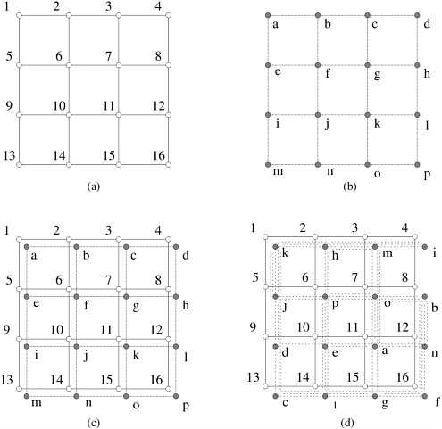
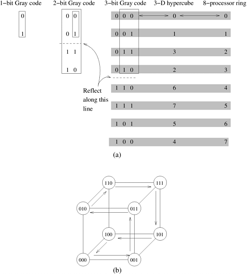
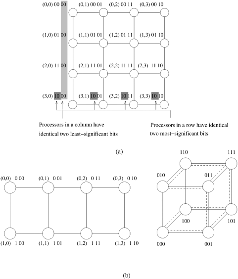
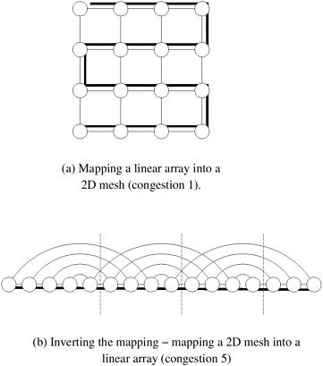
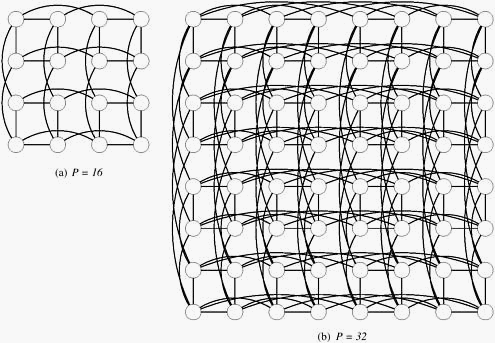

## 2.7 进程到处理器的映射技术及其影响

正如我们在第 2.5.1 节中所讨论的，程序员通常无法控制逻辑进程如何映射到网络中的物理节点。因此，即使通信模式本身并不拥塞，也可能造成网络拥塞。下面我们举例说明：

- ##### **例2.17 处理器映射的影响**

  请看[图 2.29](#fig2.29) 所示的情况。底层架构是一个 $16$ 节点的网状结构，节点标号从 $1$ 到 $16$（[图 2.29(a)](#fig2.29)），算法以 $16$​ 个进程（标号从 "*a*"到 "*p*"）的形式实现（[图 2.29(b)](#fig2.29)）。该算法是为在网格上执行而调整的，因此不会出现拥塞的通信操作。我们现在来看看流程与节点的两种映射，如[图 2.29(c)](#fig2.29)和[图 2.29(d)](#fig2.29)所示。[图 2.29(c)](#fig2.29)是一种直观的映射，底层架构中的单个链路只携带与进程间单个通信通道相对应的数据。另一方面，[图 2.29(d)](#fig2.29)对应的是进程随机映射到处理节点的情况。在这种情况下，很容易看到机器中的每条链路都在进程间携带多达六条数据通道。如果进程间通信通道所需的数据传输速率较高，这可能会导致通信时间大大增加。

  

      
      

          图2.29 进程映射对性能的影响：(a)底层架构；(b)进程及其之间的关系；(c)进程与节点的直接映射；(d)进程与节点的随机映射
      

  

从上面的例子可以看出，虽然算法可以由不拥塞的通信操作组成，但将进程映射到节点实际上可能会导致网络拥塞，造成性能下降。

### 2.7.1 图的映射技术

虽然程序员通常无法控制进程到处理器映射，但了解这种映射的算法非常重要。这是因为这些映射可用于确定算法性能的下降。给定两个图 $G(V,E)$和 $G'(V',E')$，将图 $G$ 映射到图 $G'$中，可以将集合 $V$ 中的每个顶点映射到集合 $V'$中的一个顶点（或顶点集合），将集合 $E$ 中的每条边映射到 $E'$中的一条边（或边集合）。在将图 $G(V, E)$映射到 $G'(V', E')$ 时，有三个参数非常重要。首先，$E$ 中可能有不止一条边被映射到 $E'$ 中的一条边上。映射到 $E'$ 中任何一条边上的最大边数称为映射的 **拥挤度（Congestion）**。在[例 2.17](#例2.17%20处理器映射的影响)中，[图 2.29(c)](#fig2.29) 中的映射拥挤度为 $1$，[图 2.29(d)](#fig2.29) 中的映射拥挤度为 $6$。其次，$E$ 中的一条边可以映射到 $E'$ 中的多条连续边上。这一点很重要，因为相应通信链路上的流量必须穿越多个链路，从而可能造成网络拥塞。$E'$ 中任何一条边被映射到的最大链路数称为映射的 **扩张（Dilation）**。第三，集合 $V$ 和 $V'$ 可能包含不同数量的顶点。在这种情况下，$V$ 中的一个节点对应 $V'$ 中的多个节点。集合 $V'$ 中的节点数与集合 $V$ 中的节点数之比称为映射的 **扩展（Expansion）**。在进程到处理器映射中，我们希望映射的扩展与虚拟和物理处理器的比例相同。

在本节中，我们将讨论一些常见图的嵌入，如二维网格（第 8 章中的矩阵运算）、超立方体（第 9 章和第 13 章中分别介绍了排序和 FFT 算法）和树（第 4 章中的广播和屏障）。我们的讨论范围仅限于集合 $V$ 和 $V'$ 包含节点数相等（即扩展为 $1$）的情况。

#### 线性阵列嵌入的超立方体

通过将线性数组的节点 $i$ 映射到超立方体的节点 $G(i，d)$ 上，可以将由 $2^d$ 个节点（标记为 $0$ 至 $2^d -1$）组成的线性数组（或环）嵌入到 *d* 维超立方体中。函数 $G(i, x)$ 的定义如下：
$$
\begin{align}
G(0,1)&=0 \\
G(1,1)&=1 \\
G(i,x+1)&= \left \{ 
    \begin{array}{l}
        G(i,x), &i<2^x \\
        2^x+G(2^{x+1}-1-i,x), &i \ge 2^x \\
    \end{array}
\right.
\end{align}
$$
函数 $G$ 称为 **二进制反射格雷码（Binary Reflected Gray Code，RGC）**。其中 $G(i, d)$ 表示 $d$ 位格雷码序列中的第 $i$ 个条目。$d + 1$ 比特的灰色编码是从 $d$ 比特的灰色编码表中导出的，方法是对表进行反射，并在反射条目前加上 $1$，在原始条目前加上 $0$。这个过程如[图 2.30(a)](#fig2.30) 所示。

    
    

        图2.30 (a)三比特反射格雷码环； (b)嵌入三维超立方体
    

仔细观察格雷码表就会发现，两个相邻条目（$G(i, d)$ 和 $G(i + 1, d)$）之间只有一个比特位置不同。由于线性数组中的节点 $i$ 被映射到节点 $G(i,d)$，而节点 $i + 1$ 被映射到 $G(i+1,d)$，因此超立方体中有一个直接链接与线性数组中的每个直接链接相对应。(回想一下，在超立方体中，标签只差一个比特位置的两个节点有一个直接链接）。因此，函数 $G$ 指定的映射具有 $1$ 的扩张和 $1$ 的拥塞。[图 2.30(b)](#fig2.30) 展示了将八节点环嵌入三维超立方体的过程。

#### 网格嵌入的超立方体

将网格嵌入超立方体是将环嵌入超立方体的自然延伸。我们可以通过将网格的节点 $(i, j)$ 映射到超立方体的节点 $G(i, r - 1)||G( j, s - 1)$ 上（其中 $||$ 表示两个灰色编码的连接），将 $2^r \times 2^s$ 的环绕网格嵌入到 $2^{r+s}$ 节点的超立方体中。需要注意的是，网格中的近邻节点被映射到超立方体节点上，这些节点的标签正好相差一个比特位置。因此，这种映射的扩张率为 $1$，拥塞率为 $1$。

例如，将一个 $2 \times 4$ 的网格嵌入一个八节点的超立方体中。$r$ 和 $s$ 的值分别为 $1$ 和 $2$。网格的节点 $(i, j)$ 映射到超立方体的节点 $G(i, 1)||G( j, 2)$。因此，网格的节点 $(0, 0)$ 映射到超立方体的节点 $000$，因为 $G(0, 1)$ 是 $0$，$G(0, 2)$ 是 $00$；将这两个节点连接起来就得到了超立方体节点的标签 $000$。同样，网格的节点 $(0, 1)$ 映射到超立方体的节点 $001$，依此类推。[图 2.31](#fig2.31) 展示了将网格嵌入超立方体的过程。

    
    

        图2.31 (a)4 x 4网格，说明网格节点与四维超立方体节点的映射关系；(b)嵌入三维超立方体的 2 x 4 网格
    

这种将网格映射为超立方体的方法具有某些有用的特性。网格同一行中的所有节点都被映射为超立方体节点，这些节点的标签有 $r$ 个相同的最有效位。从第 2.4.3 节中我们知道，在一个 $(r + s)$ 维超立方体的节点标签中固定任意 $r$ 个比特，就会产生一个具有 $2^s$ 个节点的 $s$ 维子立方体。由于每个网格节点都映射到超立方体中一个唯一的节点上，而网格中的每一行都有 $2^s$ 个节点，因此网格中的每一行都映射到超立方体中一个不同的子立方体上。同样，网格中的每一列都映射到超立方体中的一个不同子立方体。

#### 网格嵌入的线性阵列

在此之前，我们一直在考虑将较稀疏的网络嵌入到较密集的网络中。一个 2-D 网格有 $2 \times p$ 个链接。相比之下，一个 $p$ 节点线性阵列有 $p$ 个链接。因此，这种映射必然会产生拥塞。

首先考虑将线性阵列映射到网格中。我们假设网格和线性阵列都没有环绕连接。线性阵列与网格的直观映射如[图 2.32](#fig2.32) 所示。在这里，实线对应线性阵列中的链接，法线对应网格中的链接。从[图 2.32(a)](#fig2.32)中不难看出，线性阵列与网格的映射可以是拥塞为$1$、扩张为$1$。

    
    

        图2.32 (a)将16节点线性阵列嵌入2-D网格；(b)相反的映射关系。加粗的实线对应线性阵列中的链接，细线对应网格中的链接
    

现在考虑这种映射的逆映射，即我们给定一个网格，然后使用相同映射函数的逆映射将网格顶点映射到线性数组中的顶点。[图 2.32(b)](#fig2.32) 展示了这种映射。如前所述，实线对应线性数组中的边，法线对应网格中的边。从图中可以明显看出，这种情况下映射的拥挤度为五，即没有一条实线携带超过五条法线。一般来说，很容易看出这种（反向）映射的拥塞 $\sqrt{p}+1$ 是针对一般的 $p$ 节点映射而言的（通往下一行的每 $\sqrt{p}$ 个边缘都有一条拥塞，还有一条额外的边缘）。

虽然这是一个简单的映射，但目前的问题是我们是否能做得更好。为了回答这个问题，我们使用了两个网络的分段宽度。我们知道，不带环绕链接的二维网格的分段宽度为 $\sqrt{p}$，而线性阵列的分段宽度为 $1$。

假设二维网格到线性阵列的最佳映射的拥挤度为 $r$。这意味着，如果我们将线性阵列切成两半（从中间），我们将只切掉一个线性阵列链接，或不超过 $r$ 个网格链接。我们认为，$r$ 必须至少等于网格的分割宽度。这是因为将线性阵列等分为二的同时，也将网格等分为二。因此，根据分段宽度的定义，至少有 $\sqrt{p}$ 个网格链接必须穿过分段。因此，连接两半的一个线性阵列链路必须至少携带 $\sqrt{p}$ 个网格链路。因此，任何映射的拥塞下限都是 $\sqrt{p}$。这与[图 2.32(b)](#fig2.32)中的简单（逆）映射几乎相同。

当把密度较高的网络映射到密度较低的网络时，上文确定的下限具有更普遍的适用性。我们可以合理地认为，将具有 $x$ 个链接的网络 $S$ 映射到具有 $y$ 个链接的网络 $Q$ 时，拥塞下限为 $x/y$。在从网状网络映射到线性阵列的情况下，下限为 $2p/p$，即 $2$。然而，这个下限过于保守。事实上，通过研究两个网络的平分宽度，可以得到更严格的下限。我们将在下一节进一步说明。

#### 超立方体嵌入的二维网格

考虑将 $p$ 节点超立方体嵌入 $p$ 节点二维网格。为方便起见，我们假设 $p$ 是 $2$ 的偶次幂。在这种情况下，可以将超立方体可视化为 $\sqrt{p}$ 子立方体，每个子立方体都有 $\sqrt{p}$ 个节点。具体做法如下：设 $d = \log p$ 为超立方体的维数。根据假设，我们知道 $d$ 是偶数。我们取 $d/2$ 个最小有效位来定义节点的各个子立方体。例如，在 4D 超立方体的情况下，我们使用较低的两位定义子立方体为 $(0000,0001,0011,0010)$、$(0100,0101,0111,0110)$、$(1100,1101,1111,1110)$ 和 $(1000,1001,1011,1010)$。此时请注意，如果我们固定所有这些子立方体的 $d/2$ 个最小有效位，我们就会得到由 $d/2$ 个最有效位定义的另一个子立方体。例如，如果我们将所有子立方体的低两位固定为 $10$，就会得到节点$(0010、0110、1110、1010)$。读者可以验证这对应的是一个二维子立方体。

超立方体到网格的映射现在可以定义如下：每 $\sqrt{p}$ 个节点子立方体映射到网格的一个 $\sqrt{p}$ 节点行。我们只需将线性数组到超立方体的映射倒置即可。$\sqrt{p}$ 节点超立方体的分段宽度为 $\sqrt{p}/2$，$\sqrt{p}$ 节点行对应的二分宽度为$1$。因此，子立方体行映射的拥挤度为 $\sqrt{p}/2$（在连接两半行的边缘处）。[图 2.33(a)](#fig2.33) 和[图 2.33 (b)](#fig2.33) 展示了 $p = 16$ 和 $p = 32$ 的情况。通过这种方式，我们可以将每个子立方体映射到网格中的不同行。请注意，虽然我们已经计算了子立方体到行的映射所产生的拥塞，但还没有解决列映射所产生的拥塞。我们将超立方体节点映射到网格中的方式是，将超立方体中具有相同 $d/2$ 最小有效位的节点映射到同一列。这就形成了子立方体到列的映射，其中每个子立方体/列都有 $\sqrt{p}$ 个节点。使用与子立方体到行映射相同的论证，这将导致 $\sqrt{p}/2$ 的拥塞，因为行和列映射产生的拥塞影响到不相连的边集，所以该映射的总拥塞为 $\sqrt{p}/2$。

    
    

        图2.33 在二维网格中嵌入超立方体
    

为了确定拥塞下限，我们沿用第 2.7.1 节中的论证方法。由于超立方体的分割宽度是 $p/2$，而网格的分割宽度是 $\sqrt{p}$，因此拥塞下限就是它们的比值，即 $\sqrt{p}/2$。我们注意到，我们的映射产生了这个拥塞下限。

#### 进程到处理器映射和互连网络设计

前几节的分析表明，可以将较密集的网络映射为较稀疏的网络，并产生相关的拥塞开销。这意味着，增加链接带宽以补偿拥塞的稀疏网络，其性能有望与密集网络不相上下（模数膨胀效应）。例如，链接速度快 $\sqrt{p}/2$ 倍的网格，其性能可与超立方体相媲美。我们称这种网格为胖网格。胖网格的分段带宽与超立方体相同，但直径更大。正如我们在第 2.5.1 节中看到的，通过使用适当的信息路由技术，可以将节点距离的影响降至最低。值得注意的是，高维度网络涉及更复杂的布局、导线交叉和可变导线长度。基于这些原因，低维网络为设计互连提供了极具吸引力的替代方法。现在，我们将对并行架构的成本-性能权衡进行更正式的研究。

### 2.7.2 成本与性能的权衡

现在，我们将探讨如何利用各种成本指标来研究互连网络中的性价比权衡问题。我们通过分析成本相同的网状网络和超立方网络的性能来说明这一点。

如果网络的成本与导线数成正比，那么每个通道有 $(\log p)/4$ 根导线的 $p$ 节点正方形环绕网格的成本与每个通道只有一根导线的 $p$ 节点超立方体的成本相同。让我们比较一下这两个网络的平均通信时间。二维环绕网中任意两个节点之间的平均距离 $l_{av}$ 为 $\sqrt{p}/2$，超立方体中的平均距离 $l_{av}$ 为 $(\log p)/2$。在使用直通路由的网络中，相隔 $l_{av}$ 跳的节点之间发送大小为 $m$ 的信息所需的时间为 $t_s + t_hl_{av} + t_wm$。由于网格的信道宽度放大了 $(\log p)/4$ 倍，因此每个字的传输时间也减少了相同的系数。因此，如果超立方体上的每字传输时间为 $t_w$，那么具有增大通道的网格上的相同时间为 $4t_w/(\log p)$。因此，超立方体的平均通信延迟时间为 $t_s + t_h (\log p)/2 + t_wm$，而成本相同的环绕网格的平均通信延迟时间为 $t_s+t_h\sqrt{p}/2+4t_wm/(\log p)$

现在让我们研究一下这些表达式的行为。在节点数固定的情况下，随着信息量的增加，$t_w$ 引起的通信项将占主导地位。比较这两种网络的 $t_w$，我们会发现，如果 $p$ 大于 $16$，且信息大小 $m$ 足够大，则环绕网格的时间 ($4t_wm/(\log p)$)小于超立方体的时间 ($t_wm$)。在这种情况下，随机节点对之间的大信息点对点通信在带穿透路由的环绕网格上所需的时间比在相同成本的超立方体上所需的时间要少。此外，对于适合网格通信的算法，每个信道的额外带宽会带来更好的性能。需要注意的是，如果采用存储转发路由，网格的成本效益就不再高于超立方体。对于 k-d 立方体的一般情况，也可以分析类似的性价比权衡。

上述通信时间是在网络负载较轻的情况下计算得出的。随着报文数量的增加，网络上会出现争用现象。与超立方网络相比，争用对网状网络的不利影响更大。因此，如果网络负载较重，超立方体网络的性能将优于网状网络。

如果网络的成本与分段宽度成正比，那么每个通道 $\sqrt{p}/4$ 根导线的 $p$ 节点环绕网格的成本等于每个通道一根导线的 $p$ 节点超立方体的成本。让我们进行与上述类似的分析，利用这一成本指标来研究成本与性能之间的权衡。由于网状信道的宽度是 $\sqrt{p}/4$ 倍，因此每个字的传输时间也会降低相同的系数。因此，成本相同的超立方网络和网状网络的通信时间分别为 $t_s + t_h (\log p)/2 + t_wm$ 和 $t_s+t_h\sqrt{p}/2+4t_wm/\sqrt{p}$。同样，在节点数一定的情况下，当信息大小 $m$ 变大时，$t_w$ 项将占据主导地位。比较这两个网络的这个项，我们会发现，对于 $p > 16$ 且信息量足够大的情况，网状结构优于相同成本的超立方体。因此，对于足够大的信息量，只要网络负载较轻，网格总是优于相同成本的超立方体。即使网络负载很重，网状结构的性能也与相同成本的超立方体相似。