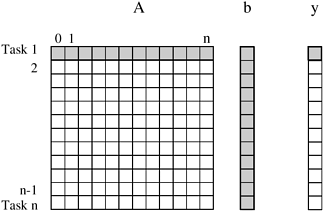
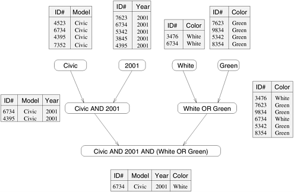
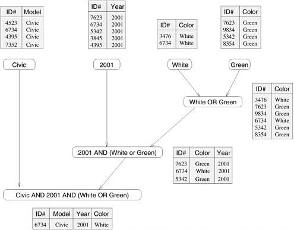
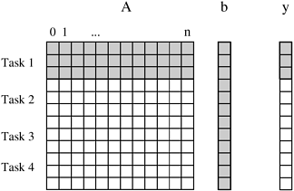
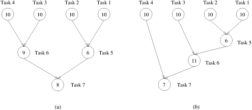
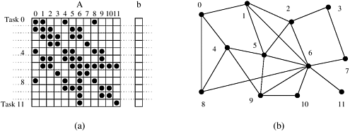
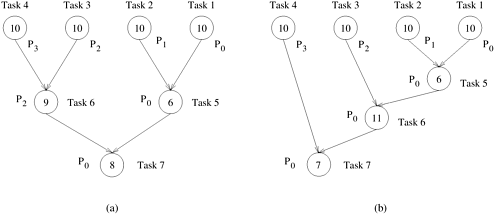

## 3.1 预备知识

将计算分成更小的计算，并将它们分配给不同的处理器并行执行，是设计并行算法的两个关键步骤。本节将介绍一些基本术语，并以矩阵-向量乘法和数据库查询处理为例，介绍并行算法设计中的这两个关键步骤。

### 3.1.1 分解、任务与依赖图

将计算划分为较小部分的过程称为 **分解（Decomposition）**，其中部分或全部计算有可能并行执行。**任务（Tasks）**是程序员定义的计算单元，通过分解，主要计算被细分为多个任务。同时执行多个任务是缩短解决整个问题所需时间的关键。任务的规模可以是任意的，但一旦定义，它们就被视为不可分割的计算单元。问题分解成的任务不一定都是相同大小的。

- ##### **例3.1 密集矩阵-矢量乘法**

  考虑将密集的 $n \times n$ 矩阵 $A$ 与向量 $b$ 相乘以产生另一个向量 $y$。乘积向量的第 $i$ 个元素 $y[i]$ 是 $A$ 的第 $i$ 行与输入向量 $b$ 的点积；即 $y[i]=\sum^n_{j=1}A[i,j] \cdot b[j]$。如[图3.1](#fig3.1)所示，每个$y[i]$的计算可以被视为一个任务。或者，如[图 3.4](#fig3.4) 所示，计算可以分解为更少的（比如四个）任务，其中每个任务大约计算向量 $y$ 的 $n/4$​ 个条目。

  <div align="center" name="fig3.1" id="fig3.1">
      
      <div>
          图3.1 将密集矩阵-向量乘法分解为n个任务，其中n是矩阵的行数。Task 1访问的矩阵部分以及输入和输出向量高亮显示
      </div>
  </div>

请注意，[图 3.1](#fig3.1) 中的所有任务都是独立的，可以一起执行，也可以按任何顺序执行。不过，一般来说，有些任务可能会使用其他任务产生的数据，因此可能需要等待这些任务完成执行。用于表达任务间这种依赖关系及其相对执行顺序的抽象概念称为 **任务依赖图（Task-Dependency Graph）**。任务依赖图是一个有向无循环图，其中节点代表任务，有向边表示任务之间的依赖关系。当所有与节点相连的任务都完成后，该节点对应的任务才能执行。请注意，任务依赖图可以是断开的，任务依赖图的边集也可以是空的。矩阵-矢量乘法就是这种情况，每个任务计算乘积矢量的一个子集。要了解更有趣的任务依赖图，请参考下面的数据库查询处理示例。

- ##### **例3.2 数据库查询处理**

  [表 3.1](#table3.1) 显示了一个车辆关系数据库。表中的每一行都是一条记录，包含与特定车辆相对应的数据，如 `ID`、`Model`、`Year`、`Color`等不同字段。请考虑在处理以下查询时执行的计算：

  ```sql
  MODEL="Civic" AND YEAR="2001" AND (COLOR="Green" OR COLOR="White")
  ```

  该查询可查找颜色为绿色或白色的所有 2001 款 Civics 汽车。在关系数据库中，处理该查询需要创建多个中间表。一种可能的方法是首先创建以下四个表：一个包含所有 Civics 的表、一个包含所有 2001 款汽车的表、一个包含所有绿色汽车的表和一个包含所有白色汽车的表。接下来，通过计算这些表格的成对交集或联合，将它们组合在一起进行计算。具体来说，计算 "思域 "表与 "2001 年款 "表的交集，就可以建立一个包含所有 2001 年款 "思域 "的表。同样，它计算绿色表和白色表的联合，以生成一个存储所有颜色为绿色或白色的汽车的表。最后，计算包含所有 2001 款 Civics 的表与包含所有绿色或白色汽车的表的交集，并返回所需的列表。

<div align="center" name="table3.1" id="table3.1">表3.1 存储二手车信息的数据库</div>

| ID#  |  Model  | Year | Color | Dealer |  Price  |
| :--: | :-----: | :--: | :---: | :----: | :-----: |
| 4523 |  Civic  | 2002 | Blue  |   MN   | $18,000 |
| 3476 | Corolla | 1999 | White |   IL   | $15,000 |
| 7623 |  Camry  | 2001 | Green |   NY   | $21,000 |
| 9834 |  Prius  | 200  | Green |   CA   | $18,000 |
| 6734 |  Civic  | 2001 | White |   OR   | $17,000 |
| 5342 | Altima  | 2001 | Green |   FL   | $19,000 |
| 3845 | Maxima  | 2001 | Blue  |   NY   | $22,000 |
| 8354 | Accord  | 2000 | Green |   VT   | $18,000 |
| 4395 |  Civic  | 2001 |  Red  |   CA   | $17,000 |
| 7352 |  Civic  | 2002 |  Red  |   WA   | $18,000 |

处理[例 3.2](#例3.2 数据库查询处理) 中的查询所涉及的各种计算可以通过[图 3.2](#fig3.2) 中所示的任务依赖图来可视化。图中的每个节点都是一个任务，对应一个需要计算的中间表，节点之间的箭头表示任务之间的依赖关系。例如，在计算与 2001 年 Civics 对应的表之前，我们必须首先计算所有 Civics 的表和所有 2001 年型号汽车的表。

<div align="center" name="fig3.2" id="fig3.2">
    
    <div>
        图3.2 查询处理操作中的不同表格及其依赖关系
    </div>
</div>

请注意，某些计算通常有多种表达方式，尤其是涉及关联运算符（如加法、乘法和逻辑 AND 或 OR）的计算。不同的计算排列方式会导致具有不同特征的任务依赖图。例如，[例 3.2](#例3.2 数据库查询处理) 中的数据库查询可以通过以下方法解决：首先计算所有绿色或白色汽车的表格，然后与所有 2001 型汽车的表格进行交叉，最后将结果与所有 Civics 汽车的表格相结合。这一系列计算的结果就是[图 3.3](#fig3.3) 所示的任务依赖关系图。

<div align="center" name="fig3.3" id="fig3.3">
    
    <div>
        图3.3 查询处理操作的备用数据依赖图
    </div>
</div>

### 3.1.2 粒度、并发性与任务交互

问题分解成的任务数量和大小决定了分解的粒度。分解成大量小任务的分解称为细粒度，分解成少量大任务的分解称为粗粒度。例如，[图 3.1](#fig3.1) 所示的矩阵-矢量乘法分解通常被视为细粒度分解，因为大量任务中的每个任务都只执行一个点积。[图 3.4](#fig3.4) 显示了将同一问题分解为四个任务的粗粒度分解，其中每个任务计算长度为 $n$ 的输出向量的 $n/4$ 个条目。

<div align="center" name="fig3.4" id="fig3.4">
    
    <div>
        图3.4 将密集矩阵-向量乘法分解为四个任务。Task 1访问的矩阵部分以及输入和输出向量突出显示
    </div>
</div>

与粒度相关的一个概念是**并发度（Degree of Concurrency）**。并行程序在任何给定时间内可同时执行的最大任务数称为最大并发度。在大多数情况下，由于任务间的依赖关系，最大并发度小于任务总数。例如，[图 3.2](#fig3.2) 和[图 3.3](#fig3.3) 任务图中的最大并发度为 $4$。在这些任务图中，当可以同时计算型号、年份、绿色和白色表格时，一开始就可以达到最大并发度。一般来说，对于树形任务依赖图，并发度的最大值总是等于树的叶子数。

衡量并行程序性能的一个更有用的指标是**平均并发度（Average Degree of Concurrency）**，即在整个程序执行期间可同时运行的任务的平均数量。

最大并发度和平均并发度通常会随着任务粒度的变小（变细）而增加。例如，[图 3.1](#fig3.1) 所示的矩阵-矢量乘法分解具有相当小的粒度和较大的并发度。[图 3.4](#fig3.4) 所示的同一问题的分解任务粒度较大，并发程度较低。

并发程度还取决于任务依赖图的形状，一般来说，相同的粒度并不能保证相同的并发程度。例如，考虑[图 3.5](#fig3.5) 中的两个任务图，它们分别是[图 3.2](#fig3.2) 和[图 3.3](#fig3.3) 中任务图的抽象。每个节点内的数字代表完成该节点对应的任务所需的工作量。[图 3.5(a)](#fig3.5)中任务图的平均并发度为 $2.33$，[图 3.5(b)](#fig3.5)中任务图的平均并发度为 $1.88$，尽管这两个任务依赖图都基于相同的分解。

<div align="center" name="fig3.5" id="fig3.5">
    
    <div>
        图3.5 <a href="#fig3.2">图3.2</a>和<a href="#fig3.3">图3.3</a>的任务图的抽象
    </div>
</div>

任务依赖图的一个特征是其**关键路径（Critical Path）**，它决定了给定粒度下的平均并发度。在任务依赖图中，我们把没有进边的节点称为起点节点，把没有出边的节点称为终点节点。任意一对开始节点和结束节点之间最长的有向路径称为关键路径。这条路径上节点的权重之和称为**关键路径长度（Critical Path Length）**，其中节点的权重是与相应任务相关的大小或工作量。工作总量与关键路径长度的比值就是平均并发程度。因此，关键路径越短，并发度越高。例如，在[图 3.5(a)](#fig3.5) 所示的任务依赖关系图中，关键路径长度为 $27$，而在[图 3.5(b)](#fig3.5) 所示的任务依赖关系图中，关键路径长度为 $34$。由于使用这两种分解方法解决问题所需的总工作量分别为 $63$ 和 $64$，因此这两个任务依赖图的平均并发度分别为 $2.33$ 和 $1.88$。

虽然看起来，只需增加分解的粒度，并利用由此产生的并发性来并行执行越来越多的任务，就能缩短解决问题所需的时间，但在大多数实际情况下并非如此。通常情况下，一个问题允许多细粒度的分解是有其内在约束的。例如，[例 3.1](#例3.1 密集矩阵-矢量乘法) 中的矩阵-矢量乘法有 $n^2$ 个乘法和加法，即使使用最精细的分解，也无法将问题分解为超过 $O(n^2)$ 个任务。

除了有限的粒度和并发程度外，还有另一个重要的实际因素限制了我们从并行化中获得无限制提速（串行执行时间与并行执行时间之比）的能力。这个因素就是运行在不同物理处理器上的任务之间的**相互作用（Interaction）**。问题分解成的任务往往共享输入、输出或中间数据。任务依赖图中的依赖关系通常源于一个任务的输出是另一个任务的输入。例如，在数据库查询示例中，任务共享中间数据；一个任务生成的表经常被另一个任务用作输入。根据任务的定义和并行编程范式，在任务依赖图中看似独立的任务之间也可能存在交互。例如，在矩阵-矢量乘法分解中，尽管所有任务都是独立的，但它们都需要访问整个输入矢量 $b$。由于矢量 $b$​ 本来只有一个副本，因此在分布式内存范例中，任务可能必须发送和接收信息，才能访问整个矢量。

任务之间的交互模式由所谓的 **任务交互图（Task-Interaction Graph）** 来捕捉。任务交互图中的节点代表任务，边则连接相互交互的任务。如果任务交互图的节点和边的权重与任务执行的计算量和沿边发生的交互量成正比（如果这些信息已知），则可以为这些节点和边分配权重。任务交互图中的边通常是无向的，但如果数据流是单向的，则可以用有向边来表示数据流的方向。任务交互图的边集通常是任务依赖图边集的超集。在前面讨论的数据库查询示例中，任务交互图与任务依赖图相同。现在我们举例说明一个更有趣的任务交互图，它是稀疏矩阵与向量相乘问题的结果。

- ##### **例3.3 稀疏矩阵-矢量乘法**

  考虑计算稀疏 $n \times n$ 矩阵 $A$ 与密集 $n \times 1$ 向量 $b$ 的乘积 $y = Ab$ 的问题。当矩阵中相当数量的条目为零，且非零条目位置不符合预定义结构或模式时，该矩阵被视为稀疏矩阵。通过避免涉及零的计算，涉及稀疏矩阵的算术运算通常可以大大优化。例如，在计算乘积向量的第 $i$ 个条目 $y[i]=\sum^n_{j=1}(A[i,j] \times b[j])$ 时，我们只需要计算 $A[i, j] \neq 0$ 的那些 $j$ 值的乘积 $A[i, j] \times b[j]$。例如：
  $$
  y[0]=A[0,0] \cdot b[0] + A[0,1] \cdot b[1] + A[0,4] \cdot b[4] + A[0,8] \cdot b[8]
  $$
  分解这种计算的一种可能方法是分割输出向量 $y$，让每个任务计算其中的一个条目。[图 3.6(a)](#fig3.6) 展示了这种分解方式。除了将输出向量 $y[i]$ 元素的计算分配给任务 $i$ 外，我们还让它成为矩阵 $A[i, *]$ 行和输入向量 $b[i]$ 元素的 "所有者"。请注意，计算 $y[i]$ 需要访问 $b$ 中由其他任务拥有的许多元素。因此，任务 $i$ 必须从适当的位置获取这些元素。在消息传递范式中，任务 $i$ 拥有了 $b[i]$ 的所有权后，也就继承了将 $b[i]$ 发送给所有需要它进行计算的其他任务的责任。例如，Task 4 必须向Task 0、5、8 和 9 发送 $b[4]$，并且必须获得 $b[0]$、$b[5]$、$b[8]$ 和 $b[9]$ 才能执行自己的计算。由此产生的任务交互图如[图 3.6(b)](#fig3.6) 所示。

  <div align="center" name="fig3.6" id="fig3.6">
      
      <div>
          图3.6 稀疏矩阵-向量乘法分解及相应的任务-交互图
      </div>
  </div>

第 5 章详细定量分析了交互和有限并发导致的开销及其对并行算法体系结构组合的性能和可扩展性的影响。在本节中，我们对这些因素进行了基本介绍，因为在设计并行算法时需要对它们进行重要考虑。

### 3.1.3 进程和映射

将问题分解成的任务在物理处理器上运行。不过，由于我们即将讨论的原因，我们将在本章中使用**进程（Process）**一词来指执行任务的处理或计算代理。在这里，"进程 "一词并不遵循操作系统对进程的严格定义。相反，它是一个抽象实体，使用与任务相对应的代码和数据，在并行程序激活任务后的有限时间内产生该任务的输出。在这段时间内，除了执行计算外，进程还可以根据需要与其他进程同步或通信。为了获得比顺序执行更快的速度，并行程序必须有多个进程同时激活，并执行不同的任务。将任务分配给进程执行的机制称为**映射（Mapping）**。例如，在[例 3.5](#例3.5 矩阵乘法) 的矩阵乘法计算中，可以分配四个进程分别计算 $C$​ 的一个子矩阵。

在为并行算法选择一个好的映射时，选择分解所产生的任务依赖关系图和任务交互图起着重要作用。一个好的映射应通过将独立的任务映射到不同的进程来最大限度地利用并发性，应通过确保在关键路径上的任务可执行时，进程能立即执行这些任务来最大限度地减少总完成时间，应通过将具有高度交互性的任务映射到同一进程来最大限度地减少进程间的交互。在大多数非并行算法中，这些目标往往是相互冲突的。例如，最有效的分解映射组合是将单个任务映射到单个进程上。它不会浪费空闲或交互时间，但也不会提高速度。找到一个能优化整体并行性能的平衡点是并行算法成功的关键。因此，任务与进程的映射在决定并行算法的效率方面起着重要作用。尽管并发程度是由分解决定的，但映射才是决定并发的实际利用程度和效率的关键。

例如，[图 3.7](#fig3.7) 显示了将[图 3.5](#fig3.5) 中的分解和任务交互图有效映射到四个进程的情况。请注意，在这种情况下，虽然任务总数为七个，但最多只能使用四个进程。这是因为并发的最大程度只有四个。最后三个任务可以在进程间任意映射，以满足任务依赖图的约束条件。不过，将由边连接的任务映射到同一个进程中更有意义，因为这样可以防止任务间的交互变成进程间的交互。例如，在[图 3.7(b)](#fig3.7)中，如果将Task 5映射到流程 $P_2$ 上，那么流程 $P_0$ 和 $P_1$ 都需要与 $P_2$ 进行交互。在当前的映射中，$P_0$ 和 $P_1$ 之间只需进行一次交互即可。

<div align="center" name="fig3.7" id="fig3.7">
    
    <div>
        图3.7 <a href="#fig3.5">图3.5</a>的任务图与四个进程的映射
    </div>
</div>

### 3.1.4 进程与处理器

在并行算法设计中，进程是执行任务的逻辑计算代理。处理器是物理上执行计算的硬件单元。在本文中，我们选择用进程来表达并行算法和程序。在大多数情况下，当我们在并行算法中提及进程时，进程与处理器之间存在一一对应的关系，假设进程的数量与并行计算机上物理 CPU 的数量相同是合适的。然而，有时可能需要更高的抽象层次来表达并行算法，特别是当它是一个具有多个阶段或不同并行形式的复杂算法时。

在为支持多种编程范式的硬件设计并行程序时，将进程和处理器分开处理也很有用。例如，考虑一台由多个计算节点组成的并行计算机，这些节点通过消息传递相互通信。现在，这些节点中的每一个都可以是具有多个 CPU 的共享地址空间模块。考虑在这样的并行计算机上实现矩阵乘法。设计并行算法的最佳方法是分两个阶段进行。首先，制定适合消息传递范式的分解和映射策略，并以此利用节点间的并行性。原始矩阵乘法问题分解成的每个任务本身就是一个矩阵乘法计算。下一步是开发适合共享内存范例的分解和映射策略，并以此在节点的多个 CPU 上实现每个任务。
