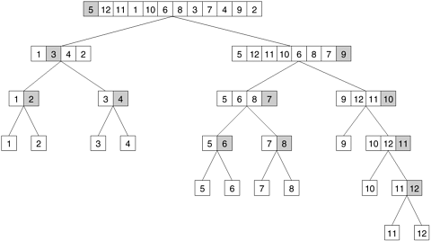

## 3.2 分解技术

如前所述，要并行地解决一个问题，我们需要采取的基本步骤之一是将要执行的计算拆分成一组任务，由任务依赖图定义并发执行。在本节中，我们将介绍一些实现并发性的常用分解技术。这并不是一套详尽无遗的分解技术。而且，给定的分解并不总能保证为给定问题带来最佳并行算法。尽管存在这些缺陷，本节中介绍的分解技术通常为许多问题提供了一个良好的起点，而且这些技术的一种或组合可用于为大量问题获得有效的分解。

这些技术大致分为**递归分解（Recursive Decomposition）**、**数据分解（Data-Decomposition）**、**探索分解（Exploratory Decomposition）**和**推测分解（Speculative Decomposition.）**。递归分解和数据分解技术是相对通用的技术，因为它们可以用来分解各种各样的问题。另一方面，推测性分解和探索性分解技术则更具有特殊用途，因为它们适用于**特定类别（Special Purpose）**的问题。

### 3.2.1 递归分解

递归分解是一种在可使用分而治之策略解决的问题中诱导并发性的方法。在这种技术中，首先要将一个问题分成一组独立的子问题来解决。在解决每个子问题时，都要递归应用类似的方法将其划分为更小的子问题，然后再将它们的结果组合起来。分而治之的策略产生了自然的并发性，因为不同的子问题可以同时解决。

- ##### **例3.4 快速排序**

  考虑使用常用的快速排序算法对包含 $n$ 个元素的序列 $A$ 进行排序的问题。快速排序是一种分而治之的算法，首先选择一个枢轴元素 $x$，然后将序列 $A$ 分成两个子序列 $A_0$ 和 $A_1$，这样 $A_0$ 中的所有元素都小于 $x$，而 $A_1$ 中的所有元素都大于或等于 $x$。通过递归调用快速排序，对 $A_0$ 和 $A_1$ 的每个子序列进行排序。每一次递归调用都会进一步分割序列。[图 3.8](#fig3.8) 以 $12$​ 个数字的序列为例进行了说明。当每个子序列只包含一个元素时，递归结束。

  <div align="center" name="fig3.8" id="fig3.8">
      
      <div>
          图3.8 基于递归分解的快速排序任务依赖图，用于对12个数字序列进行排序
      </div>
  </div>

在[图 3.8](#fig3.8) 中，我们将任务定义为分割给定子序列的工作。因此，[图 3.8](#fig3.8) 也代表了问题的任务图。最初，只有一个序列（即树的根），我们只能使用一个进程对其进行分割。根任务完成后会产生两个子序列（$A_0$ 和 $A_1$，对应树第一层的两个节点），每个子序列都可以并行分割。同样，并发性会随着树的下移而不断增加。

有时，即使问题的常用算法不是基于 "分而治之" 策略，也有可能对计算进行重组，使其适合递归分解。例如，考虑在由 $n$ 个元素组成的无序序列 $A$ 中寻找最小元素的问题。解决这个问题的序列算法会扫描整个序列 $A$​，每一步都会记录迄今发现的最小元素，如[算法 3.1](#algo3.1) 所示。不难看出，这种串行算法没有并发性。

<div name="algo3.1" id="algo3.1">算法3.1 用于查找长度为 n 的数组 A 中最小值的串行程序</div>

```pascal
procedure SERIAL_MIN (A, n)
begin
min = A[0];
for i := 1 to n - 1 do
    if (A[i] < min) min := A[i];
endfor;
return min;
end SERIAL_MIN
```

一旦我们将这种计算重组为分而治之算法，就可以使用递归分解来提取并发性。[算法 3.2](#algo3.1) 是一种用于查找数组中最小元素的分而治之算法。在该算法中，我们将序列 $A$ 分割成两个子序列，每个子序列的大小为 $n/2$，然后通过执行递归调用找到每个子序列的最小值。现在，我们通过选择这两个子序列中的最小值来找到整个最小元素。当每个子序列中只剩下一个元素时，递归结束。以这种方式重组串行计算后，就很容易为这个问题构建一个任务依赖图。[图 3.9](#fig3.9) 展示了求八个数的最小值的任务依赖图，其中每个任务都分配了求两个数的最小值的工作。

<div align="center" name="fig3.9" id="fig3.9">
    
    <div>
        图3.9 查找序列 {4, 9, 1, 7, 8, 11, 2, 12} 中最小数的任务依赖图。树中的每个节点代表查找一对数的最小值的任务
    </div>
</div>

<div name="algo3.2" id="algo3.2">算法3.2 查找长度为 n 的数组 A 中最小值的递归程序</div>

```pascal
procedure RECURSIVE_MIN (A, n)
begin
if (n = 1) then
    min := A[0];
else
    lmin := RECURSIVE_MIN (A, n/2);
    rmin := RECURSIVE_MIN (&(A[n/2]), n - n/2);
    if (lmin < rmin) then
        min := lmin;
    else
        min := rmin;
    endelse;
endelse;
return min;
end RECURSIVE_MIN
```

### 3.2.2 数据分解

数据分解是一种强大而常用的方法，可用于在大型数据结构上运行的算法中推导并发性。在这种方法中，计算的分解分两步进行。第一步，对执行计算的数据进行分区；第二步，利用数据分区将计算划分为任务。这些任务在不同数据分区上执行的运算通常是相似的（如[例 3.5](#例3.5 矩阵乘法) 中介绍的矩阵乘法），或者是从一小组运算中选择的（如[例 3.10](#例3.10 密集 LU 因式分解) 中介绍的 LU 因式分解）。

数据分区可以通过多种可能的方式进行，下文将对此进行讨论。一般来说，我们必须探索和评估所有可能的数据分区方式，并确定哪种方式能产生自然、高效的计算分解。

**输出数据分区（Partitioning Output Data）** 在许多计算中，输出的每个元素都可以作为输入的函数独立于其他元素进行计算。在此类计算中，输出数据的分割会自动将问题分解为任务，其中每个任务都被分配计算部分输出的工作。我们在例 3.5 中引入矩阵乘法问题来说明基于输出数据分区的分解。

- ##### **例3.5 矩阵乘法**

  考虑将两个 $n \times n$ 矩阵 $A$ 和 $B$ 相乘得到矩阵 $C$ 的问题。[图 3.10](#fig3.10) 显示了将这一问题分解为四个任务的过程。每个矩阵由四个块或子矩阵组成，将矩阵的每个维度分成两半。$C$ 的四个子矩阵的大小大致为 $n/2 \times n/2$，然后由四个任务分别计算 $A$ 和 $B$​ 的子矩阵的适当乘积之和。

  <div align="center" name="fig3.10" id="fig3.10">
      
      <div>
          图3.10 (a)将输入和输出矩阵划分为2x2子矩阵。(b)根据(a)中的矩阵划分，将矩阵乘法分解为四项任务
      </div>
  </div>

大多数矩阵算法，包括矩阵-向量和矩阵-矩阵乘法，都可以用块矩阵运算来表述。在这种表述中，矩阵被视为由块或子矩阵组成，对其元素的标量算术运算被对块的等效矩阵运算所取代。元素算法和块算法的结果在数学上是等价的。分块版矩阵算法通常用于辅助分解。

[图 3.10](#fig3.10) 所示的分解基于将输出矩阵 $C$ 分割为四个子矩阵，四个任务分别计算其中一个子矩阵。读者必须注意，数据分解不同于将计算分解为任务。虽然二者经常相关，而且前者经常有助于后者，但给定的数据分解并不会产生唯一的任务分解。例如，[图 3.11](#fig3.11) 显示了矩阵乘法的另外两种分解，每种分解都分为 $8$​ 个任务，与[图 3.10(a)](#fig3.10) 中使用的数据分解相对应。

<div align="center" name="fig3.11" id="fig3.11">
    
    <div>
        图3.11 将矩阵乘法分解为八项任务的两个例子
    </div>
</div>

现在我们引入另一个示例来说明基于数据分区的分解。[例 3.6](#例3.6 计算交易数据库中项目集的频率) 描述了计算事务数据库中一组项集的频率问题，该问题可根据输出数据的分区进行分解。

- ##### **例3.6 计算交易数据库中项目集的频率**

  考虑计算事务数据库中一组项目集的频率问题。在这个问题中，我们给定了一个包含 $n$ 个事务的集合 $T$ 和一个包含 $m$ 个项目集的集合 $I$。在可能的项目集合中，每个交易和项目集都包含少量项目。例如，$T$ 可以是一家杂货店的客户销售数据库，每笔交易都是购物者的个人杂货清单，每个项目组可以是店内的一组项目。如果商店想知道有多少顾客购买了每组指定的物品，那么就需要找出 $I$ 中每个项目组在所有交易中出现的次数，即每个项目组是其中一个子集的交易次数。[图 3.12(a)](#fig3.12) 显示了这类计算的一个示例。[图 3.12](#fig3.12) 所示的数据库由 $10$ 个事务组成，我们想计算的是第二列中显示的 $8$ 个项目集的频率。这些项目集在数据库中的实际频率，即频率计算程序的输出，显示在第三列中。例如，项目组 $\{D, K\}$​ 出现了两次，一次在第二笔交易中，一次在第九笔交易中。

  <div align="center" name="fig3.12" id="fig3.12">
      
      <div>
          图3.12 计算交易数据库中的项集频率
      </div>
  </div>

[图 3.12(b)](#fig3.12) 显示了如何将计算项集频率的任务分解为两个任务，方法是将输出划分为两部分，并让每个任务计算各自一半的频率。请注意，在此过程中，项目集输入也被分割，但[图 3.12(b)](#fig3.12) 中分解的主要动机是让每个任务独立计算分配给它的频率子集。

**输入数据分区（Partitioning Input Data）** 输出数据分区只有在每个输出都能作为输入函数自然计算的情况下才能进行。在许多算法中，对输出数据进行分割是不可能或不可取的。例如，在求一组数的最小值、最大值或总和时，输出是一个单一的未知值。在排序算法中，无法单独有效地确定输出的各个元素。在这种情况下，有时可以对输入数据进行分区，然后利用这种分区来诱导并发。为输入数据的每个分区创建一个任务，该任务使用这些本地数据执行尽可能多的计算。请注意，由输入分区诱导的任务解决方案可能无法直接解决原始问题。在这种情况下，需要进行后续计算来合并结果。例如，在使用 $p$ 个进程（$N > p$）求 $N$ 个数字序列的和时，我们可以将输入分割成大小几乎相等的 $p$ 个子集。然后，每个任务计算其中一个子集中的数字之和。最后，将 $p$​ 个部分结果相加，得出最终结果。

[例 3.6](#例3.6 计算交易数据库中项目集的频率) 中描述的计算交易数据库中一组项目集的频率问题，也可以根据输入数据的分区进行分解。[图 3.13(a)](#fig3.13) 显示了根据输入事务集的分区进行的分解。两个任务分别计算各自交易子集中所有项目集的频率。两组频率是两个任务的独立输出，代表中间结果。通过成对加法将中间结果合并，就得到了最终结果。

<div align="center" name="fig3.13" id="fig3.13">
    
    <div>
        图3.13计算事务数据库中项集频率的一些分解
    </div>
</div>

**对输入和输出数据进行分区（Partitioning both Input and Output Data）** 在某些可以对输出数据进行分区的情况下，对输入数据进行分区可以提供额外的并发性。例如，考虑[图 3.13(b)](#fig3.13) 所示的用于计算项集频率的 $4$ 向分解。在这里，事务集和频率被分为两部分，四个可能组合中的不同组合被分配给四个任务中的每一个。然后，每个任务计算一个本地频率集。最后，将Task 1 和Task 3 的输出以及Task 2 和Task 4 的输出相加。

**分割中间数据（Partitioning Intermediate Data）** 算法的结构通常是多阶段计算，其中一个阶段的输出是后续阶段的输入。通过对算法中间阶段的输入或输出数据进行分区，可以对这种算法进行分解。对中间数据进行分区有时会比对输入或输出数据进行分区带来更高的并发性。通常，在解决问题的串行算法中，中间数据并不是明确生成的，因此可能需要对原始算法进行一些重组，以使用中间数据分区来进行分解。

让我们重温一下矩阵乘法，以说明基于中间数据分区的分解。回想一下，如[图 3.10](#fig3.10) 和[图 3.11](#fig3.11) 所示，输出矩阵 $C$ 的 $2 \times 2$ 分割所引起的分解最大并发度为 $4$。如[图 3.14](#fig3.14) 所示，我们可以通过引入一个中间阶段来提高并发度，在这个阶段中，八个任务分别计算各自的乘积子矩阵，并将结果存储在一个临时的三维矩阵 $D$ 中。子矩阵 $D_{k,i,j}$ 是 $A_{i,k}$ 和 $B_{k,j}$​ 的乘积。

<div align="center" name="fig3.14" id="fig3.14">
    
    <div>
        图3.14 矩阵 A 和 B 与三维中间矩阵 D 的分区相乘
    </div>
</div>

对中间矩阵 $D$ 进行分割后，分解为 $8$ 个任务。[图 3.15](#fig3.15) 显示了这一分解。在乘法阶段之后，一个相对便宜的矩阵加法步骤可以计算出结果矩阵 $C$。所有具有相同第二和第三维度 $i$ 和 $j$ 的子矩阵 $D_{*,i,j}$ 相加后得到 $C_{i,j}$。[图 3.15](#fig3.15) 中编号为 $1$ 到 $8$ 的 $8$ 个任务分别执行 $O(n^3/8)$ 次 $A$ 和 $B$ 的 $n/2 \times n/2$ 子矩阵相乘。然后，编号为 $9$ 到 $12$ 的 $4$ 个任务分别花费 $O(n^2/4)$ 次时间将中间矩阵 $D$ 的相应 $n/2 \times n/2$ 子矩阵相加，得出最终结果矩阵 $C$。[图 3.16](#fig3.16) 显示了与[图 3.15](#fig3.15) 所示分解相对应的任务依赖图。

<div align="center" name="fig3.15" id="fig3.15">
    
    <div>
        图3.15 基于中间三维矩阵分区的矩阵乘法分解法
    </div>
</div>

<div align="center" name="fig3.16" id="fig3.16">
    
    <div>
        图3.16 <a href="#fig3.15">图3.15</a>所示为分解后的任务依赖关系图。
    </div>
</div>

请注意，在[图 3.11](#fig3.11) 所示的原始分解中，$D$ 的所有元素都是隐式计算的，而不是显式存储的。通过重组原始算法和显式存储 $D$​，我们设计出了一种并发度更高的分解算法。但这是以额外的总内存使用量为代价的。

**所有者计算规则（The Owner-Computes Rule）** 基于输出或输入数据分区的分解也被广泛称为**所有者计算（Owner-Computes）**规则。这一规则背后的理念是，每个分区执行涉及其拥有的数据的所有计算。根据数据的性质或数据分区的类型，所有者计算规则可能有不同的含义。例如，当我们将输入数据的分区分配给任务时，"所有者-计算 "规则意味着任务执行所有可以使用这些数据进行的计算。另一方面，如果我们对输出数据进行分区，那么 "所有者-计算 "规则就意味着任务要计算分配给它的分区中的所有数据。

### 3.2.3 探索分解

**探索分解（Exploratory decomposition）** 用于分解问题，这些问题的基本计算相当于在空间中搜索解决方案。在探索性分解中，我们将搜索空间划分为更小的部分，并同时搜索每个部分，直到找到所需的解决方案。探索性分解的一个例子是 *15-Puzzle问题*。

- ##### **例3.7 15-Puzzle问题**

  *15-Puzzle问题* 由 $15$ 个编号为 $1$ 到 $15$ 的图块和一个放在 $4 \times 4$ 网格中的空白图块组成。瓷砖可以从与其相邻的位置移动到空白位置，从而在瓷砖的原始位置形成空白。根据网格的配置，最多可以进行四次移动：向上、向下、向左和向右。棋子的初始配置和最终配置都是指定的。目标是确定将初始配置转换为最终配置的任何移动序列或最短移动序列。[图 3.17](#fig3.17) 展示了初始配置和最终配置样本，以及从初始配置到最终配置的移动序列。

  <div align="center" name="fig3.17" id="fig3.17">
      
      <div>
          图3.17 15-Puzzle问题实例显示了初始配置(a)、最终配置(d)以及从初始配置到最终配置的移动顺序
      </div>
  </div>

*15-Puzzle问题* 通常采用树状搜索技术来解决。从初始配置开始，生成所有可能的后继配置。一个配置可能有 $2$、$3$ 或 $4$ 个可能的后继配置，每个后继配置都对应于其一个相邻配置占用的空槽。寻找从初始配置到最终配置的路径的任务现在转化为寻找从这些新生成的配置之一到最终配置的路径。由于这些新生成的配置之一必须更接近解决方案（如果存在解决方案的话），因此我们在寻找解决方案方面取得了一些进展。树形搜索生成的配置空间通常被称为状态空间图。图中的每个节点都是一个配置，图中的每条边都连接着只需移动一个棋子就能到达的配置。

解决这一问题的一种并行方法如下。首先，从初始配置开始连续生成几层配置，直到搜索树上有足够数量的叶节点（即 *15-Puzzle问题* 的配置）。现在，每个节点都被分配给一个任务来进一步探索，直到其中至少有一个任务找到解决方案。一旦其中一个并发任务找到了解决方案，它就可以通知其他任务终止搜索。[图 3.18](#fig3.18) 展示了这样一个分解为四个任务的过程，其中Task 4 找到了解决方案。

<div align="center" name="fig3.18" id="fig3.18">
    
    <div>
        图3.18 15-Puzzle问题实例产生的状态
    </div>
</div>


需要注意的是，尽管探索式分解看似与数据分解类似（搜索空间可视为被分割的数据），但两者在以下方面存在本质区别。数据分解所引起的任务都是完整执行的，每个任务都会执行有用的计算来解决问题。另一方面，在探索式分解中，一旦找到整体解决方案，未完成的任务就可以终止。因此，并行方案搜索的搜索空间部分（以及执行的总工作量）可能与串行算法搜索的搜索空间截然不同。并行算法所做的工作可能比串行算法少，也可能比串行算法多。例如，将搜索空间划分为四个并发任务，如[图 3.19](#fig3.19) 所示。如果解就在与Task 3 相对应的搜索空间的起点处（[图 3.19(a)](#fig3.19)），那么并行计算法几乎可以立即找到解。而串行算法只有在完成相当于搜索与Task 1 和 2 相对应的整个空间的工作后，才能找到解决方案。另一方面，如果解决方案位于与Task 1 相对应的搜索空间的末端（[图 3.19(b)](#fig3.19)），那么并行算法所做的工作几乎是串行算法的四倍，速度不会提高。

<div align="center" name="fig3.19" id="fig3.19">
    
    <div>
        图3.19 探索性分解导致异常加速的说明
    </div>
</div>

### 3.2.4 推测分解

当程序可能会根据前面其他计算的输出，选择多个具有重要计算意义的分支之一时，就会使用**推测分解（Speculative Decomposition）**。在这种情况下，当一个任务正在执行计算（其输出用于决定下一步计算）时，其他任务可以同时开始下一阶段的计算。这种情况类似于在开关输入可用之前，并行评估 C 语言中开关语句的一个或多个分支。当一个任务正在执行最终解决开关问题的计算时，其他任务可以并行处理开关的多个分支。当最终计算出开关的输入时，与正确分支相对应的计算将被使用，而与其他分支相对应的计算将被丢弃。并行运行时间小于串行运行时间，原因是评估下一任务所依赖的条件所需的时间被用于并行执行下一阶段的有用计算。然而，开关的这种并行处理方式至少会造成一些计算的浪费。为了尽量减少浪费的计算量，可以使用稍有不同的推测分解形式，尤其是在切换的结果之一比其他结果更有可能出现的情况下。在这种情况下，只有最有希望的分支才会与前面的计算并行执行任务。如果切换的结果与预期的不同，计算将回滚，并采用正确的切换分支。

- ##### **例3.8 并行离散事件模拟**

  考虑模拟一个以网络或有向图表示的系统。该网络的节点代表组件。每个组件都有一个作业输入缓冲区。每个组件或节点的初始状态都是空闲的。空闲的组件从其输入队列（如果有的话）中拾取一个作业，在一定的时间内处理该作业，并将其放入通过出站边与其相连的组件的输入缓冲区中。如果一个元件的出线邻居的输入缓冲区已满，则该元件必须等待，直到该邻居拾取一个作业，为缓冲区创造空间。输入作业类型的数量是有限的。组件的输出（以及与其相连组件的输入）和处理作业所需的时间是输入作业的函数。现在的问题是模拟给定作业序列或一组输入作业序列的网络运行，并计算总完成时间以及系统行为的其他方面。[图 3.20](#fig3.20) 显示了离散事件求解问题的一个简单网络。

  <div align="center" name="fig3.20" id="fig3.20">
      
      <div>
          图3.20 用于离散事件模拟的简单网络
      </div>
  </div>

在[例 3.8](#例3.8 并行离散事件模拟) 中描述的网络上模拟一连串输入任务的问题本质上似乎是顺序性的，因为一个典型 组件的输入就是另一个组件的输出。不过，我们可以定义一些推测性任务，开始模拟网络的一个子部分，每个任务都假设该阶段可能有多个输入。当某一阶段的实际输入可用时（由于前一阶段的另一个选择器任务已完成），如果推测正确，则模拟该输入所需的全部或部分工作已经完成；如果推测不正确，则使用最新的正确输入重新开始模拟该阶段。

推测式分解与探索式分解有以下不同。在推测性分解中，通向多个并行任务的分支的输入是未知的，而在探索性分解中，源自一个分支的多个任务的输出是未知的。在推测式分解中，串行算法严格来说只会执行推测阶段中的一个任务，因为当它到达该阶段的起始点时，它清楚地知道要走哪条分支。因此，采用推测性分解的并行程序通过抢先计算多种可能性（其中只有一种可能性会实现），会比串行程序执行更多的总工作。即使只对其中一种可能性进行了推测性探索，并行算法执行的工作量也可能比串行算法多或相同。另一方面，在探索性分解中，串行算法也可能会一个接一个地探索不同的备选方案，因为事先并不知道可能导致求解的分支。因此，与串行算法相比，并行程序可能执行更多或更少的总工作量，也可能执行相同的工作量，这取决于解决方案在搜索空间中的位置。

### 3.2.5 混合分解

到目前为止，我们已经讨论了许多分解方法，这些方法可用于推导许多算法的并发公式。这些分解技术并不相互排斥，通常可以结合使用。通常，计算分为多个阶段，有时需要在不同阶段应用不同类型的分解。例如，在寻找由 $n$ 个数字组成的大集合的最小值时，纯粹的递归分解可能会导致任务数远远超过可用进程数 $P$。有效的分解方法是将输入划分为 $P$ 个大致相等的部分，然后让每个任务计算分配给它的序列的最小值。通过使用[图 3.21](#fig3.21) 所示的递归分解，找到 $P$ 个中间结果的最小值，就能得到最终结果。

<div align="center" name="fig3.21" id="fig3.21">
    
    <div>
        图3.21 利用四项任务混合分解寻找大小为16的数组的最小值
    </div>
</div>

作为混合分解应用的另一个例子，我们可以考虑并行执行快速排序。在[例 3.4](#例3.4 快速排序) 中，我们使用递归分解推导出了快速排序的并行表述。但是，由于这些任务之间存在依赖关系，而且任务大小不均，因此有效并发性非常有限。例如，将输入列表分成两部分的第一个任务需要 $O(n)$ 时间，这就为并行化可能带来的性能提升设置了上限。但是，并行快速排序中由任务执行的拆分列表步骤也可以使用第 9.4.1 节中讨论的输入分解技术进行分解。将递归分解和输入数据分解结合起来的混合分解，可以产生一种高度并发的快速排序方法