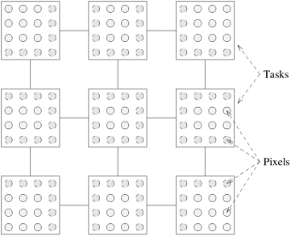

## 3.3 任务与交互的特性

通过上一节所述的各种分解技术，我们可以确定问题中可用的并发性，并将其分解为可 以并行执行的任务。设计并行算法的下一步是将这些任务分配（即映射）到可用的进程上。在设计映射方案以构建良好的并行算法时，我们通常会从分解中得到启发。任务的性质和它们之间的交互对映射有影响。在本节中，我们将讨论影响良好映射选择的任务和任务间交互的各种特性。

### 3.3.1 任务的特性

任务的以下四个特点对绘图方案的适用性有很大影响。

**任务生成（Task Generation）** 构成并行算法的任务可以静态或动态生成。**静态任务生成（Static Task Generation）**指的是在算法开始执行前已知所有任务的情况。数据分解通常会导致静态任务生成。数据分解导致静态任务生成的例子包括矩阵乘法和 LU 因式分解。递归分解也会产生静态任务依赖图。查找数字列表的最小值（[图 3.9](#fig3.9)）就是静态递归任务依赖图的一个示例。

在算法执行过程中，某些分解会导致**动态任务生成（Dynamic Task Generation）**。在这种分解中，虽然作为算法的一部分，管理任务生成的高级规则或准则是已知的，但实际的任务和任务依赖图并不是**先验地（Priori）**明确可用的。递归分解可导致动态任务生成。例如，考虑快速排序中的递归分解（[图 3.8](#fig3.8)）。任务是动态生成的，任务树的大小和形状由要排序的输入数组中的值决定。相同大小的数组会产生不同形状的任务依赖图，任务总数也不同。

探索分解可以静态或动态地生成任务。例如，考虑第 3.2.3 节中讨论的 *15-Puzzle问题*。使用探索分解生成静态任务依赖图的一种方法如下。首先，预处理任务从初始配置开始，以广度优先的方式扩展搜索树，直到生成预定数量的配置。现在，这些配置代表了独立的任务，它们可以被映射到不同的进程中并独立运行。动态生成任务的另一种分解方法是，任务将一个状态作为输入，通过广度优先搜索的预定步数扩展该状态，并生成新的任务，对生成的每个状态执行相同的计算（除非找到了解决方案，否则算法终止）。

**任务大小（Task Sizes）** 任务大小是指完成任务所需的相对时间。映射方案的复杂性通常取决于任务是否**统一（Uniform）**，即它们所需的时间是否大致相同。如果任务所需的时间差异很大，则称它们为**非统一（Non-Uniform）**任务。例如，[图 3.10](#fig3.10) 和[图 3.11](#fig3.11) 中矩阵乘法分解的任务就被认为是均匀的。而[图 3.8](#fig3.8) 中的快速排序任务则是非均匀的。

**任务规模知识（Knowledge of Task Sizes）** 影响映射方案选择的第三个特征是任务规模知识。如果知道所有任务的大小，那么在将任务映射到进程时，就可以经常使用这一信息。例如，在目前讨论的各种矩阵乘法分解中，每个任务的计算时间在并行程序启动前就已知晓。另一方面，*15-Puzzle问题* 中典型任务的大小是未知的。我们事先并不知道从给定状态出发，要走多少步才能找到解。

**任务相关数据的大小（Size of Data Associated with Tasks）** 任务的另一个重要特征是任务相关数据的大小。这是映射的一个重要考虑因素，因为与任务相关的数据必须可供执行该任务的进程使用，而这些数据的大小和位置可能决定了哪个进程可以在不产生过多数据移动开销的情况下执行任务。

与任务相关的不同类型数据可能有不同的大小。例如，输入数据可能很小，但输出数据可能很大，反之亦然。例如，*15迷宫问题* 中任务的输入可能只是谜题的一个状态。相对于找到从该状态到解题状态的移动序列所需的计算量而言，这是一个很小的输入。在计算序列最小值的问题中，输入的大小与计算量成正比，但输出只是一个数字。在快速排序的并行计算中，输入和输出数据的大小与解决任务所需的顺序时间相同。

### 3.3.2 任务之间的交互特性

在任何非简单的并行算法中，任务之间都需要进行交互，以共享数据、工作或同步信息。不同的并行算法要求并发任务之间进行不同类型的交互。这些交互的性质使它们更适合某些编程范式和映射方案，而不太适合其他范式和方案。任务间交互的类型可以从不同的维度进行描述，每个维度都与底层计算的明显特征相对应。

**静态与动态（Static versus Dynamic）** 对并发任务间的交互类型进行分类的一种方法是考虑这些交互是**静态模式（Static ）**还是**动态模式（Dynamic）**。如果对每个任务而言，交互发生的时间都是预先确定的，而且在执行算法之前就知道在这些时间进行交互的任务集，那么这种交互模式就是静态的。换句话说，在静态交互模式中，不仅任务交互图是事先已知的，而且每次交互发生的计算阶段也是已知的。如果在执行算法之前无法确定交互的时间或交互的任务集，那么交互模式就是动态的。

在消息传递范式中，静态交互很容易编程，但动态交互却很难编程。原因在于，消息传递中的交互需要交互任务（信息发送者和接收者）双方的积极参与。动态迭代的不可预测性使得发送方和接收方很难同时参与交互。因此，在以消息传递范式实现具有动态交互的并行算法时，必须为任务分配额外的同步或轮询责任。共享地址空间编程可以同样轻松地对这两种类型的交互进行编码。

本章前面介绍的并行矩阵乘法分解展示了任务间的静态交互。以动态交互为例，在解决 *15puzzle问题*时，通过对初始状态进行广度优先搜索，生成理想的状态数，然后分配任务探索不同的状态。有可能某个状态会导致所有死胡同，一个任务耗尽了搜索空间却没有到达目标状态，而其他任务仍在忙于寻找解决方案。已经耗尽工作的任务可以从另一个繁忙任务的队列中拾取一个未探索的状态并开始探索。这种工作从一个任务转移到另一个任务的过程所涉及的交互是动态的。

**有规则与无规则（Regular versus Irregular）** 交互模式的另一种分类方法是基于其空间结构。如果一种交互模式具有某种结构，可以利用这种结构来有效实施，那么这种交互模式就被认为是**有规则的（Regular）**。另一方面，如果不存在这样的规则模式，则称为**无规则（Irregular）**交互模式。不规则的动态通信更难处理，尤其是在消息传递编程模式中。图像抖动问题就是一个具有规则交互模式的分解实例。

- ##### **例3.9 图像抖动**

  在图像抖动中，图像中每个像素的颜色都是根据其原始值和相邻像素值的加权平均值确定的。我们可以通过将图像分割成正方形区域，并使用不同的任务对每个区域进行抖动处理，从而轻松地分解这种计算。需要注意的是，每个任务都需要访问分配给它的区域的像素值以及该区域周围图像的值。因此，如果我们将任务视为图中的节点，用一条边连接一对相互作用的任务，那么所产生的模式就是一个二维网格，如[图 3.22](#fig3.22) 所示。

  

      
      

          图3.22 用于图像抖动的常规二维任务交互图。带虚线的像素需要相邻任务边界像素的颜色值
      

  

第 3.1.2 节中讨论的稀疏矩阵-矢量乘法为不规则交互提供了一个很好的例子，如[图 3.6](#fig3.6) 所示。在这种分解中，尽管每个任务都能通过分解先验地知道它需要访问矩阵 $A$ 的哪些行，但如果不扫描分配给它的 $A$ 行，任务就无法知道它需要向量 $b$ 的哪些条目。原因是 $b$ 的访问模式取决于稀疏矩阵 $A$ 的结构。

**只读与读写（Read-only versus Read-Write）** 我们已经了解到，任务间共享数据会导致任务间的交互。不过，共享类型可能会影响映射的选择。数据共享交互可分为**只读交互（Read-Only）**和**读写交互（Read-Write）**。顾名思义，在只读交互中，任务只需要读取许多并发任务共享的数据。例如，在图 3.10 所示的并行矩阵乘法分解中，任务只需读取共享的输入矩阵 $A$ 和 $B$。例如，考虑解 *15-Puzzle问题*。第 3.2.3 节中提出的并行表述方法使用穷举搜索来寻找解决方案。在这种方法中，每个状态都被视为同样适合进一步扩展的候选状态。如果优先考虑那些看起来更接近解的状态，就能提高搜索效率。一种被称为**启发式搜索（Heuristic Search）**的另类搜索技术实现了这种策略。在启发式搜索中，我们使用启发式来相对近似地指示每个状态与解的距离（即到达解所需的潜在移动次数）。在 *15-Puzzle问题* 中，在给定状态下位置不对的棋子数量就可以作为启发式。根据启发式的值，需要进一步扩展的状态会被储存在一个优先队列中。在选择要扩展的状态时，我们会优先考虑更有前景的状态，也就是有较少缺位瓦片的状态，因此更有可能快速找到解决方案。在这种情况下，优先级队列构成共享数据，任务需要对其进行读写访问；它们需要将扩展后的状态放入队列，并为下一次扩展选择下一个最有希望的状态。

**单向与双向（One-way versus Two-way）** 在某些交互中，一个任务或任务子集所需的数据或工作由另一个任务或任务子集明确提供。这种交互称为**双向交互（Two-Way）**，通常涉及预定义的生产者和消费者任务。在其他交互中，一对通信任务中只有一个任务启动交互，并在不中断另一个任务的情况下完成交互。这种交互称为**单向交互（One-Way）**。所有只读交互都可以表述为单向交互。读写交互既可以是单向的，也可以是双向的。

共享地址空间编程范式可以同样轻松地处理单向和双向交互。不过，单向交互不能直接在消息传递范式中编程，因为要传输的数据源必须明确地将数据发送给接收者。在消息传递范式中，所有单向交互都必须通过程序重组转换为双向交互。静态单向交互可以很容易地转换为双向通信。由于静态单向交互的时间和在程序中的位置是先验已知的，因此在伙伴任务中引入匹配交互操作就足以将单向静态交互转换为双向静态交互。另一方面，动态单向交互可能需要一些非同小可的程序重组才能转换为双向交互。最常见的此类重组涉及轮询。每个任务都会定期检查来自其他任务的待处理请求，如果有，则为这些请求提供服务。