## 3.4 负载平衡的映射技术

一旦计算被分解成任务，这些任务就会被映射到进程中，目标是在最短的时间内完成所有任务。为了缩短执行时间，必须尽量减少并行执行任务的**开销（Overheads）**。对于给定的分解，有两个关键的开销来源。进程间交互花费的时间是开销的一个来源。另一个重要的开销来源是某些进程闲置的时间。由于各种原因，一些进程甚至可能在整体计算完成前就处于闲置状态。负载分布不均可能导致某些进程比其他进程更早完成。有时，映射到某个进程上的所有未完成任务可能都在等待映射到其他进程上的任务完成，以满足任务依赖图施加的限制。交互和空闲通常都是映射的函数。因此，一个好的流程任务映射必须努力实现以下两个目标：(1) 减少流程之间的交互时间；(2) 减少某些流程在执行某些任务时的闲置时间。

这两个目标往往相互冲突。例如，将需要相互影响的任务分配到同一个流程中，就可以轻松实现尽量减少交互的目标。在大多数情况下，这种映射会导致流程之间的工作量极不平衡。事实上，将这种策略发挥到极致往往会将所有任务都映射到一个进程上。因此，当负载较重的进程试图完成任务时，负载较轻的进程就会处于闲置状态。同样，为了平衡各进程之间的负载，可能有必要将交互严重的任务分配给不同的进程。由于这些目标之间存在冲突，因此找到一个好的映射是一个非同小可的问题。

在本节中，我们将讨论将任务映射到进程的各种方案，主要目的是平衡进程的任务工作量并最大限度地减少其空闲时间。减少进程间的交互是第 3.5 节的主题。读者应该知道，为每个进程分配均衡的任务总负载是减少进程空闲的必要条件，但不是充分条件。请注意，分解后的任务并非都能同时执行。任务依赖图决定了在执行并行算法的特定阶段，哪些任务可以并行执行，哪些任务必须等待其他任务完成。因此，在某种并行方案中，尽管所有进程执行的总工作量相同，但在不同的时间，可能只有一部分进程处于活动状态，而其余进程中的任务必须等待其他任务完成。同样，如果其中一个任务需要等待发送或接收另一个任务的数据，那么交互任务之间同步性差也会导致空转。一个好的映射必须确保并行算法执行过程中每个阶段的计算和进程间的交互都能很好地平衡。[图 3.23](#fig2.23) 显示了 $12$​ 个任务分解的两个映射，其中由于任务间的依赖关系，最后四个任务只能在前八个任务完成后才能启动。如图所示，两种映射在总体工作量平衡的情况下，可能会导致不同的完成时间。

<div align="center" name="fig2.23" id="fig2.23">
    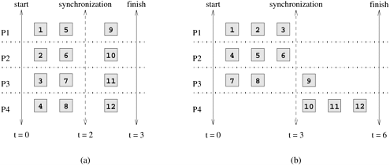
    <div>
        图2.23 假设分解与同步的两种映射
    </div>
</div>

并行算法中使用的映射技术大致可分为两类：**静态映射（Static）**和**动态映射（Dynamic）**。并行编程范式和任务的特点以及它们之间的交互决定了静态映射还是动态映射更合适。

- **静态映射（Static Mapping）**：静态映射技术是在算法执行前将任务分配给不同进程。对于静态生成的任务，可以使用静态或动态映射。在这种情况下，如何选择好的映射取决于多个因素，包括任务大小、与任务相关的数据大小、任务间交互的特点，甚至并行编程范式。即使已知任务大小，一般来说，对于非均匀任务，获得最佳映射也是一个 NP-完全问题。不过，在许多实际情况下，相对便宜的启发式方法能为最优静态映射问题提供相当可接受的近似解。

  一般来说，使用静态映射的算法更易于设计和编程。

- **动态映射（Dynamic Mapping）**：动态映射技术在算法执行过程中将工作分配给不同进程。如果任务是动态生成的，那么它们也必须动态映射。如果任务大小未知，那么静态映射可能会导致严重的负载不平衡，而动态映射通常更为有效。如果与任务相关的数据量相对于计算量较大，那么动态映射可能需要在进程间移动这些数据。这种数据移动的成本可能会超过动态映射的其他一些优势，从而使静态映射更为合适。不过，在共享地址空间范例中，如果交互是只读的，那么即使与任务相关的数据量很大，动态映射也能很好地发挥作用。读者应注意，共享地址空间编程模式并不能自动免除数据移动的成本。如果底层硬件是 NUMA（第 2.3.2 节），那么数据可能会从远处的内存物理移动。即使在 cc-UMA 架构中，数据也可能需要从一个高速缓存移动到另一个高速缓存。

  需要动态映射的算法通常比较复杂，尤其是在消息传递编程模式中。

在讨论了选择静态映射和动态映射的指导原则后，我们现在详细介绍这两种映射的各种方案。

### 3.4.1 静态映射方案

静态映射通常与基于数据分区的分解结合使用，但并非唯一。静态映射还可用于映射某些由静态任务依赖图自然表达的问题。在下面的小节中，我们将讨论基于数据分区和任务分区的映射方案。

#### A. 基于数据分区的映射

在本节中，我们将讨论基于算法中两种最常见的数据表示方式（即数组和图形）的分区映射。数据分区实际上是一种分解，但选择分区或分解时要考虑到最终映射。

**阵列分布方案（Array Distribution Schemes）** 在基于数据分区的分解中，任务通过所有者-计算规则与部分数据紧密相关。因此，将相关数据映射到进程就等同于将任务映射到进程。现在我们来研究一些常用的在进程间分配数组或矩阵的技术。

##### 1）块分配

**块分配（Block Distributions）**是分配数组并将数组的统一连续部分分配给不同进程的最简单方法。在这些分布中，一个 d 维数组被分配给不同进程，这样每个进程都能沿指定的数组维数子集接收到连续的数组块。当存在交互的局部性时，即计算数组中的某个元素需要数组中附近的其他元素时，数组的块分配尤其合适。

例如，考虑一个有 $n$ 行 $n$ 列的 $n \times n$ 二维数组 $A$。我们现在可以选择其中一个维度，例如第一个维度，然后将数组划分为 $p$ 个部分，这样第 $k$ 个部分包含 $kn/p...(k + 1)n/p - 1$ 行，其中$0 \leq k < p$ 。同样，如果我们沿第二个维度对 $A$ 进行分区，则每个分区包含 $n/p$​ 个连续列块。[图 3.24](fig3.24) 展示了这些按行和列排列的数组分布。

<div align="center" name="fig3.24" id="fig3.24">
    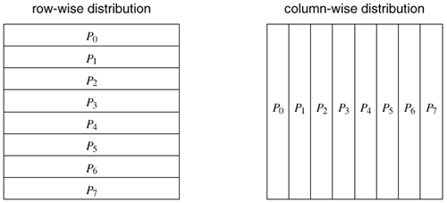
    <div>
        图3.24 在八个进程中对数组进行一维分割的示例
    </div>
</div>

同样，我们可以选择多个维度进行分割，而不是选择一个维度。例如，在数组 $A$ 的情况下，我们可以选择两个维度，并将矩阵划分为多个区块，每个区块对应矩阵的 $n/p_1 \times n/p_2$ 部分，其中 $p = p_1 \times p_2$ 为进程数。[图 3.25](#fig3.25) 展示了 $4 \times 4$ 和 $2 \times 8$ 进程网格上两种不同的二维分布。一般来说，给定一个 $d$ 维数组，我们最多可以使用 $d$ 维块分布。

<div align="center" name="fig3.25" id="fig3.25">
    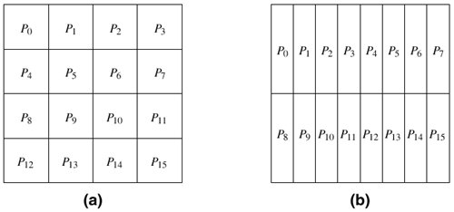
    <div>
        图3.25 阵列的二维分布示例，(a)4x4进程网格，(b)2x8进程网格
    </div>
</div>

利用这些块分布，我们可以对多维数组上的各种并行计算进行负载平衡。例如，考虑第 3.2.2 节中讨论的 $n \times n$ 矩阵乘法 $C = A \times B$。分解这种计算的一种方法是分割输出矩阵 $C$。由于 $C$ 的每个条目都需要相同的计算量，我们可以使用一维或二维分块分布将 $C$ 在 $p$ 个可用进程中均匀分配，从而平衡计算量。在第一种情况下，每个进程将得到一个包含 $n/p$ 行（或列）的 $C$ 块，而在第二种情况下，每个进程将得到一个大小为 $n/\sqrt{p} \times n/\sqrt{p}$ 的块。无论哪种情况，进程都将负责计算分配给它的 $C$​ 分区的条目。

正如矩阵乘法的例子所示，我们通常可以选择使用一维或二维分布来映射计算（如果是高维数组，选择会更多）。一般来说，高维分布允许我们使用更多进程。例如，在矩阵与矩阵相乘的情况下，通过为每个进程分配 $C$ 的单行，一维分布允许我们使用多达 $n$ 个进程。另一方面，二维分布允许我们为每个进程分配 $C$ 的一个元素，从而使用多达 $n^2$​ 个进程。

除了允许更高的并发性，高维分布有时还有助于减少许多问题中不同进程之间的交互量。[图 3.26](#fig3.26) 以密集矩阵乘法为例说明了这一点。如[图 3.26(a)](#fig3.26)所示，在按行进行一维分区的情况下，每个进程都需要访问矩阵 $A$ 的 $n/p$ 行和整个矩阵 $B$。因此需要访问的数据总量为 $n^2/p + n^2$。但在二维分布的情况下，每个进程需要访问矩阵 $A$ 的  $n/\sqrt{p}$ 行和矩阵 $B$ 的 $n/\sqrt{p}$ 列，如[图 3.26(b)](#fig3.26) 中进程 $P_5$ 所示。在二维情况下，每个进程需要访问的共享数据总量为 $O(n^2/\sqrt{p})$，与一维情况下的 $O(n^2)$ 个共享数据相比小得多。

<div align="center" name="fig3.26" id="fig3.26">
    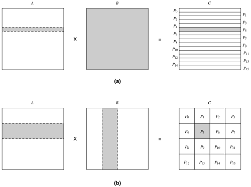
    <div>
        图3.26 矩阵乘法所需的数据共享，输出矩阵的(a)一维分割和(b)二维分割。计算输出矩阵C的阴影部分的过程需要输入矩阵A和B的阴影部分
    </div>
</div>

##### 2）循环分配和块循环分配

如果矩阵中不同元素的工作量不同，分块分布有可能导致负载不平衡。这种现象的一个典型例子是矩阵的 LU 因式分解，计算量从矩阵的左上方向右下方递增。

- ##### **例3.10 密集 LU 因式分解**

  最简单的 LU 因式分解算法是将一个非奇异方矩阵 $A$ 分解为一个有单位对角线的下三角矩阵 $L$ 和一个上三角矩阵 $U$ 的乘积。因式分解过程由 $n$ 个主要步骤组成，每个步骤由[算法 3.3](#algo3.3) 中第 $3$ 行开始的外循环迭代组成。在步骤 $k$ 中，首先，部分列 $A[k + 1 : n, k]$ 除以 $A[k,k]$。然后，从 $(n - k) \times (n - k)$ 子矩阵 $A[k + 1 : n, k + 1 : n]$ 中减去外积 $A[k + 1 : n, k] \times A[k, k + 1 : n]$。在 LU 因式分解的实际应用中，$L$ 和 $U$ 不使用单独的数组，$A$ 被修改为分别存储 $L$ 和 $U$ 的下三角部分和上三角部分。$L$ 主对角线上的 $1$ 是隐含的，对角线条目在因式分解后实际上属于 $U$。

  <div name="algo3.3" id="algo3.3">算法3.3 一种基于列的串行算法，将非奇异矩阵A分解为下三角矩阵L和上三角矩阵U。矩阵L和U与A共享空间</div>

  ```pascal
  procedure COL_LU (A)
  begin
      for k := 1 to n do
          for j := k to n do
              A[j, k]:= A[j, k]/A[k, k];
          endfor;
          for j := k + 1 to n do
              for i := k + 1 to n do
                  A[i, j] := A[i, j] - A[i, k] x A[k, j];
              endfor;
          endfor;
  /*
  After this iteration, column A[k + 1 : n, k] is logically the kth
  column of L and row A[k, k : n] is logically the kth row of U.
  */
      endfor;
  end COL_LU
  ```

  [图 3.27](#fig3.27) 显示了利用矩阵的 $3 \times 3$ 块分割和[算法 3.3](#algo3.3) 的块版本将 LU 因式分解为 $14$​ 项任务的可能分解情况。

  <div align="center" name="fig3.27" id="fig3.27">
      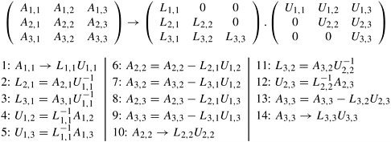
      <div>
          图3.27 将LU因式分解为14项任务
      </div>
  </div>

对于外循环 `k := 1` 到 $n$ 的每一次迭代，[算法 3.3](#algo3.3) 中的下一个嵌套循环都会从 $k + 1$ 到 $n$。换句话说，如[图 3.28](#fig3.28) 所示，矩阵的活动部分会随着计算的进行向矩阵的右下角收缩。因此，在分块分配中，分配给起始行和列（即左侧行和顶部列）的进程所做的工作远远少于分配给后面行和列的进程。例如，考虑[图 3.27](#fig3.27) 所示的 LU 因式分解，矩阵采用 $3 \times 3$ 的二维块分区。如果我们将与某个块相关的所有任务映射到 $9$ 个进程集合中的一个进程上，那么将产生大量的空闲时间。首先，计算矩阵的不同区块需要不同的工作量。[图 3.29](#fig3.29) 举例说明了这一点。例如，计算 $A_{1,1}$ 的最终值（实际上是 $L_{1,1}$ $U_{1,1}$）只需要一个任务，即Task 1。另一方面，计算 $A_{3,3}$ 的最终值需要三个任务 - Task 9、Task 13 和Task 14。其次，即使有未完成的任务与某个程序块相关联，处理该程序块的进程也可能空闲。如果任务依赖图施加的约束条件不允许在一个或多个映射到其他进程的任务完成之前继续执行该进程的剩余任务，就会出现这种空闲。

<div align="center" name="fig3.28" id="fig3.28">
    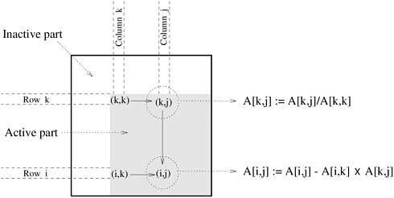
    <div>
        图3.28 外循环第k次迭代中高斯消元的典型计算和系数矩阵的有效部分
    </div>
</div>
<div align="center" name="fig3.29" id="fig3.29">
    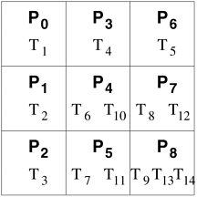
    <div>
        图3.29 基于二维块分布的LU因式分解任务与进程的原生映射
    </div>
</div>

块周期分布是块分布方案的一种变体，可用于缓解负载不平衡和空转问题。第 8 章将详细介绍采用分块循环映射的 LU 因式分解，并说明分块循环映射如何导致比[图 3.29](#fig3.29) 更均衡的工作分配。分块循环分配的核心思想是将数组划分为比可用进程数量多得多的块。然后，我们以循环方式将分区（及相关任务）分配给进程，这样每个进程都能得到几个不相邻的区块。更确切地说，在 $p$ 个进程之间对矩阵进行一维分块循环分配时，$n \times n$ 矩阵的行（列）被分成 $\alpha p$ 组，每组有 $n/(\alpha p)$ 个连续行（列），其中 $1 < \alpha < n/p$。现在，这些数据块以环绕方式分配给 $p$ 个进程，这样数据块 $b_i$ 就分配给了进程 $P_{i \% p}$（'$\%$'是调制运算符）。这种分配方式为每个进程分配了一个矩阵块，但随后分配给同一进程的每个块都相差 $p$ 个块。我们可以将一个 $n \times n$ 数组分割成 $\alpha \sqrt{p} \times \alpha \sqrt{p}$ 大小的正方形块，并以环绕方式将它们分配给假设的 $\sqrt{p} \times \sqrt{p}$ 个进程数组，从而获得 $n \times n$ 数组的二维块循环分布。同样，块周期分布也可以扩展到更高维度的数组。[图 3.30](#fig3.30) 展示了二维数组的一维和二维块循环分布。

<div align="center" name="fig3.30" id="fig3.30">
    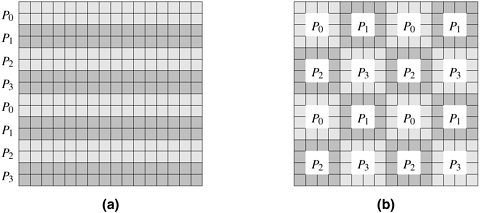
    <div>
        图3.30 四个进程之间的一维和二维块周期分布示例。(a)将数组的行分组为块，每个块由两行组成，从而形成八个行块。这些块以环绕方式分配给四个进程。(b)矩阵被分块成16个块，每个块大小为4x4，并以环绕方式映射到2x2的进程网格上
    </div>
</div>

块循环分布之所以能够显着减少空闲量，是因为所有进程都有来自矩阵所有部分的任务样本。因此，即使矩阵的不同部分需要不同的工作量，每个流程的总体工作也是平衡的。此外，由于分配给进程的任务属于矩阵的不同部分，因此很有可能至少其中一些任务已准备好在任何给定时间执行。

请注意，如果我们把 $\alpha$ 增加到其上限 $n/p$，那么在一维块周期分布中，每个块都是矩阵的单行（列），而在二维块周期分布中，每个块都是矩阵的单元素。这种分布称为循环分布。循环分布是块周期分布的极端情况，由于其底层分解极为精细，因此可以实现几乎完美的负载平衡。但是，由于进程没有任何连续的数据可处理，因此缺乏本地性可能会导致严重的性能下降。此外，相对于每个任务的计算量，这种分解通常会导致高度交互。$\alpha$ 值的下限值为 $1$ 会带来最大的局部性和交互优化，但分布会退化为块分布。因此，必须使用合适的 $\alpha$​ 值，在交互保护和负载平衡之间取得平衡。

与块状分布的情况一样，高维度的块状循环分布通常更可取，因为它们往往会减少任务间的交互量。

##### 3）随机块分配

当工作分布具有某些特殊模式时，分块循环分布可能并不总能平衡计算。例如，考虑[图 3.31(a)](#fig3.31) 中所示的稀疏矩阵，其中阴影区域对应的是包含非零元素的区域。如果如[图 3.31(b)](#fig3.31)所示，使用二维块循环分布来分配该矩阵，那么分配给对角线进程 $P_0$、$P_5$、$P_{10}$ 和 $P_{15}$ 的非零块将多于其他进程。事实上，有些进程，如 $P_{12}$​，不会得到任何工作。

<div align="center" name="fig3.31" id="fig3.31">
    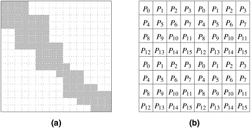
    <div>
        图3.31 使用(b)中所示的块周期分布来分配阵列(a)中执行的计算将导致负载不平衡
    </div>
</div>

随机块分布是块分布的一种更普遍的形式，可用于[图 3.31](#fig3.31) 所示的情况。与块周期分布一样，通过将阵列划分为比可用进程数量多得多的块来实现负载平衡。不过，这些区块在进程之间是均匀和随机分布的。一维随机区块分布的实现方法如下。使用长度为 $\alpha p$（等于区块数）的向量 $V$，并在 $0 \leq j < \alpha p$ 时将 $V[j]$ 设为 $j$。现在，$V$ 被随机置换，进程 $P_i$ 被分配到存储在 $V[i \alpha...(i + 1) \alpha - 1]$ 中的区块。[图 3.32](#fig3.32) 展示了 $p = 4$ 和 $\alpha = 3$ 的情况。$n \times n$ 数组的二维随机块分配也可以通过类似方法计算，即随机排列两个长度各为 $\alpha \sqrt{p}$ 的向量，并用它们来选择分配给每个进程的块的行和列索引。如[图 3.33](#fig3.33) 所示，随机块分布在平衡[图 3.31](#fig3.31) 中的计算负载方面更为有效。

<div align="center" name="fig3.32" id="fig3.32">
    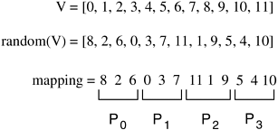
    <div>
        图3.32 将12个区块随机映射到4个进程（即α=3）的一维区块映射
    </div>
</div>

<div align="center" name="fig3.33" id="fig3.33">
    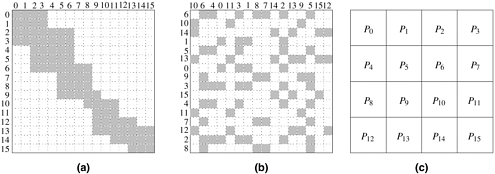
    <div>
        图3.33 如(c)所示，使用(b)所示的二维随机块分布来分配阵列(a)中执行的计算
    </div>
</div>

**图划分（Graph Partitioning）** 我们迄今为止介绍的基于数组的分布方案，对于使用密集矩阵、具有结构化和规则交互模式的各种算法来说，在平衡计算和最小化交互方面相当有效。然而，有许多算法是在稀疏数据结构上运行的，对于这些算法，数据元素之间的交互模式与数据有关，而且极不规则。物理现象的数值模拟就提供了大量此类计算。在这些计算中，物理域被离散化，由网格元素表示。模拟所模拟的物理现象时，需要计算每个网格点上某些物理量的值。网格点的计算通常需要与该网格点及其相邻网格点相对应的数据。例如，[图 3.34](#fig3.34) 显示了施加在苏必利尔湖上的网格。模拟湖中水污染物扩散等物理现象时，需要计算网格中每个顶点在不同时间间隔内的污染程度。

<div align="center" name="fig3.34" id="fig3.34">
    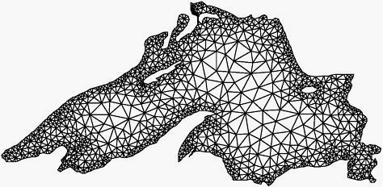
    <div>
        图3.34 用于模拟苏必利尔湖的网格
    </div>
</div>

一般来说，每个网格点的计算量是相同的，因此只需为每个进程分配相同数量的网格点，就能轻松平衡负载。但是，如果向进程分配网格点时没有努力将附近的网格点保持在一起，那么可能会因为过多的数据共享而导致交互开销过高。例如，如果每个进程都收到如[图 3.35](#fig3.35) 所示的随机点集，那么每个进程都需要访问属于其他进程的大量点集，以完成其所分配网格部分的计算。

<div align="center" name="fig3.35" id="fig3.35">
    
    <div>
        图3.35 将网格元素随机分配给八个进程
    </div>
</div>

理想情况下，我们希望网格点的分布方式既能平衡负载，又能尽量减少每个进程为完成计算而需要访问的数据量。因此，我们需要将网格划分为 $p$ 个部分，使每个部分包含的网格点或顶点数量大致相同，并尽量减少跨越分区边界的边（即连接属于两个不同分区的点的边）的数量。寻找精确的最优分区是一个 NP-完全问题。不过，可以利用强大的启发式算法来计算合理的分区。以这种方式划分网格后，这 $p$ 个分区中的每个分区都会分配给 $p$​ 个进程中的一个。因此，每个进程都会被分配到一个连续的网格区域，这样需要跨分区边界访问的网格点总数就会降到最低。[图 3.36](#fig3.36) 显示了一个很好的苏必利尔湖网格分区 - 典型的图形分区软件就会生成这样的分区。

<div align="center" name="fig3.36" id="fig3.36">
    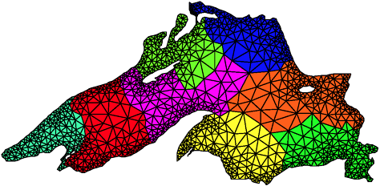
    <div>
        图3.36 通过图形划分算法，将网格元素分配给八个进程
    </div>
</div>

#### B. 基于任务分区的映射

当计算可自然地以静态任务依赖图的形式表达，且任务大小已知时，可使用基于分割任务依赖图并将其节点映射到进程的映射。通常情况下，这种映射必须努力实现两个往往相互冲突的目标：最小化空闲时间和最小化并行算法的交互时间。确定一般任务依赖图的最佳映射是一个 NP-完全问题。不过，在特定情况下，往往可以找到更简单的最优解或可接受的近似解。

作为基于任务划分的映射的一个简单示例，请考虑一个完美二叉树的任务依赖图。这种任务依赖图可能出现在递归分解的实际问题中，例如求数字列表最小值的分解（[图 3.9](#fig3.9)）。[图 3.37](#fig3.37) 显示了该任务依赖图与八个进程的映射。不难看出，这种映射通过将许多相互依赖的任务映射到同一个进程（即沿着树的直线分支的任务）上，以及将其他任务映射到仅相隔一个通信链路的进程上，最大限度地减少了交互开销。虽然不可避免地会出现一些空闲（例如，当进程 0 在根任务上工作时，所有其他进程都处于空闲状态），但这种空闲是任务依赖图所固有的。[图 3.37](#fig3.37) 所示的映射不会再引入任何空闲，任务依赖图允许并发活动的所有任务都会映射到不同的进程上并行执行。

<div align="center" name="fig3.37" id="fig3.37">
    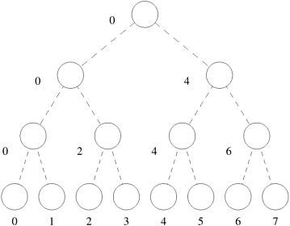
    <div>
        图3.37 二叉树式任务依赖图与超立方体进程的映射
    </div>
</div>

对于某些问题，可以通过划分任务-交互图来近似解决找到好映射的问题。在前面讨论的苏必利尔湖污染物扩散建模问题中，在数据分区的背景下，我们可以定义任务，使每个任务都负责与某个网格点相关的计算。现在，用于离散湖泊的网格也是一个任务交互图。因此，对于这个问题，使用图划分来找到一个好的映射也可以看作是任务划分。

第 3.1.2 节讨论的稀疏矩阵-向量乘法是另一个适用于任务分区的类似问题。[图 3.6](#fig3.6) 中任务 - 交互图的简单映射如[图 3.38](#fig3.38) 所示。该映射为每个进程分配了与 $b$ 的四个连续条目相对应的任务。[图 3.39](#fig3.39) 显示了[图 3.6](#fig3.6) 所示稀疏矩阵向量乘法问题的任务交互图的另一种划分方法，该方法适用于三个进程。列表 $C_i$ 包含进程 $i$ 上的任务需要从映射到其他进程上的任务中访问 $b$ 的索引。对两种情况下的列表 $C_0$、$C_1$ 和 $C_2$ 进行快速比较后，不难发现基于任务交互图分割的映射比简单映射需要在进程间交换的 $b$ 元素更少。

<div align="center" name="fig3.38" id="fig3.38">
    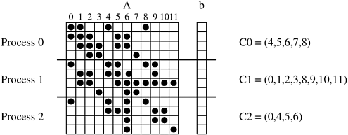
    <div>
        图3.38 稀疏矩阵-向量乘法到三个进程的映射
    </div>
</div>

<div align="center" name="fig3.39" id="fig3.39">
    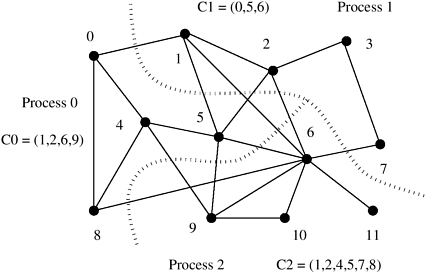
    <div>
        图3.39 通过分割任务-交互图减少稀疏矩阵-向量乘法中的交互开销
    </div>
</div>

#### C. 分级映射

某些算法可以自然地表示为任务依赖图；但是，仅基于任务依赖图的映射可能会出现负载不平衡或并发性不足的问题。例如，在[图 3.37](#fig3.37) 的二叉树任务依赖图中，只有少数任务可在树的顶端并发执行。如果任务足够大，则可以通过将任务进一步分解为更小的子任务来获得更好的映射。如果任务依赖图是一棵有四层的二叉树，那么根任务可划分为八个进程，下一层的任务可分别划分为四个进程，再下一层的任务可分别划分为两个进程。八个叶子任务可以一对一地映射到进程上。[图 3.40](#fig3.40) 展示了这种分层映射。[例 3.4](#例3.4 快速排序) 中引入的并行快速排序的任务依赖关系图与[图 3.37](#fig3.37) 所示的相似，因此是[图 3.40](#fig3.40) 所示类型的分层映射的理想候选对象。

<div align="center" name="fig3.40" id="fig3.40">
    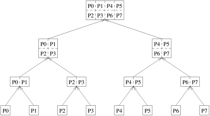
    <div>
        图3.40 任务依赖图的分层映射示例。用数组表示的每个节点都是一个超任务。数组的分区代表子任务，它们被映射到八个进程上
    </div>
</div>

上文讨论的分层映射示例直接适用于一个重要的实际问题，即稀疏矩阵因式分解。稀疏矩阵因式分解中的高层计算由任务依赖图引导，该图被称为消元图（如果矩阵是对称的，则称为消元树）。然而，消除图中的任务（尤其是靠近根的任务）通常涉及大量计算，因此需要使用数据分解法将其进一步分解为子任务。然后，将在顶层使用任务分区、在底层使用阵列分区的分层映射应用于这种混合分解。一般来说，分层映射可以有很多层，不同的分解和映射技术可能适用于不同的层。


### 3.4.2 动态映射方案

当静态映射可能导致进程间的工作分配极不平衡，或者任务依赖图本身是动态的，因而无法进行静态映射时，就需要进行动态映射。由于使用动态映射的主要原因是平衡进程间的工作量，因此动态映射通常被称为动态负载平衡。动态映射技术通常分为**集中式（Centralized）**和**分布式（Distributed）**两种。

#### A. 集中式动态映射技术

在集中式动态负载平衡方案中，所有可执行任务都保存在一个共同的中央数据结构中，或者由一个特殊进程或进程子集保存。如果指定一个特殊进程来管理可用任务池，那么它通常被称为**主进程（Master）**，而依赖主进程获取工作的其他进程则被称为**从进程（Slaves）**。每当一个进程没有工作时，它就会从中央数据结构或主进程中获取一部分可用工作。每当有新任务生成时，它就会被添加到中央数据结构或报告给主进程。集中式负载均衡方案通常比分布式方案更容易实施，但可扩展性可能有限。随着使用的进程越来越多，对公共数据结构或主进程的大量访问往往会成为瓶颈。

举例说明集中映射可能适用的情况，考虑对 $n \times n$ 矩阵 $A$ 每一行的条目进行排序的问题。实际上，这个问题可以通过以下简单的程序段来完成：

```c++
for (i = 1; i < n; i++)
    sort(A[i], n);
```

回想一下，使用一些常用的排序算法（如快速排序）对数组进行排序所需的时间会因元素的初始排序不同而有很大差异。因此，上图所示程序中循环的每次迭代所需的时间都不一样。将排序相同数量行的任务简单地映射到每个进程，可能会导致负载不平衡。在这种情况下，解决潜在负载不平衡问题的可行方法是维护一个中央索引池，其中包含尚未排序的行的索引。每当一个进程闲置时，只要索引池不是空的，它就会拾取一个可用的索引，删除它，然后用该索引排序行。这种在并行进程间调度循环独立迭代的方法被称为**自调度（Self Scheduling）**。

每次将单个任务分配给一个进程对平衡计算非常有效；但是，这可能会导致访问共享工作队列时出现瓶颈，尤其是当每个任务（即本例中的每个循环迭代）不需要足够大的计算量时。如果每个任务的平均规模为 $M$，而将工作分配给一个进程需要 $\Delta$ 时间，那么最多可以有效地让 $M/\Delta$ 个进程保持忙碌。一次获得多个任务可以缓解瓶颈问题。在**分块调度（Chunk Scheduling）**中，每当一个进程的工作耗尽时，它就会得到一组任务。这种方案的潜在问题是，如果单步分配的任务（即分块）数量很大，可能会导致负载不平衡。随着程序的进行，可以通过减小分块大小来减少因分块过大而导致负载不平衡的危险。也就是说，最初的分块大小较大，但随着待执行迭代次数的减少，分块大小也会随之减小。目前已开发出多种逐步调整分块大小的方案，这些方案可线性或非线性地减小分块大小。

#### B. 分布式动态映射技术

在分布式动态负载平衡方案中，可执行任务集分布在进程中，进程在运行时交换任务以平衡工作。每个进程都可以向任何其他进程发送或接收工作。这些方法不会出现与集中式方案相关的瓶颈问题。分布式负载均衡方案的一些关键参数如下：

- 发送和接收过程是如何配对的？
- 工作转移是由发送方还是接收方发起的？
- 每次交换传递多少工作？如果传送的工时太少，则接收方可能无法收到足够的工时，因此可能需要频繁地传送工时，从而导致过多的交互。如果传送的工时过多，那么发送方可能很快就会没有工时，从而导致频繁传送。
- 何时执行工作转移？例如，在接收方发起的负载均衡中，可能会在进程实际耗尽工作或接收方剩余工作太少并预计很快就会耗尽时请求工作。

对这些参数的详细研究超出了本章的范围。我们将在后面几章讨论并行算法时，特别是在第 11 章讨论并行搜索算法时，结合并行算法重新讨论这些负载均衡方案。

#### C. 并行架构的适用性

请注意，原则上，集中式和分布式映射方案都可以在消息传递和共享地址空间范例中实现。然而，任何动态负载平衡方案都需要将任务从一个进程转移到另一个进程，这是其本身的性质决定的。因此，要使这种方案在消息传递计算机上有效，任务的计算量应远远大于与任务相关的数据量。在共享地址空间范例中，任务不需要明确移动，但会有一些隐含的数据移动到本地缓存或进程的内存库中。一般来说，共享地址架构中需要移动的任务的计算粒度可能比消息传递架构小得多。
