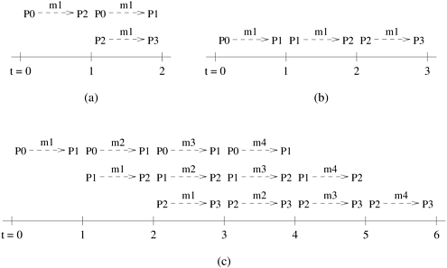

## 3.5 控制交互开销的方法

如前所述，减少并发任务间的交互开销对高效并行程序非常重要。并行程序因进程间交互而产生的开销取决于很多因素，如交互过程中交换的数据量、交互频率、交互的空间和时间模式等。

在本节中，我们将讨论一些可用于减少并行程序交互开销的通用技术。这些技术操纵上述三个因素中的一个或多个，以减少交互开销。其中一些技术适用于为算法设计分解和映射方案，另一些则适用于在特定范式下对算法进行编程。并非所有技术都适用于所有并行编程范式，其中一些技术可能需要底层硬件的支持。

### 3.5.1 本地数据利用率最大化

在大多数非复杂并行程序中，不同进程执行的任务都需要访问一些公共数据。例如，在稀疏矩阵 - 矢量乘法 $y=Ab$ 中，任务对应于计算矢量 $y$ 的各个元素（[图 3.6](#fig3.6)），输入矢量 $b$ 的所有元素需要被多个任务访问。除了共享原始输入数据外，如果进程需要其他进程生成的数据，还可能产生交互。通过使用促进使用本地数据或最近获取的数据的技术，可以减少交互开销。数据本地性增强技术包括多种方案，这些方案试图尽量减少访问的非本地数据量，最大限度地重复使用最近访问的数据，并尽量降低访问频率。在许多情况下，这些方案在本质上类似于现代高速缓存微处理器中经常执行的数据重用优化。

**尽量减少数据交换量（Minimize Volume of Data-Exchange）** 减少交互开销的基本技术是尽量减少并发进程需要访问的共享数据总量。这类似于最大化时态数据本地性，即尽可能多地连续引用相同的数据。显然，使用本地可用数据执行尽可能多的计算，就无需将更多数据引入本地内存或缓存，以便进程执行任务。如前所述，实现这一目标的方法之一是使用适当的分解和映射方案。例如，在矩阵乘法的例子中，我们可以看到，通过将计算使用二维映射到进程，我们能够将每个任务需要访问的共享数据量（即矩阵 $A$ 和 $B$）从一维映射所需的 $n^2/p + n^2$ 减少到 $2n^2/\sqrt{p}$（[图 3.26](#fig3.26)）。一般来说，使用高维分布通常有助于减少需要访问的非本地数据量。

减少多个进程访问的共享数据量的另一种方法是使用本地数据存储中间结果，只对计算的最终结果进行共享数据访问。例如，考虑并行计算长度为 $n$ 的两个向量的点积，其中 $p$ 个任务分别乘以 $n/p$ 对元素。每个任务可以先在自己的本地位置创建长度为 $n/p$ 的矢量的指定部分的部分点积，然后只访问一次最终共享位置，将部分结果相加，而不是将一对数的每个单独乘积加到最终结果中。这样，访问存储结果的共享位置的次数就会从 $n$ 次减少到 $p$ 次。

**尽量减少交互频率（Minimize Frequency of Interactions）** 尽量减少交互频率对于减少并行程序中的交互开销非常重要，因为在许多架构上，每次交互都会产生相对较高的启动成本。可以通过重组算法来降低交互频率，使共享数据被大量访问和使用。因此，通过在大量访问中摊销启动成本，我们可以降低整体交互开销，即使这种重组并不一定能减少需要访问的共享数据总量。这类似于提高数据访问的空间位置性，即确保连续访问的数据位置相近。在共享地址空间架构中，每次访问一个字时，都会取回包含许多字的整个高速缓存行。如果程序的结构具有空间位置性，那么访问的缓存行数就会减少。在消息传递系统中，空间位置性会减少网络上的消息传输，因为每条消息可以传输更多有用数据。在消息传递系统中，如果交互模式允许，而且多条消息的数据可以同时获得（尽管是在不同的数据结构中），则可以将同一源-目的对之间的消息合并成更大的消息，从而进一步减少消息的数量。

稀疏矩阵 - 矢量乘法是一个问题，其并行表述可利用这一技术减少交互开销。在典型应用中，稀疏矩阵-矢量乘法是对非零模式相同但非零数值不同的矩阵进行重复运算。在并行解决这一问题时，一个进程会与其他进程交互，以访问其本地计算可能需要的输入向量元素。通过对一个进程负责的稀疏矩阵行的非零模式进行一次性扫描，该进程可以准确地确定它需要输入向量中的哪些元素，以及从哪些进程中获取这些元素。然后，在开始每次乘法运算之前，进程可以首先收集它所需的输入向量的所有非本地项，然后执行无交互乘法运算。这种策略远远优于在计算中需要时试图访问输入向量的非本地元素。

### 3.5.2 最小化竞争与拥堵

迄今为止，我们的讨论主要集中在通过直接或间接减少数据传输的频率和数量来降低交互开销。然而，数据访问和任务间交互模式往往会导致争用，从而增加整体交互开销。一般来说，当多个任务试图同时访问相同的资源时，就会出现争用现象。在同一互连链路上同时进行多次数据传输、多次同时访问同一内存块，或多个进程同时向同一进程发送信息，都可能导致争用。这是因为在多个操作中，一次只能进行一个操作，其他操作都是排队按顺序进行的。

使用[图 3.26(b)](#fig3.26) 所示的二维分区，考虑两个矩阵 $C = AB$ 的乘法问题。假设 $p$ 为任务数，任务与进程的映射为一一对应。让每个任务负责计算 $0 \leq i,j<\sqrt{p}$ 的唯一 $C_{i,j}$。计算 $C_{i,j}$ 的简便方法是按下式计算（用矩阵块符号表示）：
$$
C_{i,j}=\sum^{\sqrt{p}-1}_{k=0}{A_{i,k} \cdot B_{k,j}}
$$
通过观察上式的内存访问模式，我们可以发现，在 $\sqrt{p}$ 步中的任何一步，$\sqrt{p}$ 个任务都将访问 $A$ 和 $B$ 的同一数据块。例如，计算 $C_{0,0},C_{0,1}...C_{0,\sqrt{p}-1}$ 的所有 $\sqrt{p}$ 个进程都将尝试同时读取 $A_{0,0}$。同样，在 $C$ 的同一列上工作的所有任务都将访问 $B$ 的同一数据块。在 NUMA 共享地址空间和消息传递并行架构上，需要同时访问矩阵 $A$ 和 $B$ 的这些数据块会造成竞争。

减少竞争的方法之一是重新设计并行算法，以无竞争模式访问数据。对于矩阵乘法算法，可以通过修改上式中的分块乘法执行顺序来消除竞争。执行这些分块乘法的无竞争方式是使用公式计算 $C_{i,j}$
$$
C_{i,j}=\sum^{\sqrt{p}-1}_{k=0}{A_{i,(i+j+k)\%\sqrt{p}} \cdot B_{(i+j+k)\%\sqrt{p}, j}}
$$
其中“$\%$”表示模运算。通过使用此公式，在 $C$ 的同一行上工作的所有任务 $P_{*,j}$ 将访问块 $A_{*,(*+j+k)\%\sqrt{p}}$，这对于每个任务都是不同的。类似地，在 $C$ 的同一列上工作的所有任务 $P_{i,*}$ 将访问块 $B_{(i+*+k)\%\sqrt{p},*}$，这对于每个任务来说也是不同的。因此，通过简单地重新安排块乘法的执行顺序，我们就可以完全消除争用。例如，在计算$C$的第一块行的进程中，计算$C_{0,j}$的进程将从A的第一块行访问$A_{0,j}$，而不是$A_{0,0}$​。

集中式动态映射方案（第 3.4.2 节）是共享数据结构或通向主进程的通信通道经常出现争用的原因。选择分布式映射方案而非集中式映射方案可以减少争用，尽管前者可能更难实现

### 3.5.3 重叠覆盖计算与通信的开销

在交互启动后，进程等待共享数据到达或接收额外工作所花费的时间，可以通过在等待时间内进行一些有用的计算来减少，通常是大幅减少。有许多技术可以用于计算与交互的重叠。

重叠的一个简单方法是尽早启动交互，以便在需要计算之前完成交互。要做到这一点，我们必须能够确定哪些计算可以在交互之前执行，并且不依赖于交互。然后，必须对并行程序进行结构化，以便在执行过程中比原始算法更早的时间点启动交互。通常情况下，如果交互模式在空间和时间上是静态的（因此也是可预测的），或者如果在同一进程上有多个准备执行的任务，这样如果其中一个任务阻塞等待交互完成，该进程就可以执行另一个任务，那么就可以做到这一点。读者应该注意，通过增加并行任务的数量来促进计算-交互的重叠，我们就会降低任务的粒度，这通常会增加开销。因此，必须谨慎使用这一技术。

在某些动态映射方案中，一旦一个进程的工作耗尽，它就会向另一个进程请求并获得额外的工作。然后，进程等待请求得到满足。如果进程能预测到自己的工作即将耗尽，并提前启动工作转移交互，那么它就可以在更多工作请求得到满足的同时继续完成手头的任务。根据问题的不同，估算剩余工作量可能很容易，也可能很难。

在大多数情况下，计算与交互的重叠需要编程模式、操作系统和硬件的支持。编程模式必须提供一种机制，允许交互和计算同时进行。这种机制应得到底层硬件的支持。分离地址空间范式和架构通常通过非阻塞消息传递原语提供这种支持。编程范式提供了发送和接收消息的功能，在消息实际完成之前将控制权返回给用户程序。因此，程序可以使用这些原语启动交互，然后继续计算。如果硬件允许计算与信息传输同时进行，那么交互开销就会大大减少。

在共享地址空间架构中，计算和交互的重叠通常由预取硬件协助完成。在这种情况下，对共享数据的访问只不过是普通的加载或存储指令。预取硬件可以预测近期需要访问的内存地址，并在需要时提前启动访问。在没有预取硬件的情况下，编译器也能达到同样的效果，编译器能检测到访问模式，并在计算实际使用某些关键内存位置之前，对这些位置进行伪引用。这种方案的成功程度取决于程序中预取硬件可推断出的可用结构，以及预取硬件在计算过程中发挥作用的独立程度。

### 3.5.4 复制数据或计算

数据或计算的复制是另一种有助于减少交互开销的技术。

在某些并行算法中，多个进程可能需要以不规则模式频繁只读访问共享数据结构（如哈希表）。在这种情况下，最好的办法是在每个进程上复制一份共享数据结构，这样在复制过程中进行初始交互后，对该数据结构的所有后续访问都不会产生任何交互开销，除非额外的内存需求过高。

在共享地址空间范例中，频繁访问的只读数据的复制通常会受到缓存的影响，而无需程序员的明确干预。显式数据复制尤其适用于只读访问共享数据比本地数据访问更昂贵或更难表达的架构和编程范式。因此，消息传递编程范式从数据复制中获益最多，因为数据复制可以减少交互开销，还能大大简化并行程序的编写。

然而，数据复制并非没有代价。数据复制会增加并行程序的内存需求。存储复制数据所需的内存总量与并发进程的数量呈线性增长。这可能会限制特定并行计算机上可解决问题的规模。因此，数据复制必须有选择地用于复制相对少量的数据。

除了输入数据之外，并行程序中的进程通常共享中间结果。在某些情况下，一个进程计算这些中间结果可能比从生成这些中间结果的另一个进程获取它们更具成本效益。在这种情况下，交互开销可以换取重复计算。例如，在执行快速傅立叶变换时（更多详细信息请参阅第 13.2.3 节），在 $N$ 点序列上，计算 $w$ 的 $N$ 个不同幂或“旋转因子”，并在计算中的各个点使用它们。在 FFT 的并行实现中，不同的过程需要这 $N$ 个旋转因子的重叠子集。在消息传递范例中，每个进程最好在本地计算其所需的所有旋转因子。尽管并行算法可以比串行算法执行更多的旋转因子计算，但它仍然可能比共享旋转因子更快。

### 3.5.5 使用优化的集体通信算法

如第 3.3.2 节所述，并发活动之间的交互模式通常是静态和规则的。这类静态和规则交互模式中的一类是由任务组执行的交互模式，它们用于实现规则数据访问或对分布式数据执行特定类型的计算。我们已经确定了一些在许多并行算法中经常出现的关键集体交互操作。向所有进程广播某些数据或将属于不同进程的数字相加就是此类集体操作的例子。集体数据共享操作可分为三类。第一类包含任务用于访问数据的操作，第二类操作用于执行一些通信密集型计算，最后，第三类用于同步。

目前已开发出这些集体操作的高度优化实现方法，可最大限度地减少数据传输和争用造成的开销。第 4 章介绍了一些常用集体交互操作的实现算法。大多数并行计算机的供应商都提供这些操作的优化实现库，例如 MPI（消息传递接口）。因此，算法设计者无需考虑如何实现这些操作，只需关注这些操作实现的功能。不过，正如第 3.5.6 节所讨论的，有时交互模式可能值得并行程序设计者实施自己的集合通信程序。

### 3.5.6 与其他通信重叠的交互

如果底层硬件的数据传输能力允许，那么多对进程之间的重叠交互可以减少有效通信量。以重叠交互为例，在消息传递范式中，有四个进程 $P_0$、$P_1$、$P_2$ 和 $P_3$，常用的集体通信操作是一对全广播。从 $P_0$ 向所有其他进程广播某些数据的常用算法如下。第一步，$P_0$ 向 $P_2$ 发送数据。第二步，$P_0$ 将数据发送给 $P_1$，与此同时，$P_2$ 将从 $P_0$ 收到的相同数据发送给 $P_3$。由于第二步的两次交互只需要一个时间步，因此整个操作在两步内完成。[图 3.41(a)](#fig3.41) 展示了这一操作。另一方面，一个简单的广播算法会将数据从 $P_0$ 发送到 $P_1$，再从 $P_2$ 发送到 $P_3$，因此需要三个步骤，如[图 3.41(b)](#fig3.41) 所示。

    
    

        图3.41 从一个进程广播数据到四个进程的重叠互动示例
    

但有趣的是，在某些情况下，[图 3.41(b)](#fig3.41)所示的天真广播算法经过调整后可能会增加重叠量。假设一个并行算法需要一个接一个地广播四个数据结构。使用第一种两步广播算法，整个交互过程需要八步。然而，如[图 3.41(c)](#fig3.41)所示，使用简单算法只需六步即可完成交互。第一步，$P_0$ 向 $P_1$ 发送第一条信息。第二步，$P_0$ 向 $P_1$ 发送第二条信息，同时 $P_1$ 向 $P_2$ 发送第一条信息。第三步，$P_0$ 向 $P_1$ 发送第三条信息，$P_1$ 向 $P_2$ 发送第二条信息，$P_2$ 向 $P_3$ 发送第一条信息。以类似的流水线方式进行，四条信息中的最后一条在四步后从 $P_0$ 发送出去，六步后到达 $P_3$。由于这种方法对于单次广播操作来说成本较高，因此不太可能被纳入集体通信库中。不过，程序员必须从算法的交互模式中推断出，在这种情况下，最好是破例执行第 3.5.5 节的建议，编写自己的集合通信函数。