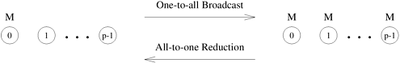
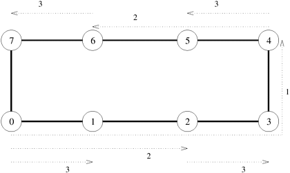
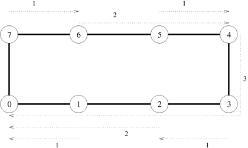
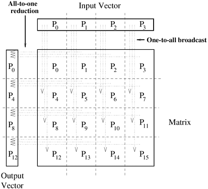
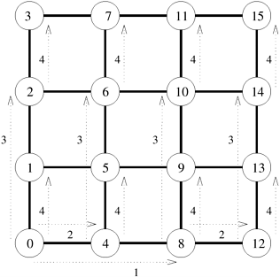
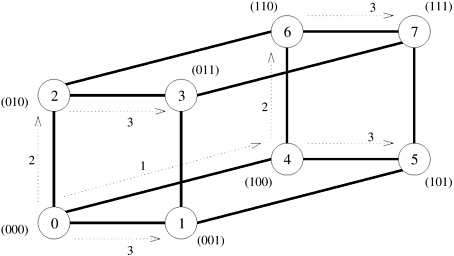
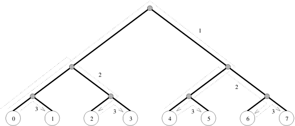

## 4.1 One-to-All Broadcast和All-to-One Reduction

并行算法通常要求单个进程向所有其他进程或其子集发送相同的数据。这种操作被称为**One-to-All Broadcast**。最初，只有源进程拥有需要广播的大小为 $m$ 的数据。程序结束时，初始数据有 $p$ 份副本，每个进程各一份。One-to-All Broadcast的对偶运算是**All-to-One Reduction**运算。在All-to-One Redection操作中，$p$ 个参与进程中的每个进程都从包含 $m$ 个字的缓冲区 $M$ 开始。来自所有进程的数据通过关联算子合并，并在一个目标进程中累积到一个大小为 $m$ 的缓冲区中。还原法可用于查找一组数字的和、乘积、最大值或最小值 - 累积 $M$ 的第 $i$ 个字是每个原始缓冲区第 $i$ 个字的和、乘积、最大值或最小值。[图 4.1](#fig4.1) 显示了 $p$​​ 个进程之间的One-to-All Broadcast和All-to-One Reduction。

<div align="center" id="fig4.1" name="fig4.1">
    
    <div>
        图4.1 One-to-All Broadcast和All-to-One Reduction
    </div>
</div>

矩阵 - 矢量乘法、高斯消除、最短路径和矢量内积等几种重要的并行算法中都使用了One-to-All Broadcast和All-to-One Reduction。在下面的小节中，我们将详细讨论One-to-All Broadcast在各种互连拓扑结构上的实现。

### 4.1.1 环型或线性阵列

执行One-to-All Broadcast的一种简单方法是按顺序从源进程向其他 $p-1$ 个进程发送 $p-1$ 条信息。然而，这种方法效率很低，因为源进程会成为瓶颈。此外，由于每次只使用一对节点之间的连接，通信网络的利用率很低。利用一种通常称为**递归加倍（Recursive Doubling）**的技术，可以设计出一种更好的Broadcast算法。源进程首先向另一个进程发送信息。现在，这两个进程可以同时向另外两个仍在等待消息的进程发送消息。通过继续这一过程，直到所有进程都接收到数据，就可以用 ${\log p}$​ 步广播信息。

在八节点线性阵列或环上进行One-to-All Broadcast的步骤如[图 4.2](#fig4.2) 所示。节点标记为 0 至 7。每个信息传输步骤由一个从信息源到目的地的编号虚线箭头表示。表示在同一时间步长内发送的信息的箭头编号相同。

<div align="center" id="fig4.2" name="fig4.2">
    
    <div>
        图4.2 八节点环上的One-to-All Broadcast。节点0是广播源。从信息源到目的地的每个信息传输步骤都用编号的虚线箭头表示。箭头上的数字表示信息传输的时间步长
    </div>
</div>

需要注意的是，在线性阵列中，必须仔细选择每一步发送信息的目标节点。在[图 4.2](#fig4.2) 中，信息首先发送到距离源节点（0）最远的节点（4）。第二步，发送节点和接收节点之间的距离减半，以此类推。每一步都以这种方式选择信息接收者，以避免网络拥塞。例如，如果节点 0 在第一步中向节点 1 发送信息，然后节点 0 和节点 1 在第二步中分别尝试向节点 2 和节点 3 发送信息，那么节点 1 和节点 2 之间的链路就会拥塞，因为它是第二步中两条信息的最短路线的一部分。

如[图 4.3](#fig4.3) 所示，只需颠倒通信的方向和顺序，就能对线性数组进行还原。第一步，每个奇数节点将自己的缓冲区发送给自己之前的偶数节点，然后将两个缓冲区的内容合二为一。第一步完成后，0、2、4 和 6 节点上还分别有四个缓冲区需要缩减。在第二步中，节点 0 和节点 2 上的缓冲区内容被累加到节点 0 上，节点 6 和节点 4 上的缓冲区内容被累加到节点 4 上。最后，节点 4 将其缓冲区内容发送给节点 0，由节点 0 计算缩减的最终结果。

<div align="center" id="fig4.3" name="fig4.3">
    
    <div>
        图4.3 八节点环上的Reduction，节点0为还原目的地
    </div>
</div>

- ##### **例4.1 矩阵 - 矢量乘法**

  考虑在 ${n \times n}$ 个节点网格上将 ${n \times n}$ 矩阵 $A$ 与 ${n \times 1}$ 向量 $x$ 相乘，得到 ${n \times 1}$ 结果向量 $y$​ 的问题。[算法 8.1](#algo8.1) 展示了这一问题的串行算法。[图 4.4](#fig4.4) 显示了矩阵和向量的一种可能映射，其中矩阵的每个元素都属于不同的进程，向量分布在网格最顶行的进程中，结果向量产生于进程的最左列。

  <div align="center" id="fig4.4" name="fig4.4">
      
      <div>
          图4.4 4x4矩阵与4x1向量相乘时的One-to-All Broadcast和All-to-One Reduction
      </div>
  </div>

  由于矩阵的所有行都必须与矢量相乘，因此每个进程都需要驻留在其列最顶端进程中的矢量元素。因此，在计算矩阵 - 矢量乘积之前，每列节点都会以列中最顶层的进程为源，对所有矢量元素进行One-to-All Broadcast。具体做法是将 ${n \times n}$ 网格的每一列视为 $n$​ 节点线性数组，并同时对所有列应用前面所述的线性数组广播程序。

  Broadcast后，每个进程将其矩阵元素与Broadcast结果相乘。现在，每一行进程都需要将其结果相加，生成乘积向量的相应元素。为此，需要对进程网格的每一行进行All-to-One Reduction，并将每一行的第一个进程作为还原操作的目的地。

  例如，P~9~ 将从 P~1~ 处接收到广播结果 $x[1]$，将其与 $A[2,1]$相乘，并与 P~8~、P~10~ 和 P~11~ 一起参与All-to-One Reduction，在 P~8~ 上累积 $y[2]$。

### 4.1.2 网格

我们可以把由 $p$ 个节点组成的正方形网格的每一行和每一列看作由 $\sqrt{p}$​ 个节点组成的线性数组。因此，网格上的许多通信算法都是线性数组对应算法的简单扩展。线性数组通信操作可以在网格上分两个阶段进行。在第一阶段，将行视为线性数组，沿一行或所有行进行操作。在第二阶段，对列进行类似处理。

考虑在一个有 $\sqrt{p}$ 行和 $\sqrt{p}$ 列的二维正方形网格上进行One-to-All Broadcast的问题。首先，从源节点向同一行的其余（$\sqrt{p}-1$）节点进行One-to-All Broadcast。一旦网格中某一行的所有节点都获取了数据，它们就会在各自的列中发起One-to-All Broadcast。第二阶段结束时，网格中的每个节点都有一份初始信息副本。[图 4.5](#fig4.5) 展示了网状结构中One-to-All Broadcast的通信步骤，其中 $p=16$​，左下角的节点 0 为信息源。步骤 1 和 2 对应第一阶段，步骤 3 和 4 对应第二阶段。

<div align="center" id="fig4.5" name="fig4.5">
    
    <div>
        图4.5 在16个节点网格上的One-to-All Broadcast
    </div>
</div>

我们也可以使用类似的方法在三维网格上进行One-to-All Broadcast。在这种情况下，三维网格中每一维的 $p^{1/3}$ 节点行将被视为线性阵列。与线性阵列的情况一样，只需颠倒信息的方向和顺序，就能对二维和三维网格进行还原。

### 4.1.3 超立方体

上一小节表明，在二维网格上，One-to-All Broadcast分两个阶段进行，每个阶段沿着不同的维度进行通信。同样，在三维网格上，这一过程也分三个阶段进行。一个有 $2$ 个节点的超立方体可视为一个在每个维度上有两个节点的 $d$ 维网格。因此，网格算法可以扩展到超立方体，只不过现在的过程是分 $d$ 个步骤进行的，每个维度一个步骤。

[图 4.6](#fig4.6) 显示了在一个八节点（三维）超立方体上进行的One-to-All Broadcast，节点 0 为源节点。在该图中，通信从最高维度开始（即节点标签二进制表示中最有效位指定的维度），并在随后的步骤中沿较低维度依次进行。请注意，[图 4.6](#fig4.6) 所示算法三个通信步骤中的源节点和目的节点与[图 4.2](#fig4.2) 所示线性数组上的广播算法中的节点完全相同。不过，在超立方体上，选择通信维数的顺序并不影响程序的结果。[图 4.6](#fig4.6) 只显示了一种这样的顺序。与线性数组不同的是，如果节点 0 在第一步先向节点 1 发送信息，然后节点 0 和节点 1 分别向节点 2 和节点 3 发送信息，最后节点 0、节点 1、节点 2 和节点 3 分别向节点 4、节点 5、节点 6 和节点 7 发送信息，超立方体广播就不会出现拥塞。

<div align="center" id="fig4.6" name="fig4.6">
    
    <div>
        图4.6 三维超立方体上的One-to-All Broadcast。括号内为节点标签的二进制表示
    </div>
</div>

### 4.1.4 平衡二叉树

One-to-All Broadcast的超立方体算法可以自然地映射到一棵平衡二叉树上，在这棵树上，每一片叶子都是一个处理节点，中间节点只充当交换单元。[图 4.7](#fig4.7) 以八个节点为例进行了说明。在该图中，通信节点的标签与[图 4.6](#fig4.6) 中的超立方体算法相同。[图 4.7](#fig4.7) 显示，任何通信链路在任何时候都不会出现拥塞。超立方体上的通信与[图 4.7](#fig4.7) 所示树形通信的不同之处在于，树形上不同路径上的切换节点数量不同。

<div align="center" id="fig4.7" name="fig4.7">
    
    <div>
        图4.7 八节点树上的One-to-All Broadcast
    </div>
</div>

### 4.1.5 算法细节

仔细观察[图 4.2](#fig4.2)、[图 4.5](#fig4.5)、[图 4.6](#fig4.6) 和[图 4.7](#fig4.7) 就会发现，在本节讨论的所有四个互连网络中，One-to-All Broadcast的基本通信模式是相同的。现在我们介绍实现广播和缩减操作的程序。为简单起见，这里的算法以超立方为背景进行描述，并假设通信进程的数量是 2 的幂次。然而，这些算法适用于任何网络拓扑结构，并且可以很容易地扩展到任何进程数量。

[算法 4.1](#algo4.1) 展示了在 $2^d$ 节点网络中，当节点 0 是广播源时的一对全广播过程。该过程在所有节点上执行。在任何节点，`my_id` 的值都是该节点的标签。让 `X` 成为要广播的信息，它最初位于源节点 0。程序执行 $d$ 个通信步骤，假设超立方体的每个维度各执行一个。在[算法 4.1](#algo4.1) 中，通信从最高维度到最低维度进行（但维度的选择顺序并不重要）。循环计数器 $i$ 表示正在进行通信的超立方体的当前维度。只有标签的 $i$ 个最小有效位为 0 的节点才会参与维度 $i$ 的通信。例如，在[图 4.6](#fig4.6) 所示的三维超立方体中，$i$ 在第一个时间步等于 $2$。因此，只有节点 0 和 4 进行通信，因为它们的两个最小有效位都是 0。在下一个时间步中，当 $i=1$​​ 时，所有最小有效位为零的节点（即 0、2、4 和 6）都参与通信。在所有维度都完成通信后，程序结束。

<div id="algo4.1" name="algo4.1">算法4.1 从d维p节点超立方体（d = log p）的第 0 节点One-to-All Bradcast信息X。AND 和 XOR 分别是位逻辑运算和排他运算</div>

```pascal
procedure ONE_TO_ALL_BC(d, my_id, X)
begin
    mask := 2d - 1;                    /* Set all d bits of mask to 1 */
    for i := d - 1 downto 0 do         /* Outer loop */
        mask := mask XOR 2i;           /* Set bit i of mask to 0 */
        if (my_id AND mask) = 0 then   /* If lower i bits of my_id are 0 */
            if (my_id AND 2i) = 0 then
                msg_destination := my_id XOR 2i;
                send X to msg_destination;
            else
                msg_source := my_id XOR 2i;
                receive X from msg_source;
            endelse;
        endif;
    endfor;
 end ONE_TO_ALL_BC
```

变量掩码有助于确定哪些节点在循环的特定迭代中进行通信。变量掩码有 ${d \ (=\log p)}$ 位，所有位最初都设置为 $1$（第 3 行）。在每次迭代开始时，掩码中最显著的非零位被重置为零（第 5 行）。第 6 行决定哪些节点在外循环的当前迭代中进行通信。例如，对于[图 4.6](#fig4.6) 中的超立方体，掩码初始设置为 111，在 $i=2$ 对应的迭代中为 011（掩码的 i 个最小有效位为 1）。第 6 行的 AND 运算只选择 $i$​ 个最小有效位为 0 的节点。

在沿维度 $i$ 选择的通信节点中，Bit位置 $i$ 为 $0$ 的节点发送数据，Bit位置 $i$ 为 $1$ 的节点接收数据。确定发送和接收节点的测试在第 7 行进行。例如，在[图 4.6](#fig4.6) 中，在 $i=2$ 对应的迭代中，节点 0（000）是发送方，节点 4（100）是接收方。同样，在 $i=1$​​ 时，节点 0 (000) 和节点 4 (100) 是发送方，节点 2 (010) 和节点 6 (110) 是接收方。

只有当节点 0 是广播源时，[算法 4.1](#algo4.1) 才会起作用。对于任意来源，我们必须在应用此程序之前，通过将每个节点的标签与来源节点的标签进行 XOR 来重新标记假设超立方体的节点。修改后的一对全广播过程适用于 $0$ 到 $p-1$​ 之间的任何源值，如[算法 4.2](#algo4.2) 所示。通过在第 3 行执行 XOR 操作，[算法 4.2](#algo4.2) 将源节点重新标记为 0，并将其他节点相对于源节点重新标记。重新标记后，就可以应用[算法 4.1](#algo4.1) 的算法进行广播。

<div id="algo4.2" name="algo4.2">算法4.2 由信源在d维假设超立方体上发起的信息X的One-to-All Broadcast。AND和XOR 运算是位逻辑运算</div>

```pascal
procedure GENERAL_ONE_TO_ALL_BC(d, my_id, source, X)
begin
    my_virtual id := my_id XOR source;
    mask := 2d - 1;
    for i := d - 1 downto 0 do            /* Outer loop */
        mask := mask XOR 2i;              /* Set bit i of mask to 0 */
        if (my_virtual_id AND mask) = 0 then
            if (my_virtual_id AND 2i) = 0 then
                virtual_dest := my_virtual_id XOR 2i;
                send X to (virtual_dest XOR source);
/* Convert virtual_dest to the label of the physical destination */
            else
                virtual_source := my_virtual_id XOR 2i;
                receive X from (virtual_source XOR source);
/* Convert virtual_source to the label of the physical source */
            endelse;
    endfor;
end GENERAL_ONE_TO_ALL_BC
```

[算法 4.3](#algo4.3) 给出了一个在假设的 $d$​ 维超微立方体上执行全对一还原的过程，这样最终结果就会累积到节点 0 上。 单节点累积是One-to-All Broadcast的对偶。因此，我们可以通过颠倒One-to-All Broadcast中信息的顺序和方向来获得实现还原所需的通信模式。[算法 4.3](#algo4.3) 中的过程 `ALL_TO_ONE_REDUCE(d, my_id, m, X, sum)` 与[算法 4.1](#algo4.1) 中的过程 `ONE_TO_ALL_BC(d, my_id, X)` 非常相似。不同之处在于，All-to-One Reducation中的通信是从最低维度到最高维度进行的。这一变化反映在[算法 4.3](#algo4.3) 中对变量 `mask` 和 `i` 的处理方式上。在一对通信节点中确定源节点和目的节点的标准也是相反的（第 7 行）。除了这些不同之外，存储过程 `ALL_TO_ONE_REDUCE` 还增加了额外的指令（第 13 和 14 行），用于在每次迭代中将节点接收到的信息内容相加（可以使用任何联立运算来代替加法运算）。

<div id="algo4.3" name="algo4.3">算法4.3 d维超立方体上的单节点累加。每个节点贡献一个包含m 字的信息X，节点0是累加的目的地。AND和XOR运算是位逻辑运算</div>

```pascal
procedure ALL_TO_ONE_REDUCE(d, my_id, m, X, sum)
begin
    for j := 0 to m - 1 do sum[j] := X[j];
    mask := 0;
    for i := 0 to d - 1 do
        /* Select nodes whose lower i bits are 0 */
        if (my_id AND mask) = 0 then
            if (my_id AND 2i) != 0 then
                msg_destination := my_id XOR 2i;
                send sum to msg_destination;
            else
                msg_source := my_id XOR 2i;
                receive X from msg_source;
                for j := 0 to m - 1 do
                    sum[j] :=sum[j] + X[j];
            endelse;
        mask := mask XOR 2i; /* Set bit i of mask to 1 */
    endfor;
end ALL_TO_ONE_REDUCE
```

### 4.1.6 开销分析

分析One-to-All Broadcast和All-to-One Reduction的成本相当简单。假设有 $p$ 个进程参与操作，需要广播或归约的数据包含 $m$ 个字。广播或缩减过程涉及 ${\log p}$ 次点对点简单信息传输，每次传输的时间成本为 $t_s+mt_w $。因此，该过程耗费的总时间为
$$
T=(t_s+mt_w) \log p
$$
