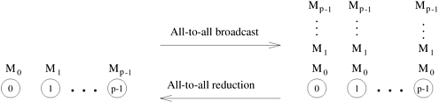
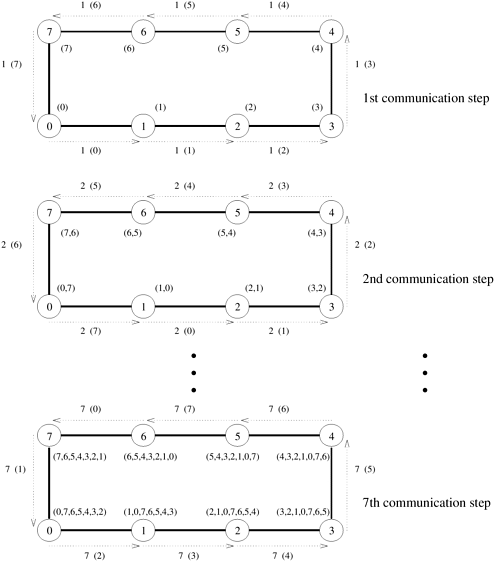
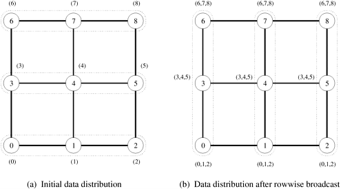
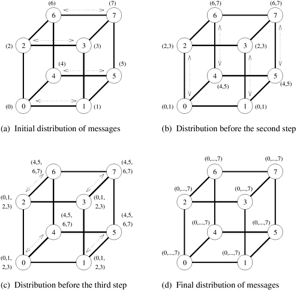
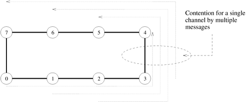

## 4.2 All-to-All Broadcast和All-to-All Reduction

**All-to-All Broadcast**是One-to-All Broadcast的概括，即所有 $p$ 个节点同时发起广播。一个进程向其他每个进程发送相同的 $m$​ 字信息，但不同的进程可能广播不同的信息。All-to-All Broadcast用于矩阵运算，包括矩阵乘法和矩阵向量乘法。All-to-All Broadcast的对偶形式是All-to-All Reduction，其中每个节点都是All-to-One Reduction的目的地。[图 4.8](#fig4.8) 展示了All-to-All Broadcast和All-to-All Reduction。

<div align="center" id="fig4.8" name="fig4.8">
    
    <div>
        图4.8 All-to-All Broadcast和All-to-All Reduction
    </div>
</div>

执行All-to-All Broadcast的一种方法是执行 $p$ 次One-to-All Broadcast，每次从一个节点开始。如果简单地执行，在某些架构上，这种方法所需的时间可能是One-to-All Broadcast的 $p$ 倍。如果同时执行 $p$​ 个One-to-All Broadcast，则可以更有效地利用互连网络中的通信链路，这样，同时穿越同一路径的所有信息都会被串联成一个信息，其大小为单个信息大小之和。

下文将介绍线性阵列、网状拓扑和超立方拓扑上的All-to-All Broadcast。

### 4.2.1 环型和线性阵列

在线性阵列或环网中执行All-to-All Broadcast时，所有通信链路都可以同时保持繁忙，直到操作完成，因为每个节点总是有一些信息可以传递给它的邻居。每个节点首先向它的一个邻居发送需要广播的数据。在随后的步骤中，它会将从一个邻居收到的数据转发给另一个邻居。

[图 4.9](#fig4.9) 展示了一个八节点环的All-to-All Broadcast。同样的程序也适用于双向链路的线性阵列。与前几幅图一样，箭头的整数标签表示发送信息的时间步长。在All-to-All Broadcast中，$p$ 个不同的信息在 $p$ 个节点集合中循环。在[图 4.9](#fig4.9) 中，每条信息都由其初始来源标识，其标签与时间步长一起出现在括号中。例如，节点 0 和节点 1 之间标有 2 (7) 的弧代表节点 0 在时间步骤 2 中从节点 7 接收到的数据。如[图 4.9](#fig4.9) 所示，如果通信是单向循环进行的，那么每个节点都会在 $p-1$ 个步骤中从所有其他节点接收到 $p-1$​ 条信息。

<div align="center" id="fig4.9" name="fig4.9">
    
    <div>
        图4.9 八节点环上的All-to-All Broadcast。每个箭头的标号表示时间步长，括号内的标号表示在广播开始前拥有当前正在传输的信息的节点的标号。每个节点旁边括号中的数字是在当前通信步骤之前已收到数据的节点的标签。仅显示第一个、第二个和最后一个通信步骤
    </div>
</div>

[算法 4.4](#algo4.4) 给出了在 $p$ 节点环上进行All-to-All Broadcast的程序。要广播的初始信息在每个节点本地称为 `my_msg`。程序结束时，每个节点会将所有 $p$​ 条信息的集合存储在结果中。如程序所示，网状结构上的All-to-All Broadcast应用了两次线性数组过程，一次沿行，一次沿列。

<div id="algo4.4" name="algo4.4">算法4.4 p个节点环上的All-to-All Broadcast</div>

```pascal
procedure ALL_TO_ALL_BC_RING(my_id, my_msg, p, result)
begin
    left := (my_id - 1) mod p;
    right := (my_id + 1) mod p;
    result := my_msg;
    msg := result;
    for i := 1 to p - 1 do
        send msg to right;
        receive msg from left;
        result := result U msg;
    endfor;
end ALL_TO_ALL_BC_RING
```

在All-to-All Reduction（All-to-All Broadcast的对偶）中，每个节点都从 $p$ 个报文开始，每个报文都将在一个不同的节点累积。All-to-All Reduction可以通过颠倒报文的方向和顺序来实现。例如，在 8 节点环上进行All-to-All Reduction的第一个通信步骤与[图 4.9](#fig4.9) 的最后一个步骤相对应，节点 0 将 `msg[1]` 发送给 7，而不是接收。唯一需要增加的步骤是，节点在接收到信息后，必须将其与与接收到的信息具有相同目的地的本地信息副本合并，然后再将合并后的信息转发给下一个邻居。[算法 4.5](#algo4.5) 给出了在 $p$ 节点环上进行All-to-All Reduction的程序。

<div id="algo4.5" name="algo4.5">算法4.5 p个节点环上的All-to-All Reduction</div>

```pascal
procedure ALL_TO_ALL_RED_RING(my_id, my_msg, p, result)
begin
    left := (my_id - 1) mod p;
    right := (my_id + 1) mod p;
    recv := 0;
    for i := 1 to p - 1 do
        j := (my_id + i) mod p;
        temp := msg[j] + recv;
        send temp to left;
        receive recv from right;
    endfor;
    result := msg[my_id] + recv;
end ALL_TO_ALL_RED_RING
```

### 4.2.2 二维网格

与One-to-All Broadcast一样，二维网格的All-to-All Broadcast算法也是基于线性数组算法，将网格的行和列视为线性数组。同样，通信分为两个阶段。在第一阶段，网格的每一行都使用线性阵列的程序执行All-to-All Broadcast。在这一阶段，所有节点都会收集与各自行中 $\sqrt{p}$ 节点相对应的 $\sqrt{p}$ 信息。每个节点将这些信息合并成一条大小为 $m\sqrt{p}$ 的信息，然后进入算法的第二个通信阶段。第二通信阶段是对合并后的信息进行列对列广播。在这一阶段结束时，每个节点都会获得原来存在于不同节点上的所有 $p$ 个 $m$ 字数据。[图 4.10](#fig4.10) 显示了算法第一和第二阶段开始时 ${3 \times 3}$​ 网格中各节点的数据分布情况。

<div align="center" id="fig4.10" name="fig4.10">
    
    <div>
        图4.10 3x3网格上的All-to-All Broadcast。每个阶段相互通信的节点组由虚线围成。在第二阶段结束时，所有节点都会收到 (0,1,2,3,4,5,6,7)（即来自每个节点的一条信息）
    </div>
</div>

[算法 4.6](#algo4.6) 给出了在 ${\sqrt{p} \times \sqrt{p}}$​ 网格上进行All-to-All Broadcast的程序。All-to-All Reduction的网格程序留给读者练习。

<div id="algo4.6" name="algo4.6">算法4.6 由p个节点组成的正方形网格上的All-to-All Broadcast</div>

```pascal
procedure ALL_TO_ALL_BC_MESH(my_id, my_msg, p, result)
begin
/* Communication along rows */
    left := my_id - (my_id mod \sqrt{p}) + (my_id - 1) mod \sqrt{p};
    right := my_id - (my_id mod \sqrt{p}) + (my_id + 1) mod \sqrt{p};
    result := my_msg;
    msg := result;
    for i := 1 to \sqrt{p} - 1 do
        send msg to right;
        receive msg from left;
        result := result U msg;
    endfor;
/* Communication along columns */
    up := (my_id - \sqrt{p}) mod p;
    down := (my_id + \sqrt{p}) mod p;
    msg := result;
    for i := 1 to \sqrt{p} - 1 do
        send msg to down;
        receive msg from up;
        result := result U msg;
    endfor;
end ALL_TO_ALL_BC_MESH
```

### 4.2.3 超立方

All-to-All Broadcast的超立方算法是将网格算法扩展到对数 $p$ 维。该过程需要 ${ \log p}$ 个步骤。每一步都沿着 $p$​ 节点超立方体的不同维度进行通信。在每一步中，成对的节点交换数据，并通过将接收到的信息与当前数据连接起来，将下一步要传输的信息的大小增加一倍。[图 4.11](#fig4.11) 显示了具有双向通信通道的八节点超立方体的上述步骤。

<div align="center" id="fig4.11" name="fig4.11">
    
    <div>
        图4.11 八节点超立方体上的All-to-All Broadcast
    </div>
</div>

[算法 4.7](#algo4.7) 给出了在 $d$ 维超立方上实现全对全广播的程序。通信从超立方体的最低维度开始，然后依次沿着较高维度进行（线路 4）。在每次迭代中，节点成对通信，以便第 $i$ 次迭代中相互通信的节点的标签在二进制表示的第 $i$​ 个最小有效位上不同（第 5 行）。在一个迭代的通信步骤结束后，每个节点将其在该迭代中接收到的数据与其常驻数据进行串联（第 8 行）。在接下来的迭代中，将传送这一合并信息。

<div id="algo4.7" name="algo4.7">算法4.7 d维超立方上的All-to-All Broadcast</div>

```pascal
procedure ALL_TO_ALL_BC_HCUBE(my_id, my_msg, d, result)
begin
    result := my_msg;
    for i := 0 to d - 1 do
        partner := my id XOR 2i;
        send result to partner;
        receive msg from partner;
        result := result U msg;
    endfor;
end ALL_TO_ALL_BC_HCUBE
```

与往常一样，通过颠倒All-to-All Broadcast中报文的顺序和方向，可以推导出All-to-All Reduction的算法。此外，还原操作需要在每次迭代中选择适当的缓冲区子集来发送和累积收到的信息，而不是串联信息。[算法 4.8](#fig4.8) 给出了在 $d$​ 维超立方上进行All-to-All Reduction的过程。在每次迭代中，它使用 `senloc` 索引到发出信息的起始位置，并使用 `recloc` 索引到添加接收信息的位置。

<div id="algo4.8" name="algo4.8">算法4.8 在d维超立方体上进行All-to-All Broadcast。AND和XOR分别是按位逻辑与和异或运算</div>

```pascal
procedure ALL_TO_ALL_RED_HCUBE(my_id, msg, d, result)
begin
    recloc := 0;
    for i := d - 1 to 0 do
        partner := my_id XOR 2i;
        j := my_id AND 2i;
        k := (my_id XOR 2i) AND 2i;
        senloc := recloc + k;
        recloc := recloc + j;
        send msg[senloc .. senloc + 2i - 1] to partner;
        receive temp[0 .. 2i - 1] from partner;
        for j := 0 to 2i - 1 do
            msg[recloc + j] := msg[recloc + j] + temp[j];
        endfor;
    endfor;
    result := msg[my_id];
end ALL_TO_ALL_RED_HCUBE
```

### 4.2.4 开销分析

在环形或线性阵列上，All-to-All Broadcast涉及最近邻居之间的 $p-1$ 步通信。每个步骤涉及大小为 $m$ 的消息，需要时间 $t_s+mt_w$​。因此，整个操作所花费的时间为
$$
T=(t_s+mt_w)(p-1)
$$
同样，在网格上，第一阶段 $\sqrt{p}$ 次同时All-to-All Broadcast（每次在 $\sqrt{p}$ 个节点之间进行）在 $(t_s+mt_w)(p-1)$ 时间内结束。参与第二阶段All-to-All Broadcast的节点数也是 $\sqrt{p}$，但现在每条信息的大小是 $m\sqrt{p}$。因此，这一阶段需要 $(t_s+mt_w\sqrt{p})(p-1)$ 时间完成。在一个 $p$ 节点的二维正方形网格上，整个All-to-All Broadcast的时间是各个阶段所用时间的总和，即
$$
T=2t_s(\sqrt{p}-1)+mt_w(p-1)
$$
在 $p$ 节点超立方体上，对数 $p$ 步中第 $i$ 步交换的每条信息的大小为 $2^{i-1}m$。在第 $i$ 个步骤中，一对节点相互发送和接收信息需要时间 $t_s+2^{i-1}mt_w$​。因此，完成整个程序的时间为
$$
T=\sum^{\log p}_{i=1}(t_s+2^{i-1}mt_w)=t_s \log p+mt_w(p-1)
$$
上述三个公式表明，在所有体系结构中，All-to-All Broadcast通信时间表达式中与 $t_w$ 相关的项为 $mt_w(p-1)$。这个项也是并行计算机All-to-All Broadcast通信时间的下限，在并行计算机上，节点每次只能在其一个端口上进行通信。这是因为，无论采用何种架构，每个节点都会接收至少 $m(p-1)$ 个字的数据。因此，对于大型信息而言，像超立方体这样高度连接的网络在执行All-to-All Broadcast或All-to-All Reduction方面并不比简单的环型好。事实上，针对环型这种简单结构的直接All-to-All Broadcast算法具有重要的实际意义。仔细观察该算法就会发现，它是由 $p$ 个One-to-All Broadcast组成的序列，每个广播都有不同的来源。这些广播是流水线式的，因此总共只需 $p$ 个近邻通信步骤就能完成所有广播。许多并行算法都涉及一系列不同来源的One-to-All Broadcast，其中通常会穿插一些计算。如果使用第 4.1.3 节中的超立方体算法来执行每个One-to-All Broadcast，那么 $n$ 次广播将需要 ${n(t_s+mt_w)\log p}$ 的时间。另一方面，如[图 4.9](#fig4.9) 所示，通过流水线化广播，只要所有广播的来源不同且 $n \leq p$，则执行所有广播的通信时间不会超过 $(t_s+mt_w)(p-1)$。在后面的章节中，我们将展示这种流水线广播如何提高一些并行算法的性能，如高斯消元法（第 8.3.1 节）、反向置换法（第 8.3.3 节）和查找图中最短路径的弗洛伊德算法（第 10.4.2 节）。

All-to-All Broadcast的另一个值得注意的特性是，与One-to-All Broadcast不同，超立方体算法不能原封不动地应用于网状和环状结构。原因是All-to-All Broadcast的超立方程序会导致节点数相同的小维度网络通信信道拥塞。例如，[图 4.12](#fig4.12) 显示了在一个环上执行超立方All-to-All Broadcast过程的第三步（[图 4.11(c)](#fig4.11)）的结果。环中的一条链路被所有四条报文穿越，完成通信步骤所需的时间是原来的四倍。

<div align="center" id="fig4.12" name="fig4.12">
    
    <div>
        图4.12 在图4.11(c)中超立方体的通信步骤映射到环上时的信道竞争情况
    </div>
</div>
