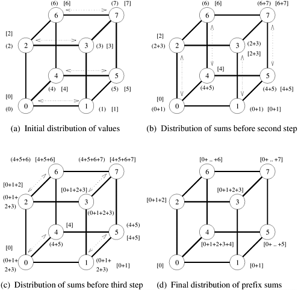

## 4.3 All-Reduce和Prefix-Sum操作

All-to-All Broadcast的通信模式还可用于执行其他一些操作。其中一种操作是Reduce的第三种变体，即每个节点从大小为 $m$ 的缓冲区开始，操作的最终结果是每个节点上大小为 $m$ 的相同缓冲区，这些缓冲区是通过使用关联算子将原始的 $p$ 个缓冲区组合而成的。从语义上讲，这种操作通常被称为**All Reduce**操作，与执行All-to-One Reduction，然后One-to-All Broadcast结果的操作相同。这种操作不同于All-to-All Reduction，后者是同时进行 $p$ 个All-to-One Reduction，每个Reduce结果的目的地都不同。

在消息传递计算机上，通常使用在每个节点上带有单字消息的All Reduce操作来实现Barrier同步。Reduce操作的语义是，在执行并行程序时，任何节点都不能在每个节点贡献一个值之前完成还原。

执行All Reduce的简单方法是先执行All-to-One Reduction，然后再执行All-to-All Broadcast。不过，还有一种更快的方法，即使用All-to-All Broadcast的通信模式来执行All-Reduce。[图 4.11](#fig4.11) 展示了八节点超立方体的这种算法。假设图中括号中的每个整数不是表示信息，而是表示一个要添加的数字，该数字最初位于带有该整数标签的节点上。为了进行Reduce，我们遵循All-to-All Broadcast过程的通信步骤，但在每一步结束时，添加两个数字，而不是连接两条信息。在Reduce过程结束时，每个节点都会持有总和（${0 + 1 + 2 + … + 7}$）（而不是像All-to-All Broadcast那样，持有编号从 0 到 7 的八条信息）。与All-to-All Broadcast不同的是，Reduce操作中传输的每个报文只有一个字。由于数字是相加而不是串联的，因此每一步的报文大小都不会翻倍。因此，所有 ${\log p}$ 步的总通信时间为
$$
T=(t_s+mt_w)\log p
$$
如果`my_msg`、`msg`和`result`都是数字（而不是信息），并且第 8 行的 union 操作 ('`U`') 被加法取代，则[算法 4.7](#algo4.7) 可用来执行 $p$ 个数字的求和。

查找**Prefix-Sum**（也称为**扫描（Scan）**操作）是另一个重要问题，可以通过使用类似于All-to-All Broadcast和All Reduce操作的通信模式来解决。给定 $p$ 个数字 $n_0$、$n_1$、......、$n_{p-1}$（每个节点一个），问题是计算 $0$ 到 $p-1$ 之间所有 $k$ 的和 ${s_k=\sum^k_{i=0}{n_i}}$。例如，如果原始数字序列是 `<3, 1, 4, 0, 2>`，那么Prefix-Sum的序列就是 `<3, 4, 8, 8, 10>`。初始时，$n_k$ 位于标记为 $k$ 的节点上，在程序结束时，同一节点上保存着 $s_k$。每个节点可以从大小为 $m$ 的缓冲区或向量开始，而不是从单个数字开始，$m$​ 字结果将是缓冲区中相应元素的和。

[图 4.13](#fig4.13) 展示了八节点超立方体的Prefix-Sum过程。该图是对[图 4.11](#fig4.11) 的修改。在Prefix相加过程中，标号为 $k$ 的节点只使用标号小于或等于 $k$ 的节点的 $k$ 节点子集的信息，因此需要进行修改。[图 4.13](#fig4.13) 中的方括号表示该缓冲区。在通信步骤结束时，只有当传入的信息来自一个标签小于接收节点的节点时，该信息的内容才会被添加到结果缓冲区中。传出信息的内容（图中用括号表示）会随着每条传入信息的更新而更新，就像全还原操作一样。例如，在第一个通信步骤后，节点 0、2 和 4 不会将从节点 1、3 和 5 收到的数据添加到它们的结果缓冲区中。不过，下一步的传出信息内容会被更新。

<div align="center" id="fig4.13" name="fig4.13">
    
    <div>
        图4.13 在八节点超立方体上计算Prefix-Sum。在每个节点上，方括号表示结果缓冲区中累积的本地Prefix-Sum，括号表示下一步的传出信息缓冲区内容
    </div>
</div>

由于节点接收到的所有信息都不会对其最终结果产生影响，因此它接收到的某些信息可能是多余的。我们省略了[图 4.13](#fig4.13) 中标准的All-to-All Broadcast通信模式的这些步骤，尽管这些报文的存在与否并不影响算法的结果。[算法 4.9](#algo4.9) 给出了在 $d$​ 维超微立方体上求解前缀和问题的过程。

<div id="algo4.9" name="algo4.9">算法4.9 d维超立方体上的Prefix-Sum</div>

```pascal
procedure PREFIX_SUMS_HCUBE(my_id, my number, d, result)
begin
    result := my_number;
    msg := result;
    for i := 0 to d - 1 do
        partner := my_id XOR 2i;
        send msg to partner;
        receive number from partner;
        msg := msg + number;
        if (partner < my_id) then result := result + number;
    endfor;
end PREFIX_SUMS_HCUBE
```

