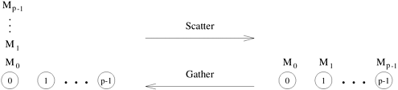
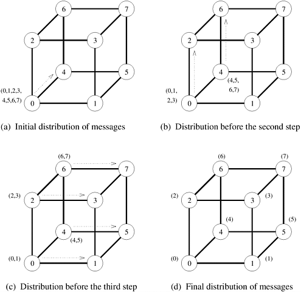

## 4.4 Scatter和Gather操作

在**Scatter**操作中，单个节点向其他每个节点发送大小为 $m$ 的唯一信息。这种操作也被称为**One-to-All Personalized Communication**。One-to-All Personalized Communication不同于One-to-All Broadcast，因为源节点一开始会有 $p$ 个唯一的信息，每个节点一个。与One-to-All Broadcast不同，One-to-All Personalized Communication不涉及任何数据重复。One-to-All Personalized Communication或Scatter操作的对偶操作是**Gather**操作或**Concatenation**操作，在这种操作中，单个节点从每个节点收集唯一的信息。收集操作不同于All-to-One Reduce操作，因为它不涉及数据的任何组合或还原。[图 4.14](#fig4.14) 展示了Scatter和Gather操作。

	
    

        图4.14 Scatter和Gather操作
    

虽然Scatter操作在语义上不同于One-to-All Broadcast，但Scatter算法与Broadcast算法十分相似。[图 4.15](#fig4.15) 显示了在八节点超立方体上进行Scatter操作的通信步骤。One-to-All Broadcast（[图 4.6](#fig4.6)）和Scatter（[图 4.15](#fig4.15)）的通信模式完全相同。只有信息的大小和内容不同。在[图 4.15](#fig4.15) 中，源节点（节点 0）包含所有报文。报文由其目的节点的标签标识。在第一个通信步骤中，源节点将一半的信息传输给它的一个邻居。在随后的步骤中，每个拥有部分数据的节点会将一半数据传输给尚未接收到任何数据的邻居。总共有 ${\log p}$ 个通信步骤，与超立方体的 $\log{p}$ 维数相对应。

    
    

        图4.15 八节点超立方体上的Scatter操作
    

Gather操作与Scatter操作正好相反。每个节点从 $m$ 字信息开始。第一步，每个奇数节点将其缓冲区发送给后面的偶数邻居，后者将收到的信息与自己的缓冲区连接起来。只有偶数节点参与下一步通信，结果是标签数为四的倍数的节点收集更多数据，并将其数据量增加一倍。该过程以类似方式继续，直到节点 0 收集完所有数据。

就像One-to-All Broadcast和All-to-One Reduction一样，超立方体Scatter和Gather算法可以不加改动地应用于线性阵列和网状互连拓扑，而不会增加任何通信时间。

**成本分析** $p$ 节点超立方体的所有链接都沿某一维度连接两个 $p/2$​ 节点的子立方体（第 2.4.3 节）。如[图 4.15](#fig4.15) 所示，在散点操作的每个通信步骤中，数据从一个子立方体流向另一个子立方体。节点在某一维度开始通信前拥有的数据中，有一半需要发送给另一个子立方体中的节点。在每一步中，通信节点都会保留一半的数据，这些数据是为其子立方体中的节点准备的，并将另一半数据发送给其在另一个子立方体中的邻居。所有数据分发到各自目的地的时间为
$$
T=t_s\log{p}+mt_w(p-1)
$$
在线性阵列和二维方形网格上进行Scatter和Gather操作也需要时间 $t_s\log{p}+mt_w(p-1)$。需要注意的是，不考虑信息启动时间的影响，在任何 k-d网格互连网络（第 2.4.3 节）上对大型信息进行Scatter和Gather操作的成本是相似的。在Scatter操作中，源节点必须向外传输至少 $m(p-1)$ 个字的数据，而在Gather操作中，目的节点必须接收至少 $m(p-1)$ 个字的数据。因此，与All-to-All Broadcast的情况一样，$mt_w(p-1)$ 是Scatter和Gather操作通信时间的下限。这个下限与互连网络无关。