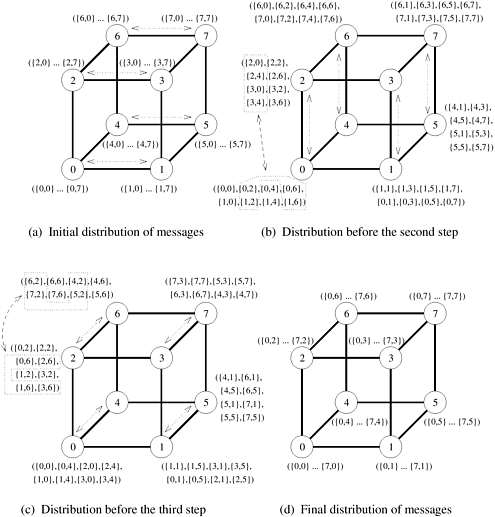

## 4.5 All-to-All Personalized Communication

在**All-to-All Personalized Communication**中，每个节点向其他每个节点发送大小为 $m$ 的不同信息。每个节点向不同的节点发送不同的信息，这与All-to-All Broadcast不同，在All-to-All Broadcast中，每个节点向所有其他节点发送相同的信息。[图 4.16](#fig4.16) 展示了All-to-All Personalized Communication操作。仔细观察该图就会发现，该操作相当于使用一维数组分区将分布在 $p$​ 个进程中的二维数据数组进行转置（[图 3.24](#fig3.24)）。All-to-All Personalized Communication也称为**Total Exchange**。这种操作用于多种并行算法，如快速傅立叶变换、矩阵转置、抽样排序和一些并行数据库连接操作。

<div align="center" id="fig4.16" name="fig4.16">
    
    <div>
        图4.16 All-to-All Personalized Communication
    </div>
</div>

- ##### **例4.2 矩阵转置**

  $n\times{n}$ 矩阵 $A$ 的转置是相同大小的矩阵 $A^T$，使得 $A^T[i,j]=A[j,i]$（${0 \leq i, j < n}$）。考虑将一个 $n\times{n}$ 矩阵映射到 $n$ 个处理器上，使每个处理器包含矩阵的一个完整行。在这种映射下，处理器 $P_i$ 最初包含矩阵中索引为 $[i,0],[i,1],...,[i,n-1]$ 的元素。转置后，元素 $[i,0]$ 属于 $P_0$，元素 $[i,1]$ 属于 $P_1$，以此类推。一般来说，元素 $[i,j]$ 最初位于 $P_i$ 上，但在转置过程中会移动到 $P_j$ 上。[图 4.17](#fig4.17) 是使用一维行向分割将 $4\times{4}$ 矩阵映射到四个进程的数据通信模式。请注意，图中每个进程都向其他进程发送矩阵中的一个不同元素。这就是All-to-All Personalized Communication的一个例子。

  <div align="center" id="fig4.17" name="fig4.17">
      
      <div>
          图4.17 使用四种程序转置4x4矩阵的All-to-All Personalized Communication
      </div>
  </div>

  一般来说，如果我们使用 $p$ 个进程，且 $p \leq n$，那么每个进程最初都持有矩阵的 $n/p$ 行（即 $n^2/p$ 个元素）。现在，执行转置涉及大小为 ${n/p \times n/p}$​ 的矩阵块的All-to-All Personalized Communication，而不是单个元素的通信。

现在，我们将讨论在具有线性阵列、网状和超立方体互连网络的并行计算机上实现All-to-All Personalized Communication的问题。在这三种架构上，All-to-All Personalized Communication的通信模式与All-to-All Broadcast的通信模式完全相同。只有信息的大小和内容不同。

### 4.5.1 环型

[图 4.18](#fig4.18) 显示了在六节点线性阵列上进行All-to-All Personalized Communication的步骤。在图中，这些数据由一对形式为 `{i, j}` 的整数标识，其中 $i$ 是信息源，$j$ 是最终目的地。首先，每个节点将所有数据作为一条大小为 $m(p-1)$ 的合并信息发送给它的一个邻居（所有节点的通信方向相同）。在这一步中，节点收到的 $m(p-1)$ 字数据中，有一个 $m$ 字数据包属于它。因此，每个节点都会从接收到的数据中提取属于自己的信息，并将剩余的 $(p-2)$ 个大小为 $m$ 的数据包转发给下一个节点。这一过程持续 $p-1$ 步。节点间传输数据的总大小在每个连续步骤中减少 $m$ 个字。在每一步中，每个节点都会向其收集的数据中添加一个来自不同节点的 $m$ 字数据包。因此，在 $p-1$​ 个步骤中，每个节点都会收到来自集合中所有其他节点的信息。

<div align="center" id="fig4.18" name="fig4.18">
    
    <div>
        图4.18 六节点环上的All-to-All Personalized Communication。每个信息的标签形式为{x，y}，其中 x是最初拥有信息的节点的标签，y是信息最终目的地节点的标签。标签（{x1，y1}，{x2，y2}，......，{xn，yn}）表示由n个单独的信息连接而成的信息
    </div>
</div>

在上述过程中，所有信息都是同向发送的。如果一半的信息朝一个方向发送，剩下的一半朝另一个方向发送，那么由于 $t_w$​ 产生的通信成本就可以降低 2 倍。为简单起见，我们忽略了这一恒定系数的改进。

**成本分析** 在环形或双向线性阵列上，All-to-All Personalized Communication涉及 $p-1$ 个通信步骤。由于第 $i$ 步传输的信息大小为 $m(p-i)$​，因此该操作所需的总时间为
$$
\begin{align}
T&=\sum^{p-1}_{i=1}{(t_s+mt_w(p-i))} \\
&=t_s(p-1)+\sum^{p-1}_{i=1}imt_w \\
&=(t_s+mt_w\frac{p}{2})(p-1)
\end{align}
$$
在上述All-to-All Personalized Communication程序中，每个节点都会发送 $m(p-1)$ 个字的数据，因为每个节点都有一个 $m$ 字的数据包。假设所有信息都按顺时针或逆时针方向发送。一个 $m$ 字数据包的平均传输距离为 ${(\sum^{p-1}_{i=1}{i})/(p-1)}$，等于 $p/2$。由于有 p 个节点，每个节点都执行相同类型的通信，因此网络上的总流量（在直接连接的节点之间传输的数据字总数）为 ${m(p-1)\times p/2 \times p}$。不考虑信息启动时间 $t_s$，这正好是线性阵列程序所需的时间。因此，本节所述的All-to-All Personalized Communication算法是最优的。

### 4.5.2 二维网格

在 ${\sqrt{p} \times \sqrt{p}}$ 网格上的All-to-All Personalized Communication中，每个节点首先根据其目的节点的列对其 $p$ 报文进行分组。[图 4.19](#fig4.19) 显示了一个 ${3 \times 3}$ 网格，其中每个节点最初都有九条 $m$ 字信息，每个节点一条。每个节点将其数据分成三组，每组三条信息（一般来说，每组 $\sqrt{p}$ 条信息，共 $\sqrt{p}$​ 组）。第一组包含给标记为 0、3 和 6 的节点的信息；第二组包含给标记为 1、4 和 7 的节点的信息；最后一组包含给标记为 2、5 和 8 的节点的信息。

<div align="center" id="fig4.19" name="fig4.19">
    
    <div>
        图4.19 3x3网格中All-to-All Personalized Communication每个阶段开始时的信息分布。在第二阶段结束时，节点i拥有信息（{0, i}，..., {8, i}）。每个阶段一起通信的节点组用虚线围起来
    </div>
</div>

信息分组后，在每一行中使用大小为 $m\sqrt{p}$ 的聚类信息独立执行All-to-All Personalized Communication。一个群组包含特定列中所有 $\sqrt{p}$​ 节点的信息。[图 4.19(b)](#fig4.19) 显示了这一通信阶段结束时节点间的数据分布情况。

在第二通信阶段之前，每个节点中的信息会再次排序，这次是根据其目的地节点的行来排序；然后在网状结构的所有列中进行与第一阶段类似的通信。在这一阶段结束时，每个节点都会收到来自其他节点的信息。

**成本分析** 我们可以用环型拓扑的成本分析公式中的节点数 $\sqrt{p}$ 和信息量 $m\sqrt{p}$ 来代替第一阶段所花费的时间。代入的结果是 ${(t_s+mt_wp/2)(\sqrt{p}-1)}$。第二阶段所用时间与第一阶段相同。因此，在一个 $p$ 节点的二维正方形网格上，对大小为 $m$​ 的信息进行全对全个性化通信的总时间为
$$
T=(2t_s+mt_wp)(\sqrt{p}-1)
$$
上式中的All-to-All Personalized Communication的通信时间表达式没有考虑数据局部重新排列（即按行或列对报文进行排序）所需的时间。假设最初数据已为第一通信阶段做好准备，第二通信阶段需要重新排列 $mp$ 个数据字。如果 $t_r$ 是对节点本地存储器中一个数据字进行读写操作的时间，那么节点在整个过程中重新排列数据所花费的总时间就是 $t_rmp$​。这个时间远远小于每个节点用于通信的时间。

根据对线性阵列的分析可以看出，上式所给出的在方形网格上进行All-to-All Communication的通信时间，在一个很小的常数因子范围内是最优的。

### 4.5.3 超立方

在 $p$ 节点超立方体上执行All-to-All Personalized Communication的一种方法，是简单地将二维网格算法扩展到 $\log p$ 维。[图 4.20](#fig4.20) 显示了在三维超立方体上执行这一操作所需的通信步骤。如图所示，通信以 $\log p$ 步进行。节点对在每一步中交换不同维度的数据。回想一下，在 $p$ 节点超立方体中，同维度的一组 $p/2$ 链接连接着两个各有 $p/2$ 节点的子立方体（第 2.4.3 节）。在 All-to-All Personalized Commnication的任何阶段，每个节点都持有大小为 $m$ 的 $p$ 个数据包。在特定维度中通信时，每个节点发送 $p/2$ 个数据包（合并为一条信息）。这些数据包的目的地是当前维度中由链接连接的其他子立方体的节点。

<div align="center" id="fig4.20" name="fig4.20">
    
    <div>
        图4.20 三维超立方体上的All-to-All Personalized Communication算法
    </div>
</div>

在前述过程中，节点必须在每对数 $p$ 个通信步骤之前在本地重新排列其报文。这样做的目的是确保在通信步骤中发送给同一节点的所有 $p/2$ 条报文都占据连续的内存位置，以便作为一条合并报文进行传输。

**成本分析** 在上述All-to-All Personalized Communication的超立方体算法中，每次 $\log p$ 的迭代都要沿着双向信道交换 $mp/2$​ 个字的数据。由此产生的总通信时间为
$$
T=(t_s+mt_wp/2)\log p
$$
在每 $\log p$ 个通信步骤之前，节点都要重新排列 $mp$ 个数据字。因此，在整个过程中，每个节点花费在本地数据重新排列上的总时间为 $t_r m p \log p$。这里的 $t_r$ 是对节点本地内存中的单字数据进行读写操作所需的时间。对于大多数实用计算机来说，$t_r$ 远远小于 $t_w$​；因此，执行全对全个性化通信所需的时间主要是通信时间。

有趣的是，与本节描述的线性阵列和网格算法不同，超立方体算法并非最优。每个 $p$ 节点发送和接收 $m(p-1)$ 个数据字，超立方体上任意两个节点之间的平均距离为 $(\log p)/2$。因此，网络上的总数据流量为 $p \times m(p-1) \times (\log p)/2$。由于超立方体网络中总共有 $(p \log p)/2$​ 个链路，因此全对All-to-All Personalized Communication时间的下限为
$$
T=\frac{t_wpm(p-1)(\log p)/2}{(p \log p)/2}=t_wm(p-1)
$$

#### 最优算法

All-to-All Personalized Communication的有效结果是，所有节点对都会交换一些数据。在超立方体上，进行这种交换的最佳方式是让每对节点直接相互通信。因此，每个节点只需执行 $p-1$ 个通信步骤，在每个步骤中与不同的节点交换 $m$ 个字的数据。节点必须在每一步中选择自己的通信伙伴，这样超立方链路才不会出现拥塞。[图 4.21](#fig4.21) 显示了在三维超立方体中进行成对数据交换的一种无拥塞时间表。如图所示，在第 $j$ 个通信步骤中，节点 $i$ 与节点 ($i$ XOR $j$) 交换数据。例如，在[图4.21(a)](#fig4.21)部分（第 1 步），通信伙伴的标签在最小有效位上不同。在[（g）](#fig4.21)部分（步骤 7）中，通信伙伴的标签在所有位上都不同，因为 7 的二进制表示法是 111。在该图中，每个通信步骤中的所有路径都没有拥塞，没有一条双向链路在同一方向上携带多于一条信息。对于任何维度的超立方体来说，一般情况下都是如此。如果信息路由适当，那么在 $p$ 节点超立方体上进行All-to-All Personalized Communication的 $p-1$ 个通信步骤中，就存在一个无拥塞时间表。回顾第 2.4.3 节，在超立方体上，从节点 $i$ 到节点 $j$ 的信息至少要经过 $l$ 个链接，其中 $l$ 是 $i$ 和 $j$ 之间的**汉明距离（Hamming Distance）**（即 $i$ XOR $j$ 的二进制表示中非零比特的个数）。从节点 $i$ 到节点 $j$ 的信息要穿越 $l$ 个维度的链路（与二进制表示 $i$ XOR $j$ 中的非零比特数相对应）。虽然信息可以沿着 $i$ 和 $j$ 之间存在的长度为 $l$ 的几条路径中的一条（假设 $l$ > 1）移动，但通过对信息移动的维数进行升序排序，可以得到一条不同的路径。根据这一策略，在与 ($i$ XOR $j$) 的最小有效非零比特相对应的维度中选择第一条链路，以此类推。这种路由方案被称为 E立方路由。

<div align="center" id="fig4.21" name="fig4.21">
    
    <div>
        图4.21 八节点超立方体上All-to-All Personalized Communication的七个步骤
    </div>
</div>

在 $d$ 维超立方上进行All-to-All Personalized Communication的[算法 4.10](#algo4.10) 就是基于这一策略。

<div id="algo4.10" name="algo4.10">算法4.10 在d维超微立方体上执行全对全个性化通信的程序。信息 M_{i,j} 最初位于节点i上，目的地是节点j</div>

```pascal
procedure ALL_TO_ALL_PERSONAL(d, my_id)
begin
    for i := 1 to 2d - 1 do
    begin
        partner := my_id XOR i;
        send Mmy_id, partner to partner;
        receive Mpartner,my_id from partner;
    endfor;
end ALL_TO_ALL_PERSONAL
```

成本分析 E-立方路由根据[算法 4.10](#fig4.10) 选择通信对，可确保节点 $i$ 和节点 $j$ 之间的信息传输通信时间为 $t_s+t_wm$，因为节点 $i$ 和节点 $j$ 之间的链路不存在与同方向传输的任何其他信息的竞争。整个操作的总通信时间为
$$
T=(t_s+t_wm)(p-1)
$$
对上述两个公式进行比较后发现，第二种超立方算法中与 $t_s$ 相关的项较高，而第一种算法中与 $t_w$ 相关的项较高。因此，对于小信息，启动时间可能占主导地位，第一种算法可能仍然有用。

