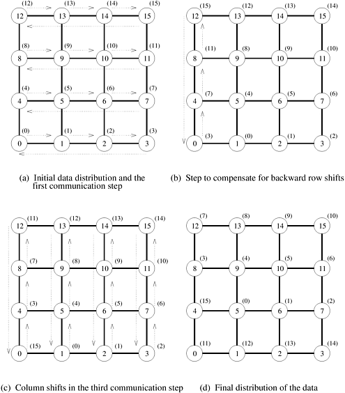
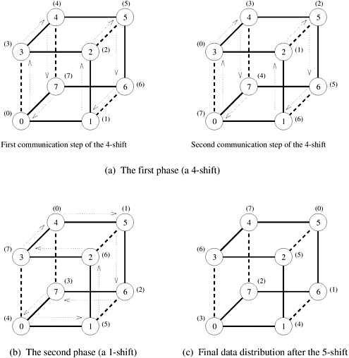
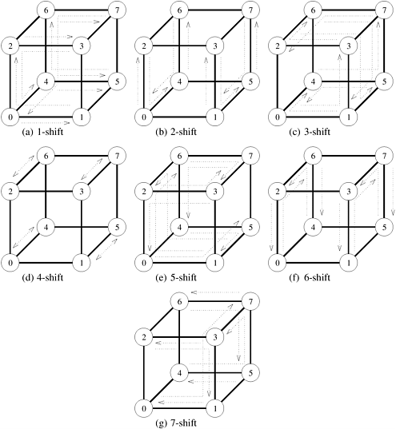

## 4.6 循环移位

循环移位是更广泛的全局通信操作中的一种，被称为 **置换（Permutation）**。置换是一种同步、一对一的数据再分配操作，其中每个节点向唯一的节点发送一个包含 $m$ 个字的数据包。我们将**循环 $q$ 移位（Circular q-Shift）**定义为在 $p$ 个节点集合$(0<q<p)$中，节点 $i$ 向节点 ${(i + q) \mod p}$ 发送数据包的操作。移位操作适用于某些矩阵计算以及字符串和图像模式匹配。

### 4.6.1 二维网格

在环形或双向线性阵列上实现循环 $q$ 移位相当直观。它可以通过单向`min{q, p - q}`邻近通信来实现。利用环形算法可以推导出圆周位移的网格算法。

如果网格的节点都有行主标，那么在一个 $p$ 个节点的正方形环绕网格上，可以分两个阶段进行圆周 $q$ 移位。[图 4.22](#fig4.22) 展示了在 ${4 \times 4}$ 网格上进行圆周 5 移位的过程。首先，整组数据同时沿行移动 (${q \mod \sqrt{p}}$) 步。然后沿列移动 ${\lfloor q/\sqrt{p} \rfloor}$ 步。在循环行移位过程中，部分数据会从行的最高标注节点到最低标注节点绕行连接。所有这些数据包都必须沿列向前多移动一步，以补偿它们在各自行中穿越后向边缘时损失的 $\sqrt{p}$​ 距离。例如，[图 4.22](#fig4.22) 中的 5 次移位需要一次行移位、一次补偿性列移位和最后一次列移位。

    
    

        图4.22 4x4网格上循环5档的通信步骤
    

在实际操作中，我们可以选择行和列的移动方向，以尽量减少圆周移动的步数。例如，$4 \times 4$ 网格上的 3 次移动可以通过一次向后的行移动来完成。使用这种策略，一个方向上的单位移动次数不能超过 ${\lfloor \sqrt{p} / 2 \rfloor}$​。

**成本分析** 考虑到某些数据包的补偿列移动，使用大小为 $m$ 的数据包在 $p$ 节点网格上进行任何循环 $q$ 移位的总时间上限为
$$
T=(t_s+mt_w)(\sqrt{p}+1)
$$

### 4.6.2 超立方

在开发移位运算的超立方体算法时，我们将一个有 $2^d$ 个节点的线性数组映射到一个 $d$ 维的超立方体上。具体方法是将线性数组的节点 $i$ 分配给超立方体的节点 $j$，这样 $j$ 就是 $i$ 的 $d$ 位二进制反射格雷码 (RGC)。这种映射的一个特性是，线性阵列上距离为 $2^i$ 的任意两个节点，在超立方体上正好相隔两个链路。$i=0$（即线性阵列上直接连接的节点）是一个例外，此时两个节点之间只有一个超立方体链路相隔。

    
    

        图4.23 将一个八节点线性阵列映射到一个三维超立方体上，以4移位和1移位相结合的方式进行循环5移位
    

例如，数字 5 可以表示为 $2^2 + 2^0$。这两个项对应于 5 的二进制表示中的 0 和 2 位，即 101。如果 $q$ 是 $s$ 个不同的 2 的幂的和，那么超立方体上的循环 $q$ 移位要分 $s$ 个阶段进行。

例如，如[图 4.23](#fig4.23) 所示，5 移位由 4 移位和 1 移位组成。除 1 移位外，每个阶段都包含两个通信步骤，如果需要（即 $q$ 的最小有效位为 1），1 移位只包含一个步骤。例如，在 5 次移位中，4 次移位的第一阶段（[图 4.23(a)](#fig4.23)）由两个步骤组成，1 次移位的第二阶段（[图 4.23(b)](#fig4.23)）由一个步骤组成。因此，$p$ 节点超立方体中任意 $q$ 的总步数最多为 $2 \log p-1$。

在给定的时间步长内，所有通信都不会拥塞。这得益于线性阵列映射的特性，即线性阵列上相互距离为 2 的幂次的所有节点都被安排在超立方体上互不相连的子阵列中。因此，所有节点都可以在各自的子阵列中以循环方式自由通信。如[图 4.23(a)](#fig4.23)所示，标有 0、3、4 和 7 的节点组成一个子阵列，标有 1、2、5 和 6 的节点组成另一个子阵列。

在 $p$ 节点超立方体上对 $m$​ 字数据包进行任意移位时，总通信时间的上限为
$$
T=(t_s+mt_w)(2 \log p-1)
$$
我们可以通过同时进行前移和后移，将这一上限降低为 $(t_s+mt_w) \log p$。例如，在 8 个节点上，可以通过一次后向 2 移位来完成 6 移位，而不是先进行前向 4 移位，然后再进行前向 2 移位。

我们现在要说明的是，如果使用第 4.5 节中介绍的 E 立方体路由，那么对于大信息量，超立方体上的循环移动时间几乎可以提高 $\log p$ 倍。这是因为采用 E 立方体路由时，在具有双向信道的 $p$ 节点超立方体中，每对具有恒定距离 $l$ 的节点（$i \leq l < p$）都有一条无拥塞路径。[图 4.24](#fig4.24) 展示了八节点超立方体上 $1 \leq q < 8$ 的循环 $q$ 移位操作中所有报文的无冲突路径。在 $p$ 节点超立方体上进行循环 $q$ 移位时，最长路径包含 $\log p - \gamma(q)$ 链路，其中 $\gamma(q)$ 是 $q$ 能被 $2^j$ 整除的最大整数 $j$。因此，长度为 $m$ 的信息的总通信时间为
$$
T=t_s+mt_w
$$

    
    

        图4.24 8节点超立方体上的循环q移位
    

